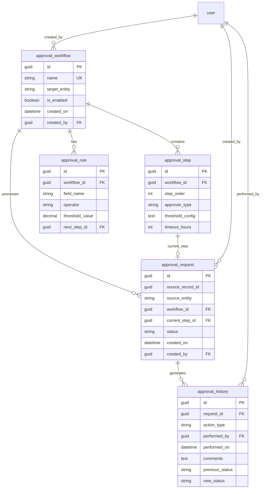

# STORY-002: Approval Entity Schema

## Description

Implement the complete entity schema for the WebVella ERP Approval Workflow system. This story creates five core entities that form the data foundation for the multi-level approval workflow automation: `approval_workflow`, `approval_step`, `approval_rule`, `approval_request`, and `approval_history`.

These entities enable:
- **Workflow Definition** (`approval_workflow`): Configuration of approval workflows targeting specific entity types (e.g., purchase orders, expense requests)
- **Step Hierarchies** (`approval_step`): Multi-level approval chains with configurable approver types (role-based, user-based, or department head) and timeout settings
- **Routing Rules** (`approval_rule`): Dynamic routing based on field values and amount thresholds that determine which approval steps to execute
- **Request Tracking** (`approval_request`): Active approval request instances with status tracking through the workflow lifecycle
- **Audit Trail** (`approval_history`): Comprehensive logging of all approval actions for compliance and traceability

The entity schema follows WebVella ERP conventions with snake_case naming, GUID primary keys, proper foreign key relationships, and appropriate field types for each data element. All entities are created via a dated migration patch (`ApprovalPlugin.20260115.cs`) following the established plugin migration pattern.

## Business Value

- **Data Persistence Foundation**: Establishes the complete data model required for all approval workflow functionality, enabling persistent storage of workflows, rules, requests, and audit trails
- **Compliance Support**: The `approval_history` entity provides an immutable audit trail for regulatory compliance, SOX requirements, and internal audit needs
- **Flexible Configuration**: Separation of workflow definition, steps, and rules allows administrators to configure complex approval hierarchies without code changes
- **Scalable Architecture**: Entity relations support unlimited approval steps per workflow and unlimited requests per workflow, scaling with organizational needs
- **Query Performance**: Proper indexing and relation design enables efficient queries for pending approvals, approval history, and workflow analytics
- **Integration Ready**: Standard WebVella entity patterns enable integration with existing ERP features (dashboards, reports, exports)

## Acceptance Criteria

### Entity Creation
- [ ] **AC1**: The `approval_workflow` entity is created successfully with all specified fields (id, name, target_entity, is_enabled, created_on, created_by) and can be queried via EQL
- [ ] **AC2**: The `approval_step` entity is created successfully with all specified fields (id, workflow_id, step_order, approver_type, threshold_config, timeout_hours) and supports JSON storage for threshold_config
- [ ] **AC3**: The `approval_rule` entity is created successfully with all specified fields (id, workflow_id, field_name, operator, threshold_value, next_step_id) and decimal precision for threshold_value
- [ ] **AC4**: The `approval_request` entity is created successfully with all specified fields (id, source_record_id, source_entity, workflow_id, current_step_id, status, created_on, created_by) with proper status enum values
- [ ] **AC5**: The `approval_history` entity is created successfully with all specified fields (id, request_id, action_type, performed_by, performed_on, comments, previous_status, new_status) with text field for comments

### Entity Relations
- [ ] **AC6**: OneToMany relation `approval_workflow_approval_step` is created linking `approval_workflow.id` to `approval_step.workflow_id`
- [ ] **AC7**: OneToMany relation `approval_workflow_approval_rule` is created linking `approval_workflow.id` to `approval_rule.workflow_id`
- [ ] **AC8**: OneToMany relation `approval_request_approval_history` is created linking `approval_request.id` to `approval_history.request_id`

### Migration Integrity
- [ ] **AC9**: The migration patch `Patch20260115()` executes without errors during plugin initialization and creates all entities within a single database transaction
- [ ] **AC10**: Plugin version is correctly updated to `20260115` after successful migration, preventing duplicate execution on subsequent startups

## Technical Implementation Details

### Files/Modules to Create

| File Path | Description |
|-----------|-------------|
| `WebVella.Erp.Plugins.Approval/ApprovalPlugin.20260115.cs` | Migration patch creating all 5 entities and 3 relations |

### Entity Definitions

#### approval_workflow Entity

| Field Name | Field Type | Required | Unique | Description |
|------------|------------|----------|--------|-------------|
| `id` | GuidField | Yes | Yes | Primary key identifier |
| `name` | TextField | Yes | Yes | Workflow display name (max 200 chars) |
| `target_entity` | TextField | Yes | No | Entity name this workflow applies to (e.g., "purchase_order") |
| `is_enabled` | CheckboxField | Yes | No | Whether workflow is active (default: true) |
| `created_on` | DateTimeField | Yes | No | Timestamp of workflow creation |
| `created_by` | GuidField | Yes | No | User ID of workflow creator (FK to user entity) |

**Entity Configuration:**
- Name: `approval_workflow`
- Label: `Approval Workflow`
- Label Plural: `Approval Workflows`
- Icon: `fa fa-project-diagram`
- Color: `#2196F3`

#### approval_step Entity

| Field Name | Field Type | Required | Unique | Description |
|------------|------------|----------|--------|-------------|
| `id` | GuidField | Yes | Yes | Primary key identifier |
| `workflow_id` | GuidField | Yes | No | Foreign key to approval_workflow |
| `step_order` | NumberField | Yes | No | Execution order (1, 2, 3...) |
| `approver_type` | SelectField | Yes | No | Type of approver: "role", "user", "department_head" |
| `threshold_config` | TextField | No | No | JSON configuration for amount thresholds and approver IDs |
| `timeout_hours` | NumberField | No | No | Hours before escalation (0 = no timeout) |

**Entity Configuration:**
- Name: `approval_step`
- Label: `Approval Step`
- Label Plural: `Approval Steps`
- Icon: `fa fa-tasks`
- Color: `#4CAF50`

**SelectField Options for approver_type:**
```json
[
  { "value": "role", "label": "Role-Based" },
  { "value": "user", "label": "Specific User" },
  { "value": "department_head", "label": "Department Head" }
]
```

#### approval_rule Entity

| Field Name | Field Type | Required | Unique | Description |
|------------|------------|----------|--------|-------------|
| `id` | GuidField | Yes | Yes | Primary key identifier |
| `workflow_id` | GuidField | Yes | No | Foreign key to approval_workflow |
| `field_name` | TextField | Yes | No | Source entity field to evaluate (e.g., "amount") |
| `operator` | SelectField | Yes | No | Comparison operator |
| `threshold_value` | NumberField | Yes | No | Threshold value for comparison (decimal) |
| `next_step_id` | GuidField | No | No | Optional FK to approval_step for rule-based routing |

**Entity Configuration:**
- Name: `approval_rule`
- Label: `Approval Rule`
- Label Plural: `Approval Rules`
- Icon: `fa fa-filter`
- Color: `#FF9800`

**SelectField Options for operator:**
```json
[
  { "value": "eq", "label": "Equals" },
  { "value": "ne", "label": "Not Equals" },
  { "value": "gt", "label": "Greater Than" },
  { "value": "gte", "label": "Greater Than or Equal" },
  { "value": "lt", "label": "Less Than" },
  { "value": "lte", "label": "Less Than or Equal" }
]
```

#### approval_request Entity

| Field Name | Field Type | Required | Unique | Description |
|------------|------------|----------|--------|-------------|
| `id` | GuidField | Yes | Yes | Primary key identifier |
| `source_record_id` | GuidField | Yes | No | ID of the record being approved |
| `source_entity` | TextField | Yes | No | Entity name of the source record |
| `workflow_id` | GuidField | Yes | No | Foreign key to approval_workflow |
| `current_step_id` | GuidField | No | No | Foreign key to current approval_step |
| `status` | SelectField | Yes | No | Current status: Pending, Approved, Rejected, Escalated |
| `created_on` | DateTimeField | Yes | No | Timestamp of request creation |
| `created_by` | GuidField | Yes | No | User ID of request creator |

**Entity Configuration:**
- Name: `approval_request`
- Label: `Approval Request`
- Label Plural: `Approval Requests`
- Icon: `fa fa-clipboard-check`
- Color: `#9C27B0`

**SelectField Options for status:**
```json
[
  { "value": "pending", "label": "Pending" },
  { "value": "approved", "label": "Approved" },
  { "value": "rejected", "label": "Rejected" },
  { "value": "escalated", "label": "Escalated" }
]
```

#### approval_history Entity

| Field Name | Field Type | Required | Unique | Description |
|------------|------------|----------|--------|-------------|
| `id` | GuidField | Yes | Yes | Primary key identifier |
| `request_id` | GuidField | Yes | No | Foreign key to approval_request |
| `action_type` | SelectField | Yes | No | Action performed |
| `performed_by` | GuidField | Yes | No | User ID who performed the action |
| `performed_on` | DateTimeField | Yes | No | Timestamp of action |
| `comments` | MultiLineTextField | No | No | Optional comments or justification |
| `previous_status` | TextField | No | No | Status before action |
| `new_status` | TextField | No | No | Status after action |

**Entity Configuration:**
- Name: `approval_history`
- Label: `Approval History`
- Label Plural: `Approval History`
- Icon: `fa fa-history`
- Color: `#607D8B`

**SelectField Options for action_type:**
```json
[
  { "value": "submitted", "label": "Submitted" },
  { "value": "approved", "label": "Approved" },
  { "value": "rejected", "label": "Rejected" },
  { "value": "escalated", "label": "Escalated" },
  { "value": "delegated", "label": "Delegated" },
  { "value": "recalled", "label": "Recalled" },
  { "value": "commented", "label": "Commented" }
]
```

### Entity Relations

| Relation Name | Type | Origin Entity | Origin Field | Target Entity | Target Field |
|---------------|------|---------------|--------------|---------------|--------------|
| `approval_workflow_approval_step` | OneToMany | approval_workflow | id | approval_step | workflow_id |
| `approval_workflow_approval_rule` | OneToMany | approval_workflow | id | approval_rule | workflow_id |
| `approval_request_approval_history` | OneToMany | approval_request | id | approval_history | request_id |

### Entity Relationship Diagram



### Key Classes and Functions

#### ApprovalPlugin.20260115.cs

```csharp
public partial class ApprovalPlugin : ErpPlugin
{
    private static void Patch20260115(EntityManager entMan, EntityRelationManager relMan, RecordManager recMan)
    {
        #region << ***Create Entity*** Entity name: approval_workflow >>
        {
            var entity = new InputEntity();
            entity.Id = new Guid("a1b2c3d4-e5f6-4789-abcd-ef0123456789");
            entity.Name = "approval_workflow";
            entity.Label = "Approval Workflow";
            entity.LabelPlural = "Approval Workflows";
            entity.System = false;
            entity.IconName = "fa fa-project-diagram";
            entity.Color = "#2196F3";
            entity.RecordPermissions = new RecordPermissions();
            entity.RecordPermissions.CanRead = new List<Guid> { SystemIds.AdministratorRoleId, SystemIds.RegularRoleId };
            entity.RecordPermissions.CanCreate = new List<Guid> { SystemIds.AdministratorRoleId };
            entity.RecordPermissions.CanUpdate = new List<Guid> { SystemIds.AdministratorRoleId };
            entity.RecordPermissions.CanDelete = new List<Guid> { SystemIds.AdministratorRoleId };
            
            var response = entMan.CreateEntity(entity);
            if (!response.Success)
                throw new Exception("Failed to create approval_workflow entity: " + response.Message);
        }
        #endregion

        // Create fields for approval_workflow
        // ... (TextField: name, target_entity; CheckboxField: is_enabled; 
        //      DateTimeField: created_on; GuidField: created_by)

        #region << ***Create Entity*** Entity name: approval_step >>
        // Similar pattern for approval_step entity
        #endregion

        #region << ***Create Entity*** Entity name: approval_rule >>
        // Similar pattern for approval_rule entity
        #endregion

        #region << ***Create Entity*** Entity name: approval_request >>
        // Similar pattern for approval_request entity
        #endregion

        #region << ***Create Entity*** Entity name: approval_history >>
        // Similar pattern for approval_history entity
        #endregion

        #region << ***Create Relation*** Relation: approval_workflow_approval_step >>
        {
            var relation = new EntityRelation();
            relation.Id = new Guid("b2c3d4e5-f6a7-4890-bcde-f01234567890");
            relation.Name = "approval_workflow_approval_step";
            relation.Label = "Workflow Steps";
            relation.RelationType = EntityRelationType.OneToMany;
            relation.OriginEntityId = new Guid("a1b2c3d4-e5f6-4789-abcd-ef0123456789"); // approval_workflow
            relation.OriginFieldId = /* id field GUID */;
            relation.TargetEntityId = /* approval_step entity GUID */;
            relation.TargetFieldId = /* workflow_id field GUID */;
            
            var response = relMan.Create(relation);
            if (!response.Success)
                throw new Exception("Failed to create relation: " + response.Message);
        }
        #endregion

        // Create remaining relations...
    }
}
```

**Source Pattern**: `WebVella.Erp/Api/EntityManager.cs`, `WebVella.Erp.Plugins.SDK/SdkPlugin.20181215.cs`

### Integration Points

| Integration | Description |
|-------------|-------------|
| `EntityManager.CreateEntity()` | Creates each entity with InputEntity configuration |
| `EntityManager.CreateField()` | Adds fields to entities after creation |
| `EntityRelationManager.Create()` | Establishes OneToMany relations between entities |
| `RecordManager` | Available for creating default records if needed |
| `DbContext.Current.Transaction` | All operations execute within transaction scope |
| `Cache.Clear()` | Cache is cleared after entity creation to reflect changes |

### Technical Approach

1. **Create Migration Patch File**: Create `ApprovalPlugin.20260115.cs` as a partial class of `ApprovalPlugin` with the `Patch20260115()` method

2. **Update ProcessPatches()**: Add version check in `ApprovalPlugin._.cs`:
   ```csharp
   if (currentPluginSettings.Version < 20260115)
   {
       Patch20260115(entMan, relMan, recMan);
       currentPluginSettings.Version = 20260115;
   }
   ```

3. **Create Entities in Order**:
   - Create `approval_workflow` first (no dependencies)
   - Create `approval_step` second (depends on workflow for FK)
   - Create `approval_rule` third (depends on workflow and step for FKs)
   - Create `approval_request` fourth (depends on workflow and step for FKs)
   - Create `approval_history` last (depends on request for FK)

4. **Add Fields to Each Entity**: For each entity, create all fields using `entMan.CreateField()`:
   - `InputTextField` for string fields with maxLength configuration
   - `InputGuidField` for GUID fields (PK and FKs)
   - `InputCheckboxField` for boolean fields
   - `InputDateTimeField` for timestamp fields
   - `InputNumberField` for integer and decimal fields
   - `InputSelectField` for enum fields with options array
   - `InputMultiLineTextField` for long text fields (comments)

5. **Create Entity Relations**: After all entities exist, create relations using `relMan.Create()`:
   - Set `RelationType = EntityRelationType.OneToMany`
   - Origin entity is the "one" side (parent)
   - Target entity is the "many" side (child)
   - Origin field is typically the `id` field
   - Target field is the foreign key field

6. **Set Record Permissions**: Configure appropriate CRUD permissions:
   - Administrators: Full CRUD on all entities
   - Regular users: Read on workflows, Create/Read/Update on requests and history
   - Guest: No access

7. **Transaction Management**: All entity and relation creation occurs within the transaction started in `ProcessPatches()`, ensuring atomic creation

### Field Creation Code Patterns

#### TextField Example (name field)

```csharp
#region << ***Create field*** Entity: approval_workflow Field: name >>
{
    InputTextField field = new InputTextField();
    field.Id = new Guid("c3d4e5f6-a7b8-4901-cdef-012345678901");
    field.Name = "name";
    field.Label = "Name";
    field.PlaceholderText = "Enter workflow name";
    field.Description = "Unique name for the approval workflow";
    field.HelpText = "";
    field.Required = true;
    field.Unique = true;
    field.Searchable = true;
    field.Auditable = true;
    field.System = false;
    field.DefaultValue = "";
    field.MaxLength = 200;
    field.EnableSecurity = false;
    
    var response = entMan.CreateField(
        new Guid("a1b2c3d4-e5f6-4789-abcd-ef0123456789"), // approval_workflow entity ID
        field,
        false
    );
    if (!response.Success)
        throw new Exception("Failed to create field: " + response.Message);
}
#endregion
```

#### SelectField Example (status field)

```csharp
#region << ***Create field*** Entity: approval_request Field: status >>
{
    InputSelectField field = new InputSelectField();
    field.Id = new Guid("d4e5f6a7-b8c9-4012-def0-123456789012");
    field.Name = "status";
    field.Label = "Status";
    field.PlaceholderText = "";
    field.Description = "Current approval status";
    field.Required = true;
    field.Unique = false;
    field.Searchable = true;
    field.Auditable = true;
    field.System = false;
    field.DefaultValue = "pending";
    field.Options = new List<SelectFieldOption>
    {
        new SelectFieldOption { Key = "pending", Value = "Pending" },
        new SelectFieldOption { Key = "approved", Value = "Approved" },
        new SelectFieldOption { Key = "rejected", Value = "Rejected" },
        new SelectFieldOption { Key = "escalated", Value = "Escalated" }
    };
    field.EnableSecurity = false;
    
    var response = entMan.CreateField(entityId, field, false);
    if (!response.Success)
        throw new Exception("Failed to create field: " + response.Message);
}
#endregion
```

#### DateTimeField Example (created_on field)

```csharp
#region << ***Create field*** Entity: approval_workflow Field: created_on >>
{
    InputDateTimeField field = new InputDateTimeField();
    field.Id = new Guid("e5f6a7b8-c9d0-4123-ef01-234567890123");
    field.Name = "created_on";
    field.Label = "Created On";
    field.PlaceholderText = "";
    field.Description = "Timestamp when the workflow was created";
    field.Required = true;
    field.Unique = false;
    field.Searchable = true;
    field.Auditable = true;
    field.System = false;
    field.DefaultValue = null;
    field.Format = "yyyy-MM-dd HH:mm:ss";
    field.UseCurrentTimeAsDefaultValue = true;
    field.EnableSecurity = false;
    
    var response = entMan.CreateField(entityId, field, false);
    if (!response.Success)
        throw new Exception("Failed to create field: " + response.Message);
}
#endregion
```

#### NumberField Example (step_order field)

```csharp
#region << ***Create field*** Entity: approval_step Field: step_order >>
{
    InputNumberField field = new InputNumberField();
    field.Id = new Guid("f6a7b8c9-d0e1-4234-f012-345678901234");
    field.Name = "step_order";
    field.Label = "Step Order";
    field.PlaceholderText = "";
    field.Description = "Execution order of this step in the workflow";
    field.Required = true;
    field.Unique = false;
    field.Searchable = false;
    field.Auditable = true;
    field.System = false;
    field.DefaultValue = 1;
    field.MinValue = 1;
    field.MaxValue = 100;
    field.DecimalPlaces = 0;
    field.EnableSecurity = false;
    
    var response = entMan.CreateField(entityId, field, false);
    if (!response.Success)
        throw new Exception("Failed to create field: " + response.Message);
}
#endregion
```

### EQL Query Examples

After entity creation, the following EQL queries can be used to retrieve approval data:

```sql
-- Get all enabled workflows
SELECT * FROM approval_workflow WHERE is_enabled = true

-- Get workflow with steps (using relation expansion)
SELECT *, $approval_workflow_approval_step FROM approval_workflow WHERE id = @workflowId

-- Get pending approval requests for a user's role
SELECT *, $approval_workflow_approval_request FROM approval_workflow 
WHERE id IN (SELECT workflow_id FROM approval_request WHERE status = 'pending')

-- Get approval history for a specific request
SELECT * FROM approval_history WHERE request_id = @requestId ORDER BY performed_on DESC

-- Get all rules for a workflow ordered by threshold
SELECT * FROM approval_rule WHERE workflow_id = @workflowId ORDER BY threshold_value ASC
```

## Dependencies

| Dependency | Description |
|------------|-------------|
| **STORY-001** | Approval Plugin Infrastructure - Provides the plugin scaffold, `ProcessPatches()` orchestration, and database transaction management required for entity migration |

## Effort Estimate

**8 Story Points**

Rationale:
- 5 entities with multiple fields each (complexity)
- 3 entity relations to create
- Detailed migration patch implementation
- Field type variety (TextField, GuidField, SelectField, DateTimeField, NumberField, MultiLineTextField)
- Transaction management and error handling
- Testing of entity creation and relation functionality

## Labels

`workflow`, `approval`, `backend`, `data-model`, `entities`, `migration`

## Risk Considerations

| Risk | Mitigation |
|------|------------|
| Entity naming conflicts | Use unique names with `approval_` prefix; validate entity doesn't exist before creation |
| Migration failure rollback | All operations within transaction scope; rollback on any exception |
| Field type compatibility | Use standard WebVella field types; avoid custom implementations |
| Relation creation order | Create entities first, then relations; handle FK field creation properly |
| Permission configuration | Start with Administrator-only access; expand in later stories |

## Testing Approach

1. **Unit Testing**: Verify each entity and field creation method in isolation
2. **Integration Testing**: Run full migration patch and verify all entities/relations exist
3. **EQL Testing**: Execute sample queries against created entities
4. **Rollback Testing**: Intentionally fail migration and verify clean rollback
5. **Permission Testing**: Verify CRUD operations respect configured permissions

## Definition of Done

- [ ] All 5 entities created successfully in database
- [ ] All fields created with correct types and configurations
- [ ] All 3 relations created and functional
- [ ] Migration patch executes without errors
- [ ] Plugin version updated to 20260115
- [ ] EQL queries return expected results
- [ ] Code review completed
- [ ] Documentation updated
