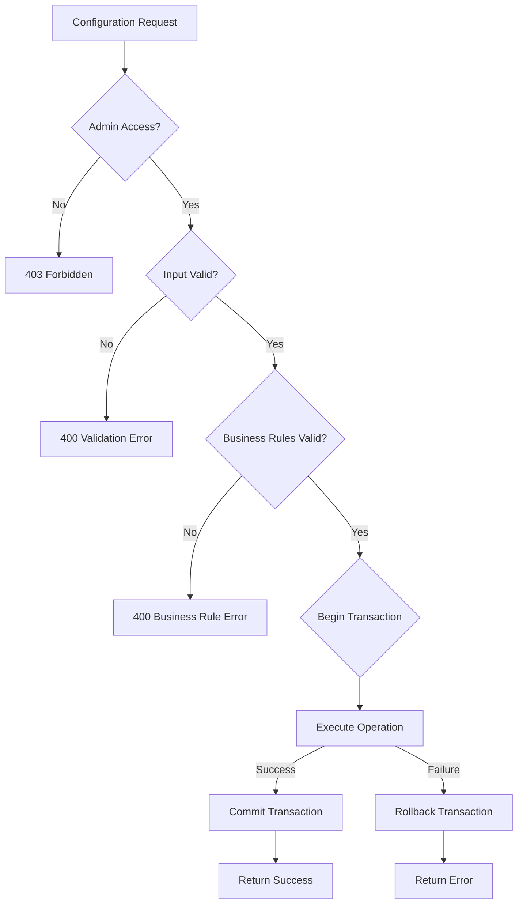
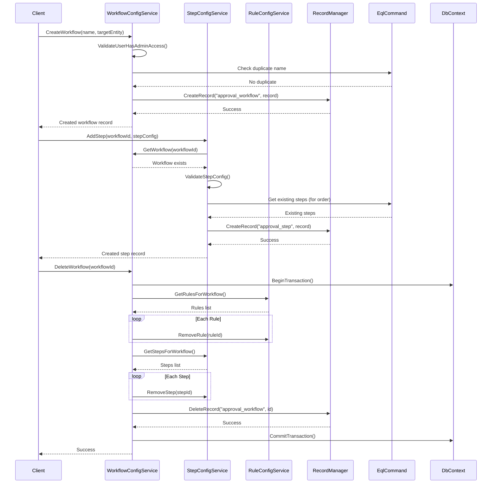

# STORY-003: Workflow Configuration Management

## Description

Implement comprehensive workflow configuration management services for the WebVella ERP Approval Workflow system. This story creates the service layer that enables administrators to configure, manage, and maintain approval workflows through CRUD operations on workflows, steps, and rules.

The configuration management layer consists of three core services:

- **WorkflowConfigService**: Manages the lifecycle of approval workflow definitions including creation, modification, and deletion with proper cascade handling for dependent steps and rules
- **StepConfigService**: Handles approval step configuration within workflows, including step ordering, approver type assignment, timeout configuration, and threshold settings
- **RuleConfigService**: Manages routing rules that determine approval flow based on field values and amount thresholds

This story implements robust validation logic to ensure workflow configuration integrity:
- Threshold ordering validation (ensuring `threshold_min < threshold_max`)
- Overlap detection to prevent conflicting threshold ranges
- Approver type validation with role/user existence verification
- Referential integrity checks for step and rule dependencies

The services follow the established WebVella service patterns using `RecordManager` for CRUD operations and `EqlCommand` for complex queries with `$relation` expansion to efficiently retrieve workflows with their associated steps and rules.

## Business Value

- **Self-Service Administration**: Empowers administrators to configure complex approval hierarchies without developer intervention, reducing IT dependency and accelerating workflow deployment
- **Configuration Flexibility**: Enables dynamic adjustment of approval thresholds, approver assignments, and routing rules to adapt to changing business requirements
- **Reduced Error Risk**: Comprehensive validation prevents misconfiguration that could result in stuck approvals, skipped approvals, or orphaned requests
- **Operational Efficiency**: Centralized configuration management reduces the time and effort required to set up new approval workflows from days to minutes
- **Audit-Ready Configuration**: All configuration changes are tracked, supporting compliance requirements and change management policies
- **Scalable Workflow Management**: Services designed to handle unlimited workflows, steps, and rules, scaling with organizational growth

## Acceptance Criteria

### Workflow Configuration Service
- [ ] **AC1**: `WorkflowConfigService.CreateWorkflow(name, targetEntity)` successfully creates a new `approval_workflow` record with auto-generated `id`, `created_on` timestamp, and `created_by` user ID, returning the created workflow record
- [ ] **AC2**: `WorkflowConfigService.UpdateWorkflow(id, settings)` updates workflow properties (`name`, `target_entity`, `is_enabled`) and returns the updated record, with validation preventing duplicate workflow names
- [ ] **AC3**: `WorkflowConfigService.DeleteWorkflow(id)` performs cascade deletion of all associated `approval_step` and `approval_rule` records before deleting the workflow, returning success/failure status

### Step Configuration Service
- [ ] **AC4**: `StepConfigService.AddStep(workflowId, stepConfig)` creates a new `approval_step` with automatic `step_order` assignment (max existing order + 1), validating approver type against allowed values ("role", "user", "department_head")
- [ ] **AC5**: `StepConfigService.ReorderSteps(workflowId, stepOrder[])` updates `step_order` values for multiple steps in a single transaction, ensuring contiguous ordering (1, 2, 3, ...) with no gaps or duplicates

### Rule Configuration Service
- [ ] **AC6**: `RuleConfigService.AddRule(workflowId, ruleConfig)` creates a new `approval_rule` with validation that `threshold_value` is a valid decimal and `operator` is one of the allowed values
- [ ] **AC7**: `RuleConfigService.UpdateRule(ruleId, ruleConfig)` validates threshold ranges do not overlap with existing rules for the same workflow and field combination

### Validation Requirements
- [ ] **AC8**: All services return appropriate error messages when validation fails, including specific field names and constraint violations
- [ ] **AC9**: All configuration operations execute within database transaction scope, ensuring atomic updates and proper rollback on failure

## Technical Implementation Details

### Files/Modules to Create

| File Path | Description |
|-----------|-------------|
| `WebVella.Erp.Plugins.Approval/Services/WorkflowConfigService.cs` | Service class for workflow CRUD operations |
| `WebVella.Erp.Plugins.Approval/Services/StepConfigService.cs` | Service class for approval step management |
| `WebVella.Erp.Plugins.Approval/Services/RuleConfigService.cs` | Service class for routing rule management |
| `WebVella.Erp.Plugins.Approval/Services/BaseApprovalService.cs` | Base service class with shared validation and manager instances |
| `WebVella.Erp.Plugins.Approval/Model/WorkflowConfig.cs` | DTO for workflow configuration input |
| `WebVella.Erp.Plugins.Approval/Model/StepConfig.cs` | DTO for step configuration input |
| `WebVella.Erp.Plugins.Approval/Model/RuleConfig.cs` | DTO for rule configuration input |
| `WebVella.Erp.Plugins.Approval/Model/ConfigValidationResult.cs` | DTO for validation results with errors |

### Service Class Definitions

#### BaseApprovalService.cs

```csharp
namespace WebVella.Erp.Plugins.Approval.Services
{
    public abstract class BaseApprovalService
    {
        protected RecordManager RecMan { get; }
        protected EntityManager EntMan { get; }
        protected SecurityManager SecMan { get; }

        protected BaseApprovalService()
        {
            RecMan = new RecordManager();
            EntMan = new EntityManager();
            SecMan = new SecurityManager();
        }

        protected EntityRecordList ExecuteEql(string eqlCommand, List<EqlParameter> parameters = null)
        {
            var eqlParams = parameters ?? new List<EqlParameter>();
            return new EqlCommand(eqlCommand, eqlParams).Execute();
        }

        protected void ValidateUserHasAdminAccess()
        {
            var currentUser = SecurityContext.CurrentUser;
            if (currentUser == null || !currentUser.Roles.Any(r => r.Name == "administrator"))
                throw new UnauthorizedAccessException("Admin access required for workflow configuration");
        }
    }
}
```

**Source Pattern**: `WebVella.Erp.Plugins.Project/Services/BaseService.cs`

#### WorkflowConfigService.cs

```csharp
namespace WebVella.Erp.Plugins.Approval.Services
{
    public class WorkflowConfigService : BaseApprovalService
    {
        /// <summary>
        /// Creates a new approval workflow
        /// </summary>
        /// <param name="name">Unique workflow name</param>
        /// <param name="targetEntity">Entity name this workflow applies to</param>
        /// <returns>Created workflow record</returns>
        public EntityRecord CreateWorkflow(string name, string targetEntity)
        {
            ValidateUserHasAdminAccess();
            ValidateWorkflowInput(name, targetEntity);

            // Check for duplicate name
            var existing = GetWorkflowByName(name);
            if (existing != null)
                throw new ValidationException($"Workflow with name '{name}' already exists");

            var workflowRecord = new EntityRecord();
            workflowRecord["id"] = Guid.NewGuid();
            workflowRecord["name"] = name;
            workflowRecord["target_entity"] = targetEntity;
            workflowRecord["is_enabled"] = true;
            workflowRecord["created_on"] = DateTime.UtcNow;
            workflowRecord["created_by"] = SecurityContext.CurrentUser?.Id;

            var response = RecMan.CreateRecord("approval_workflow", workflowRecord);
            if (!response.Success)
                throw new Exception($"Failed to create workflow: {response.Message}");

            return GetWorkflow((Guid)workflowRecord["id"]);
        }

        /// <summary>
        /// Updates an existing workflow configuration
        /// </summary>
        /// <param name="id">Workflow ID</param>
        /// <param name="settings">Updated settings</param>
        /// <returns>Updated workflow record</returns>
        public EntityRecord UpdateWorkflow(Guid id, WorkflowConfig settings)
        {
            ValidateUserHasAdminAccess();

            var existingWorkflow = GetWorkflow(id);
            if (existingWorkflow == null)
                throw new Exception($"Workflow with ID {id} not found");

            // Check for name conflicts (if name is being changed)
            if (!string.IsNullOrEmpty(settings.Name) && 
                settings.Name != (string)existingWorkflow["name"])
            {
                var duplicate = GetWorkflowByName(settings.Name);
                if (duplicate != null && (Guid)duplicate["id"] != id)
                    throw new ValidationException($"Workflow with name '{settings.Name}' already exists");
            }

            var updateRecord = new EntityRecord();
            updateRecord["id"] = id;
            
            if (!string.IsNullOrEmpty(settings.Name))
                updateRecord["name"] = settings.Name;
            if (!string.IsNullOrEmpty(settings.TargetEntity))
                updateRecord["target_entity"] = settings.TargetEntity;
            if (settings.IsEnabled.HasValue)
                updateRecord["is_enabled"] = settings.IsEnabled.Value;

            var response = RecMan.UpdateRecord("approval_workflow", updateRecord);
            if (!response.Success)
                throw new Exception($"Failed to update workflow: {response.Message}");

            return GetWorkflow(id);
        }

        /// <summary>
        /// Deletes a workflow with cascade deletion of steps and rules
        /// </summary>
        /// <param name="id">Workflow ID to delete</param>
        /// <returns>True if deletion successful</returns>
        public bool DeleteWorkflow(Guid id)
        {
            ValidateUserHasAdminAccess();

            var workflow = GetWorkflow(id);
            if (workflow == null)
                throw new Exception($"Workflow with ID {id} not found");

            using (var connection = DbContext.Current.CreateConnection())
            {
                try
                {
                    connection.BeginTransaction();

                    // Cascade delete: Rules first, then Steps, then Workflow
                    var ruleService = new RuleConfigService();
                    var rules = ruleService.GetRulesForWorkflow(id);
                    foreach (var rule in rules)
                    {
                        ruleService.RemoveRule((Guid)rule["id"]);
                    }

                    var stepService = new StepConfigService();
                    var steps = stepService.GetStepsForWorkflow(id);
                    foreach (var step in steps)
                    {
                        stepService.RemoveStep((Guid)step["id"]);
                    }

                    // Delete the workflow
                    var response = RecMan.DeleteRecord("approval_workflow", id);
                    if (!response.Success)
                        throw new Exception($"Failed to delete workflow: {response.Message}");

                    connection.CommitTransaction();
                    return true;
                }
                catch
                {
                    connection.RollbackTransaction();
                    throw;
                }
            }
        }

        /// <summary>
        /// Retrieves a workflow by ID with related steps and rules
        /// </summary>
        public EntityRecord GetWorkflow(Guid id)
        {
            var eqlCommand = @"SELECT *, $approval_workflow_approval_step, $approval_workflow_approval_rule 
                               FROM approval_workflow WHERE id = @id";
            var eqlParams = new List<EqlParameter> { new EqlParameter("id", id) };
            var result = ExecuteEql(eqlCommand, eqlParams);
            return result.FirstOrDefault();
        }

        /// <summary>
        /// Retrieves a workflow by name
        /// </summary>
        public EntityRecord GetWorkflowByName(string name)
        {
            var eqlCommand = "SELECT * FROM approval_workflow WHERE name = @name";
            var eqlParams = new List<EqlParameter> { new EqlParameter("name", name) };
            var result = ExecuteEql(eqlCommand, eqlParams);
            return result.FirstOrDefault();
        }

        /// <summary>
        /// Retrieves all enabled workflows
        /// </summary>
        public EntityRecordList GetAllEnabledWorkflows()
        {
            var eqlCommand = "SELECT * FROM approval_workflow WHERE is_enabled = @enabled ORDER BY name ASC";
            var eqlParams = new List<EqlParameter> { new EqlParameter("enabled", true) };
            return ExecuteEql(eqlCommand, eqlParams);
        }

        /// <summary>
        /// Retrieves workflows for a specific target entity
        /// </summary>
        public EntityRecordList GetWorkflowsForEntity(string targetEntity)
        {
            var eqlCommand = @"SELECT * FROM approval_workflow 
                               WHERE target_entity = @targetEntity AND is_enabled = @enabled";
            var eqlParams = new List<EqlParameter>
            {
                new EqlParameter("targetEntity", targetEntity),
                new EqlParameter("enabled", true)
            };
            return ExecuteEql(eqlCommand, eqlParams);
        }

        private void ValidateWorkflowInput(string name, string targetEntity)
        {
            if (string.IsNullOrWhiteSpace(name))
                throw new ValidationException("Workflow name is required");
            if (name.Length > 200)
                throw new ValidationException("Workflow name cannot exceed 200 characters");
            if (string.IsNullOrWhiteSpace(targetEntity))
                throw new ValidationException("Target entity is required");

            // Verify target entity exists
            var entity = EntMan.ReadEntity(targetEntity);
            if (entity.Object == null)
                throw new ValidationException($"Target entity '{targetEntity}' does not exist");
        }
    }
}
```

**Source Pattern**: `WebVella.Erp.Plugins.Project/Services/TaskService.cs`

#### StepConfigService.cs

```csharp
namespace WebVella.Erp.Plugins.Approval.Services
{
    public class StepConfigService : BaseApprovalService
    {
        private static readonly string[] ValidApproverTypes = { "role", "user", "department_head" };

        /// <summary>
        /// Adds a new step to a workflow
        /// </summary>
        /// <param name="workflowId">Parent workflow ID</param>
        /// <param name="stepConfig">Step configuration</param>
        /// <returns>Created step record</returns>
        public EntityRecord AddStep(Guid workflowId, StepConfig stepConfig)
        {
            ValidateUserHasAdminAccess();
            ValidateStepConfig(stepConfig);

            // Verify workflow exists
            var workflowService = new WorkflowConfigService();
            var workflow = workflowService.GetWorkflow(workflowId);
            if (workflow == null)
                throw new Exception($"Workflow with ID {workflowId} not found");

            // Calculate next step order
            var existingSteps = GetStepsForWorkflow(workflowId);
            int nextOrder = 1;
            if (existingSteps.Any())
            {
                nextOrder = existingSteps.Max(s => (int)(decimal)s["step_order"]) + 1;
            }

            var stepRecord = new EntityRecord();
            stepRecord["id"] = Guid.NewGuid();
            stepRecord["workflow_id"] = workflowId;
            stepRecord["step_order"] = nextOrder;
            stepRecord["approver_type"] = stepConfig.ApproverType;
            stepRecord["threshold_config"] = SerializeThresholdConfig(stepConfig);
            stepRecord["timeout_hours"] = stepConfig.TimeoutHours ?? 0;

            var response = RecMan.CreateRecord("approval_step", stepRecord);
            if (!response.Success)
                throw new Exception($"Failed to create step: {response.Message}");

            return GetStep((Guid)stepRecord["id"]);
        }

        /// <summary>
        /// Updates an existing step configuration
        /// </summary>
        public EntityRecord UpdateStep(Guid stepId, StepConfig stepConfig)
        {
            ValidateUserHasAdminAccess();
            ValidateStepConfig(stepConfig);

            var existingStep = GetStep(stepId);
            if (existingStep == null)
                throw new Exception($"Step with ID {stepId} not found");

            var updateRecord = new EntityRecord();
            updateRecord["id"] = stepId;
            updateRecord["approver_type"] = stepConfig.ApproverType;
            updateRecord["threshold_config"] = SerializeThresholdConfig(stepConfig);
            
            if (stepConfig.TimeoutHours.HasValue)
                updateRecord["timeout_hours"] = stepConfig.TimeoutHours.Value;

            var response = RecMan.UpdateRecord("approval_step", updateRecord);
            if (!response.Success)
                throw new Exception($"Failed to update step: {response.Message}");

            return GetStep(stepId);
        }

        /// <summary>
        /// Reorders steps within a workflow
        /// </summary>
        /// <param name="workflowId">Workflow ID</param>
        /// <param name="stepIds">Ordered array of step IDs</param>
        public void ReorderSteps(Guid workflowId, Guid[] stepIds)
        {
            ValidateUserHasAdminAccess();

            if (stepIds == null || stepIds.Length == 0)
                throw new ValidationException("Step IDs array cannot be empty");

            // Verify all steps belong to the workflow
            var existingSteps = GetStepsForWorkflow(workflowId);
            var existingStepIds = existingSteps.Select(s => (Guid)s["id"]).ToHashSet();

            foreach (var stepId in stepIds)
            {
                if (!existingStepIds.Contains(stepId))
                    throw new ValidationException($"Step {stepId} does not belong to workflow {workflowId}");
            }

            if (stepIds.Distinct().Count() != stepIds.Length)
                throw new ValidationException("Duplicate step IDs in reorder array");

            using (var connection = DbContext.Current.CreateConnection())
            {
                try
                {
                    connection.BeginTransaction();

                    for (int i = 0; i < stepIds.Length; i++)
                    {
                        var updateRecord = new EntityRecord();
                        updateRecord["id"] = stepIds[i];
                        updateRecord["step_order"] = i + 1; // 1-based ordering

                        var response = RecMan.UpdateRecord("approval_step", updateRecord);
                        if (!response.Success)
                            throw new Exception($"Failed to update step order: {response.Message}");
                    }

                    connection.CommitTransaction();
                }
                catch
                {
                    connection.RollbackTransaction();
                    throw;
                }
            }
        }

        /// <summary>
        /// Removes a step and reorders remaining steps
        /// </summary>
        public bool RemoveStep(Guid stepId)
        {
            ValidateUserHasAdminAccess();

            var step = GetStep(stepId);
            if (step == null)
                throw new Exception($"Step with ID {stepId} not found");

            var workflowId = (Guid)step["workflow_id"];
            var removedOrder = (int)(decimal)step["step_order"];

            using (var connection = DbContext.Current.CreateConnection())
            {
                try
                {
                    connection.BeginTransaction();

                    // Delete the step
                    var response = RecMan.DeleteRecord("approval_step", stepId);
                    if (!response.Success)
                        throw new Exception($"Failed to delete step: {response.Message}");

                    // Reorder remaining steps to maintain contiguous ordering
                    var remainingSteps = GetStepsForWorkflow(workflowId)
                        .Where(s => (int)(decimal)s["step_order"] > removedOrder)
                        .OrderBy(s => (decimal)s["step_order"])
                        .ToList();

                    foreach (var remainingStep in remainingSteps)
                    {
                        var updateRecord = new EntityRecord();
                        updateRecord["id"] = remainingStep["id"];
                        updateRecord["step_order"] = (int)(decimal)remainingStep["step_order"] - 1;

                        var updateResponse = RecMan.UpdateRecord("approval_step", updateRecord);
                        if (!updateResponse.Success)
                            throw new Exception($"Failed to reorder step: {updateResponse.Message}");
                    }

                    connection.CommitTransaction();
                    return true;
                }
                catch
                {
                    connection.RollbackTransaction();
                    throw;
                }
            }
        }

        /// <summary>
        /// Retrieves a step by ID
        /// </summary>
        public EntityRecord GetStep(Guid stepId)
        {
            var eqlCommand = "SELECT * FROM approval_step WHERE id = @id";
            var eqlParams = new List<EqlParameter> { new EqlParameter("id", stepId) };
            var result = ExecuteEql(eqlCommand, eqlParams);
            return result.FirstOrDefault();
        }

        /// <summary>
        /// Retrieves all steps for a workflow ordered by step_order
        /// </summary>
        public EntityRecordList GetStepsForWorkflow(Guid workflowId)
        {
            var eqlCommand = "SELECT * FROM approval_step WHERE workflow_id = @workflowId ORDER BY step_order ASC";
            var eqlParams = new List<EqlParameter> { new EqlParameter("workflowId", workflowId) };
            return ExecuteEql(eqlCommand, eqlParams);
        }

        private void ValidateStepConfig(StepConfig config)
        {
            if (config == null)
                throw new ValidationException("Step configuration is required");

            if (string.IsNullOrWhiteSpace(config.ApproverType))
                throw new ValidationException("Approver type is required");

            if (!ValidApproverTypes.Contains(config.ApproverType.ToLower()))
                throw new ValidationException($"Invalid approver type '{config.ApproverType}'. Valid values: {string.Join(", ", ValidApproverTypes)}");

            // Validate approver based on type
            ValidateApproverAssignment(config);

            // Validate threshold configuration
            if (config.ThresholdMin.HasValue && config.ThresholdMax.HasValue)
            {
                if (config.ThresholdMin.Value >= config.ThresholdMax.Value)
                    throw new ValidationException("Threshold minimum must be less than threshold maximum");
            }

            if (config.TimeoutHours.HasValue && config.TimeoutHours.Value < 0)
                throw new ValidationException("Timeout hours cannot be negative");
        }

        private void ValidateApproverAssignment(StepConfig config)
        {
            switch (config.ApproverType.ToLower())
            {
                case "role":
                    if (!config.ApproverRoleId.HasValue)
                        throw new ValidationException("Approver role ID is required for role-based approval");
                    // Verify role exists
                    var roleResult = SecMan.GetRole(config.ApproverRoleId.Value);
                    if (roleResult == null)
                        throw new ValidationException($"Role with ID {config.ApproverRoleId} does not exist");
                    break;

                case "user":
                    if (!config.ApproverUserId.HasValue)
                        throw new ValidationException("Approver user ID is required for user-based approval");
                    // Verify user exists
                    var userResult = SecMan.GetUser(config.ApproverUserId.Value);
                    if (userResult == null)
                        throw new ValidationException($"User with ID {config.ApproverUserId} does not exist");
                    break;

                case "department_head":
                    // Department head is resolved at runtime based on the requester's department
                    break;
            }
        }

        private string SerializeThresholdConfig(StepConfig config)
        {
            var thresholdConfig = new
            {
                threshold_min = config.ThresholdMin,
                threshold_max = config.ThresholdMax,
                approver_role_id = config.ApproverRoleId,
                approver_user_id = config.ApproverUserId,
                auto_approve_conditions = config.AutoApproveConditions
            };
            return JsonConvert.SerializeObject(thresholdConfig);
        }
    }
}
```

**Source Pattern**: `WebVella.Erp.Plugins.Project/Services/TaskService.cs`

#### RuleConfigService.cs

```csharp
namespace WebVella.Erp.Plugins.Approval.Services
{
    public class RuleConfigService : BaseApprovalService
    {
        private static readonly string[] ValidOperators = { "eq", "ne", "gt", "gte", "lt", "lte" };

        /// <summary>
        /// Adds a new routing rule to a workflow
        /// </summary>
        /// <param name="workflowId">Parent workflow ID</param>
        /// <param name="ruleConfig">Rule configuration</param>
        /// <returns>Created rule record</returns>
        public EntityRecord AddRule(Guid workflowId, RuleConfig ruleConfig)
        {
            ValidateUserHasAdminAccess();
            ValidateRuleConfig(ruleConfig);

            // Verify workflow exists
            var workflowService = new WorkflowConfigService();
            var workflow = workflowService.GetWorkflow(workflowId);
            if (workflow == null)
                throw new Exception($"Workflow with ID {workflowId} not found");

            // Validate no overlapping thresholds for same field
            ValidateNoThresholdOverlap(workflowId, ruleConfig.FieldName, ruleConfig.ThresholdValue, null);

            // Validate next_step_id if provided
            if (ruleConfig.NextStepId.HasValue)
            {
                var stepService = new StepConfigService();
                var step = stepService.GetStep(ruleConfig.NextStepId.Value);
                if (step == null)
                    throw new ValidationException($"Next step with ID {ruleConfig.NextStepId} does not exist");
                if ((Guid)step["workflow_id"] != workflowId)
                    throw new ValidationException("Next step must belong to the same workflow");
            }

            var ruleRecord = new EntityRecord();
            ruleRecord["id"] = Guid.NewGuid();
            ruleRecord["workflow_id"] = workflowId;
            ruleRecord["field_name"] = ruleConfig.FieldName;
            ruleRecord["operator"] = ruleConfig.Operator;
            ruleRecord["threshold_value"] = ruleConfig.ThresholdValue;
            ruleRecord["next_step_id"] = ruleConfig.NextStepId;

            var response = RecMan.CreateRecord("approval_rule", ruleRecord);
            if (!response.Success)
                throw new Exception($"Failed to create rule: {response.Message}");

            return GetRule((Guid)ruleRecord["id"]);
        }

        /// <summary>
        /// Updates an existing routing rule
        /// </summary>
        public EntityRecord UpdateRule(Guid ruleId, RuleConfig ruleConfig)
        {
            ValidateUserHasAdminAccess();
            ValidateRuleConfig(ruleConfig);

            var existingRule = GetRule(ruleId);
            if (existingRule == null)
                throw new Exception($"Rule with ID {ruleId} not found");

            var workflowId = (Guid)existingRule["workflow_id"];

            // Validate no overlapping thresholds (excluding current rule)
            ValidateNoThresholdOverlap(workflowId, ruleConfig.FieldName, ruleConfig.ThresholdValue, ruleId);

            // Validate next_step_id if provided
            if (ruleConfig.NextStepId.HasValue)
            {
                var stepService = new StepConfigService();
                var step = stepService.GetStep(ruleConfig.NextStepId.Value);
                if (step == null)
                    throw new ValidationException($"Next step with ID {ruleConfig.NextStepId} does not exist");
                if ((Guid)step["workflow_id"] != workflowId)
                    throw new ValidationException("Next step must belong to the same workflow");
            }

            var updateRecord = new EntityRecord();
            updateRecord["id"] = ruleId;
            updateRecord["field_name"] = ruleConfig.FieldName;
            updateRecord["operator"] = ruleConfig.Operator;
            updateRecord["threshold_value"] = ruleConfig.ThresholdValue;
            updateRecord["next_step_id"] = ruleConfig.NextStepId;

            var response = RecMan.UpdateRecord("approval_rule", updateRecord);
            if (!response.Success)
                throw new Exception($"Failed to update rule: {response.Message}");

            return GetRule(ruleId);
        }

        /// <summary>
        /// Removes a routing rule
        /// </summary>
        public bool RemoveRule(Guid ruleId)
        {
            ValidateUserHasAdminAccess();

            var rule = GetRule(ruleId);
            if (rule == null)
                throw new Exception($"Rule with ID {ruleId} not found");

            var response = RecMan.DeleteRecord("approval_rule", ruleId);
            if (!response.Success)
                throw new Exception($"Failed to delete rule: {response.Message}");

            return true;
        }

        /// <summary>
        /// Retrieves a rule by ID
        /// </summary>
        public EntityRecord GetRule(Guid ruleId)
        {
            var eqlCommand = "SELECT * FROM approval_rule WHERE id = @id";
            var eqlParams = new List<EqlParameter> { new EqlParameter("id", ruleId) };
            var result = ExecuteEql(eqlCommand, eqlParams);
            return result.FirstOrDefault();
        }

        /// <summary>
        /// Retrieves all rules for a workflow ordered by threshold value
        /// </summary>
        public EntityRecordList GetRulesForWorkflow(Guid workflowId)
        {
            var eqlCommand = "SELECT * FROM approval_rule WHERE workflow_id = @workflowId ORDER BY threshold_value ASC";
            var eqlParams = new List<EqlParameter> { new EqlParameter("workflowId", workflowId) };
            return ExecuteEql(eqlCommand, eqlParams);
        }

        /// <summary>
        /// Retrieves rules for a specific field within a workflow
        /// </summary>
        public EntityRecordList GetRulesForField(Guid workflowId, string fieldName)
        {
            var eqlCommand = @"SELECT * FROM approval_rule 
                               WHERE workflow_id = @workflowId AND field_name = @fieldName 
                               ORDER BY threshold_value ASC";
            var eqlParams = new List<EqlParameter>
            {
                new EqlParameter("workflowId", workflowId),
                new EqlParameter("fieldName", fieldName)
            };
            return ExecuteEql(eqlCommand, eqlParams);
        }

        private void ValidateRuleConfig(RuleConfig config)
        {
            if (config == null)
                throw new ValidationException("Rule configuration is required");

            if (string.IsNullOrWhiteSpace(config.FieldName))
                throw new ValidationException("Field name is required");

            if (string.IsNullOrWhiteSpace(config.Operator))
                throw new ValidationException("Operator is required");

            if (!ValidOperators.Contains(config.Operator.ToLower()))
                throw new ValidationException($"Invalid operator '{config.Operator}'. Valid values: {string.Join(", ", ValidOperators)}");

            // Note: threshold_value can be 0 or negative for certain use cases
        }

        private void ValidateNoThresholdOverlap(Guid workflowId, string fieldName, decimal thresholdValue, Guid? excludeRuleId)
        {
            var existingRules = GetRulesForField(workflowId, fieldName);

            foreach (var rule in existingRules)
            {
                if (excludeRuleId.HasValue && (Guid)rule["id"] == excludeRuleId.Value)
                    continue;

                var existingThreshold = (decimal)rule["threshold_value"];
                var existingOperator = (string)rule["operator"];

                // Check for potential conflicts based on operator combinations
                // This is a simplified check - production code would need more sophisticated range overlap detection
                if (Math.Abs(existingThreshold - thresholdValue) < 0.01m)
                {
                    throw new ValidationException(
                        $"A rule with threshold value {thresholdValue} already exists for field '{fieldName}'. " +
                        "Duplicate thresholds may cause unpredictable routing behavior.");
                }
            }
        }
    }
}
```

**Source Pattern**: `WebVella.Erp.Plugins.Project/Services/TaskService.cs`

### Model Classes

#### Model/WorkflowConfig.cs

```csharp
namespace WebVella.Erp.Plugins.Approval.Model
{
    public class WorkflowConfig
    {
        [JsonProperty("name")]
        public string Name { get; set; }

        [JsonProperty("target_entity")]
        public string TargetEntity { get; set; }

        [JsonProperty("is_enabled")]
        public bool? IsEnabled { get; set; }
    }
}
```

#### Model/StepConfig.cs

```csharp
namespace WebVella.Erp.Plugins.Approval.Model
{
    public class StepConfig
    {
        [JsonProperty("approver_type")]
        public string ApproverType { get; set; }

        [JsonProperty("approver_role_id")]
        public Guid? ApproverRoleId { get; set; }

        [JsonProperty("approver_user_id")]
        public Guid? ApproverUserId { get; set; }

        [JsonProperty("threshold_min")]
        public decimal? ThresholdMin { get; set; }

        [JsonProperty("threshold_max")]
        public decimal? ThresholdMax { get; set; }

        [JsonProperty("timeout_hours")]
        public int? TimeoutHours { get; set; }

        [JsonProperty("auto_approve_conditions")]
        public string AutoApproveConditions { get; set; }
    }
}
```

#### Model/RuleConfig.cs

```csharp
namespace WebVella.Erp.Plugins.Approval.Model
{
    public class RuleConfig
    {
        [JsonProperty("field_name")]
        public string FieldName { get; set; }

        [JsonProperty("operator")]
        public string Operator { get; set; }

        [JsonProperty("threshold_value")]
        public decimal ThresholdValue { get; set; }

        [JsonProperty("next_step_id")]
        public Guid? NextStepId { get; set; }
    }
}
```

#### Model/ConfigValidationResult.cs

```csharp
namespace WebVella.Erp.Plugins.Approval.Model
{
    public class ConfigValidationResult
    {
        public bool IsValid { get; set; }
        public List<ConfigValidationError> Errors { get; set; } = new List<ConfigValidationError>();

        public static ConfigValidationResult Success() => new ConfigValidationResult { IsValid = true };

        public static ConfigValidationResult Failure(string fieldName, string message)
        {
            return new ConfigValidationResult
            {
                IsValid = false,
                Errors = new List<ConfigValidationError>
                {
                    new ConfigValidationError { FieldName = fieldName, Message = message }
                }
            };
        }
    }

    public class ConfigValidationError
    {
        public string FieldName { get; set; }
        public string Message { get; set; }
    }
}
```

### Key Classes and Functions Summary

| Class | Method | Purpose |
|-------|--------|---------|
| `WorkflowConfigService` | `CreateWorkflow(name, targetEntity)` | Creates new approval workflow with validation |
| `WorkflowConfigService` | `UpdateWorkflow(id, settings)` | Updates workflow properties with duplicate name check |
| `WorkflowConfigService` | `DeleteWorkflow(id)` | Cascade deletes workflow with all steps and rules |
| `WorkflowConfigService` | `GetWorkflow(id)` | Retrieves workflow with $relation expansion |
| `StepConfigService` | `AddStep(workflowId, stepConfig)` | Adds step with auto step_order calculation |
| `StepConfigService` | `UpdateStep(stepId, stepConfig)` | Updates step with approver validation |
| `StepConfigService` | `ReorderSteps(workflowId, stepIds[])` | Reorders steps in single transaction |
| `StepConfigService` | `RemoveStep(stepId)` | Removes step and maintains contiguous ordering |
| `RuleConfigService` | `AddRule(workflowId, ruleConfig)` | Adds routing rule with overlap validation |
| `RuleConfigService` | `UpdateRule(ruleId, ruleConfig)` | Updates rule with threshold conflict detection |
| `RuleConfigService` | `RemoveRule(ruleId)` | Removes routing rule |

### Integration Points

| Integration | Description |
|-------------|-------------|
| `RecordManager.CreateRecord()` | Creates entity records for workflows, steps, and rules |
| `RecordManager.UpdateRecord()` | Updates existing configuration records |
| `RecordManager.DeleteRecord()` | Removes configuration records |
| `EqlCommand.Execute()` | Executes EQL queries for data retrieval |
| `EntityManager.ReadEntity()` | Validates target entity existence |
| `SecurityManager.GetRole()` | Validates role existence for role-based approvers |
| `SecurityManager.GetUser()` | Validates user existence for user-based approvers |
| `SecurityContext.CurrentUser` | Gets current user for created_by attribution |
| `DbContext.Current.CreateConnection()` | Transaction management for atomic operations |
| `JsonConvert.SerializeObject()` | Serializes threshold_config to JSON |

### EQL Query Examples

```sql
-- Get workflow by ID with steps and rules (relation expansion)
SELECT *, $approval_workflow_approval_step, $approval_workflow_approval_rule 
FROM approval_workflow 
WHERE id = @id

-- Get workflow by name for duplicate checking
SELECT * FROM approval_workflow WHERE name = @name

-- Get all enabled workflows
SELECT * FROM approval_workflow WHERE is_enabled = @enabled ORDER BY name ASC

-- Get workflows for a specific target entity
SELECT * FROM approval_workflow 
WHERE target_entity = @targetEntity AND is_enabled = @enabled

-- Get steps for a workflow ordered by step_order
SELECT * FROM approval_step WHERE workflow_id = @workflowId ORDER BY step_order ASC

-- Get rules for a workflow ordered by threshold
SELECT * FROM approval_rule WHERE workflow_id = @workflowId ORDER BY threshold_value ASC

-- Get rules for a specific field (for overlap detection)
SELECT * FROM approval_rule 
WHERE workflow_id = @workflowId AND field_name = @fieldName 
ORDER BY threshold_value ASC
```

**Source Pattern**: `WebVella.Erp/Eql/EqlBuilder.cs`, `docs/developer/entities/create-entity.md`

### Technical Approach

1. **Create Base Service Class**: Implement `BaseApprovalService` with shared functionality:
   - Manager instance initialization (`RecordManager`, `EntityManager`, `SecurityManager`)
   - EQL query execution helper method
   - Admin access validation method

2. **Implement WorkflowConfigService**: 
   - Create workflow with auto-generated fields (`id`, `created_on`, `created_by`)
   - Update workflow with duplicate name validation
   - Delete workflow with cascade deletion (rules → steps → workflow)
   - Use EQL with `$relation` expansion for efficient data retrieval

3. **Implement StepConfigService**:
   - Add step with automatic `step_order` calculation
   - Validate approver type against allowed values
   - Validate approver existence based on type (role/user)
   - Serialize threshold config to JSON for flexible storage
   - Reorder steps in single transaction with contiguous numbering
   - Remove step with automatic reordering of remaining steps

4. **Implement RuleConfigService**:
   - Add rule with threshold overlap validation
   - Validate operator against allowed values
   - Validate next_step_id belongs to same workflow
   - Update rule with conflict detection
   - Remove rule with simple deletion (no cascade needed)

5. **Implement Model DTOs**:
   - Create input DTOs for each configuration type
   - Include JSON serialization attributes
   - Create validation result DTO for consistent error reporting

6. **Transaction Management**:
   - Use `DbContext.Current.CreateConnection()` for transaction scope
   - Wrap multi-record operations in transactions
   - Implement proper rollback on any failure

7. **Validation Strategy**:
   - Input validation (required fields, valid values)
   - Business rule validation (no overlaps, valid references)
   - Authorization validation (admin access required)
   - Return clear error messages with field names

### Validation Flow Diagram



### Service Interaction Diagram



## Dependencies

| Dependency | Description |
|------------|-------------|
| **STORY-001** | Approval Plugin Infrastructure - Provides the plugin scaffold, namespace, and project structure for the service classes |
| **STORY-002** | Approval Entity Schema - Provides the `approval_workflow`, `approval_step`, and `approval_rule` entities and relations that the services operate on |

## Effort Estimate

**5 Story Points**

Rationale:
- 4 service classes with CRUD operations (moderate complexity)
- 4 model/DTO classes (low complexity)
- Comprehensive validation logic (moderate complexity)
- EQL query construction with relation expansion (low complexity)
- Transaction management for cascade operations (moderate complexity)
- No UI components (reduces scope)
- Follows established WebVella service patterns (reduces discovery)

## Labels

`workflow`, `approval`, `backend`, `configuration`, `admin`, `services`

## Risk Considerations

| Risk | Mitigation |
|------|------------|
| Validation edge cases | Comprehensive unit tests for all validation scenarios |
| Cascade delete performance | Batch delete operations within single transaction |
| Concurrent modification | Use database transactions with appropriate isolation |
| Threshold overlap detection complexity | Start with simple duplicate detection, enhance if needed |
| Role/user validation failures | Clear error messages identifying missing entities |

## Testing Approach

1. **Unit Testing**:
   - Test each validation method independently
   - Mock RecordManager and EqlCommand for isolation
   - Test error scenarios for each validation rule

2. **Integration Testing**:
   - Create/update/delete workflows end-to-end
   - Verify cascade deletion removes all children
   - Test step reordering with various configurations

3. **Validation Testing**:
   - Test duplicate workflow names
   - Test invalid approver types
   - Test threshold overlap scenarios
   - Test missing role/user references

4. **Performance Testing**:
   - Test with workflows having many steps/rules
   - Verify transaction timeouts are appropriate
   - Test concurrent configuration changes

## Definition of Done

- [ ] All 4 service classes implemented and compiling
- [ ] All 4 model/DTO classes implemented
- [ ] All validation scenarios covered with appropriate error messages
- [ ] EQL queries executing correctly with relation expansion
- [ ] Transaction management implemented for cascade operations
- [ ] Unit tests cover all service methods
- [ ] Integration tests verify end-to-end functionality
- [ ] Code review completed
- [ ] Documentation updated
