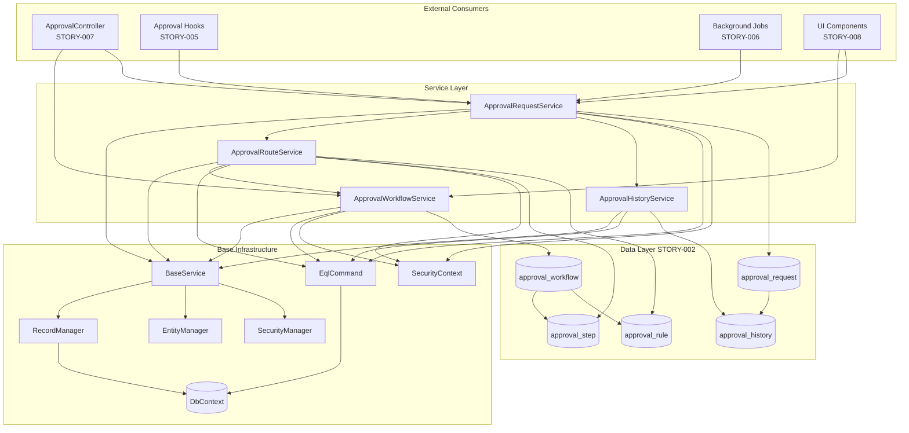

# STORY-004: Approval Service Layer

## Description

Implement the core business logic services for the WebVella ERP Approval Workflow system. This story creates four essential services that encapsulate all approval workflow operations, providing a clean separation between data access, business rules, and external interfaces.

The service layer consists of:

- **ApprovalWorkflowService**: Manages workflow lifecycle operations including creation, retrieval, updates, and deletion of approval workflow definitions. Provides methods to query workflows by target entity and enabled status.
- **ApprovalRouteService**: Implements the intelligent routing engine that evaluates field values and amount thresholds to determine the next approval step. Handles approver resolution based on role, user, or department head configurations.
- **ApprovalRequestService**: Manages the complete lifecycle of approval requests from creation through final disposition. Handles state transitions (Pending → Approved/Rejected/Escalated), delegation to alternate approvers, and request cancellation.
- **ApprovalHistoryService**: Provides comprehensive audit trail management by logging all approval actions with full context including actor, timestamp, comments, and status transitions.

All services inherit from `BaseService` (following the pattern established in `WebVella.Erp.Plugins.Project/Services/BaseService.cs`), gaining access to pre-initialized `RecordManager`, `EntityManager`, `SecurityManager`, and `EntityRelationManager` instances. Data access is performed through `RecordManager.Find()` for simple queries and `EqlCommand.Execute()` for complex queries with relation expansion.

The service layer implements robust permission checking using `SecurityContext.CurrentUser` to validate that only authorized users can perform approval actions. All state-changing operations execute within transaction scope to ensure data consistency.

## Business Value

- **Encapsulated Business Rules**: All approval logic is centralized in service classes, enabling consistent behavior across API endpoints, UI components, and background jobs. Changes to approval rules are isolated to service classes without affecting consumers.
- **Testability**: Service classes with dependency injection support enable unit testing of business logic independent of database and UI layers. Mock implementations can be substituted for integration testing.
- **Maintainability**: Clear separation of concerns allows developers to understand and modify approval behavior without navigating through controllers, hooks, or UI components. Each service has a single responsibility.
- **Reusability**: Services can be consumed by REST API controllers (STORY-007), page components (STORY-008), background jobs (STORY-006), and hooks (STORY-005) without code duplication.
- **Security Enforcement**: Centralized permission validation ensures consistent authorization checks regardless of entry point, preventing security bypass through alternative code paths.
- **Performance Optimization**: Services can implement caching strategies, batch operations, and optimized queries without impacting consumers. Query optimization is isolated to service implementation.
- **Audit Compliance**: Automatic history logging through `ApprovalHistoryService` ensures complete audit trails for regulatory compliance (SOX, GDPR) and internal governance requirements.

## Acceptance Criteria

### ApprovalWorkflowService
- [ ] **AC1**: `CreateWorkflow(name, targetEntity, createdBy)` creates a new `approval_workflow` record with auto-generated GUID, timestamps, and returns the complete workflow entity record including all fields
- [ ] **AC2**: `GetWorkflow(workflowId)` retrieves a single workflow by ID with optional `$relation` expansion to include associated `approval_step` and `approval_rule` records in a single query
- [ ] **AC3**: `GetWorkflowsForEntity(entityName)` returns all enabled workflows configured for a specific target entity, supporting multi-workflow scenarios where different workflows apply to the same entity type
- [ ] **AC4**: `UpdateWorkflow(workflowId, updateFields)` validates admin permissions, updates specified fields, and returns the updated record with proper optimistic concurrency handling
- [ ] **AC5**: `DeleteWorkflow(workflowId)` performs cascade validation to prevent deletion of workflows with pending requests, returning detailed error messages if deletion is blocked

### ApprovalRouteService
- [ ] **AC6**: `EvaluateNextStep(requestId)` analyzes the current request state, evaluates applicable routing rules against source record field values, and returns the next `approval_step` ID or null if workflow is complete
- [ ] **AC7**: `GetApproversForStep(stepId)` resolves the list of authorized approver user IDs based on step configuration (role-based returns all users in role, user-based returns specified user, department_head returns calculated department head)
- [ ] **AC8**: `DetermineRoute(recordId, entityName)` identifies the applicable workflow for a new record, evaluates all rules to determine the initial approval step, returning null if no workflow applies or record doesn't meet threshold requirements

### ApprovalRequestService
- [ ] **AC9**: `CreateRequest(sourceRecordId, sourceEntity, workflowId, initiatedBy)` creates a new `approval_request` with "pending" status, assigns to first step, and triggers initial history logging via `ApprovalHistoryService`
- [ ] **AC10**: `ApproveRequest(requestId, approverId, comments)` validates approver authorization for current step, advances request to next step (via `ApprovalRouteService`), updates status, and logs the action with full audit trail
- [ ] **AC11**: `RejectRequest(requestId, approverId, comments)` validates approver authorization, transitions status to "rejected", logs rejection with comments, and triggers notification to request creator
- [ ] **AC12**: `DelegateRequest(requestId, delegatorId, delegateToUserId, comments)` validates delegator authorization, creates delegation record, reassigns current step approver, and logs delegation action

### ApprovalHistoryService
- [ ] **AC13**: `LogApprovalAction(requestId, actionType, performedBy, comments, previousStatus, newStatus)` creates an immutable `approval_history` record with server-generated timestamp, supporting all action types (submitted, approved, rejected, escalated, delegated, recalled, commented)
- [ ] **AC14**: `GetRequestHistory(requestId)` returns all history records for a request ordered by `performed_on` descending, with user details expanded via `$user_1n_approval_history` relation

### Cross-Cutting Concerns
- [ ] **AC15**: All service methods validate user permissions using `SecurityContext.CurrentUser` before performing operations, throwing `UnauthorizedAccessException` with descriptive messages for permission failures
- [ ] **AC16**: All state-changing operations execute within `DbContext.Current.CreateConnection()` transaction scope with proper commit/rollback handling

## Technical Implementation Details

### Files/Modules to Create

| File Path | Description |
|-----------|-------------|
| `WebVella.Erp.Plugins.Approval/Services/ApprovalWorkflowService.cs` | Workflow CRUD operations and query methods |
| `WebVella.Erp.Plugins.Approval/Services/ApprovalRouteService.cs` | Routing logic and approver resolution |
| `WebVella.Erp.Plugins.Approval/Services/ApprovalRequestService.cs` | Request lifecycle management and state transitions |
| `WebVella.Erp.Plugins.Approval/Services/ApprovalHistoryService.cs` | Audit trail logging and history queries |
| `WebVella.Erp.Plugins.Approval/Model/ApprovalStatus.cs` | Enum for approval status values |
| `WebVella.Erp.Plugins.Approval/Model/ApprovalActionType.cs` | Enum for history action types |
| `WebVella.Erp.Plugins.Approval/Model/ApproverType.cs` | Enum for step approver types |

### Key Classes and Functions

#### ApprovalWorkflowService.cs

```csharp
namespace WebVella.Erp.Plugins.Approval.Services
{
    /// <summary>
    /// Service for managing approval workflow definitions.
    /// Handles CRUD operations and workflow queries.
    /// </summary>
    public class ApprovalWorkflowService : BaseService
    {
        /// <summary>
        /// Creates a new approval workflow definition
        /// </summary>
        /// <param name="name">Unique workflow name</param>
        /// <param name="targetEntity">Target entity name (e.g., "purchase_order")</param>
        /// <param name="createdBy">User ID creating the workflow</param>
        /// <returns>Complete workflow EntityRecord</returns>
        public EntityRecord CreateWorkflow(string name, string targetEntity, Guid createdBy)
        {
            ValidateAdminPermission();
            ValidateWorkflowDoesNotExist(name);
            
            var record = new EntityRecord();
            record["id"] = Guid.NewGuid();
            record["name"] = name;
            record["target_entity"] = targetEntity;
            record["is_enabled"] = true;
            record["created_on"] = DateTime.UtcNow;
            record["created_by"] = createdBy;
            
            var response = RecMan.CreateRecord("approval_workflow", record);
            if (!response.Success)
                throw new Exception($"Failed to create workflow: {response.Message}");
            
            return GetWorkflow((Guid)record["id"]);
        }

        /// <summary>
        /// Retrieves a workflow by ID with optional relation expansion
        /// </summary>
        /// <param name="workflowId">Workflow GUID</param>
        /// <param name="includeStepsAndRules">Include related steps and rules</param>
        /// <returns>Workflow EntityRecord or null if not found</returns>
        public EntityRecord GetWorkflow(Guid workflowId, bool includeStepsAndRules = false)
        {
            var fields = includeStepsAndRules 
                ? "*,$approval_workflow_approval_step.*,$approval_workflow_approval_rule.*"
                : "*";
            
            var eqlCommand = $"SELECT {fields} FROM approval_workflow WHERE id = @workflowId";
            var eqlParams = new List<EqlParameter> { new EqlParameter("workflowId", workflowId) };
            var result = new EqlCommand(eqlCommand, eqlParams).Execute();
            
            return result.Any() ? result[0] : null;
        }

        /// <summary>
        /// Gets all enabled workflows for a specific entity type
        /// </summary>
        /// <param name="entityName">Target entity name</param>
        /// <returns>List of enabled workflows</returns>
        public EntityRecordList GetWorkflowsForEntity(string entityName)
        {
            var eqlCommand = "SELECT * FROM approval_workflow WHERE target_entity = @entityName AND is_enabled = @enabled";
            var eqlParams = new List<EqlParameter> 
            {
                new EqlParameter("entityName", entityName),
                new EqlParameter("enabled", true)
            };
            return new EqlCommand(eqlCommand, eqlParams).Execute();
        }

        /// <summary>
        /// Updates workflow properties
        /// </summary>
        /// <param name="workflowId">Workflow ID</param>
        /// <param name="updateFields">Fields to update</param>
        /// <returns>Updated workflow record</returns>
        public EntityRecord UpdateWorkflow(Guid workflowId, EntityRecord updateFields)
        {
            ValidateAdminPermission();
            
            var existing = GetWorkflow(workflowId);
            if (existing == null)
                throw new Exception($"Workflow {workflowId} not found");
            
            updateFields["id"] = workflowId;
            var response = RecMan.UpdateRecord("approval_workflow", updateFields);
            if (!response.Success)
                throw new Exception($"Failed to update workflow: {response.Message}");
            
            return GetWorkflow(workflowId);
        }

        /// <summary>
        /// Deletes a workflow after validating no pending requests exist
        /// </summary>
        /// <param name="workflowId">Workflow ID to delete</param>
        /// <returns>True if deleted successfully</returns>
        public bool DeleteWorkflow(Guid workflowId)
        {
            ValidateAdminPermission();
            ValidateNoPendingRequests(workflowId);
            
            // Delete is handled by STORY-003 cascade logic
            var response = RecMan.DeleteRecord("approval_workflow", workflowId);
            return response.Success;
        }

        private void ValidateAdminPermission()
        {
            var currentUser = SecurityContext.CurrentUser;
            if (currentUser == null)
                throw new UnauthorizedAccessException("Authentication required");
            
            if (!SecurityContext.IsUserInRole(SystemIds.AdministratorRoleId))
                throw new UnauthorizedAccessException("Administrator role required for workflow management");
        }

        private void ValidateWorkflowDoesNotExist(string name)
        {
            var eqlCommand = "SELECT id FROM approval_workflow WHERE name = @name";
            var result = new EqlCommand(eqlCommand, new EqlParameter("name", name)).Execute();
            if (result.Any())
                throw new ValidationException($"Workflow with name '{name}' already exists");
        }

        private void ValidateNoPendingRequests(Guid workflowId)
        {
            var eqlCommand = "SELECT id FROM approval_request WHERE workflow_id = @workflowId AND status = @status";
            var eqlParams = new List<EqlParameter>
            {
                new EqlParameter("workflowId", workflowId),
                new EqlParameter("status", "pending")
            };
            var result = new EqlCommand(eqlCommand, eqlParams).Execute();
            if (result.Any())
                throw new InvalidOperationException($"Cannot delete workflow with {result.Count} pending requests");
        }
    }
}
```

**Source Pattern**: `WebVella.Erp.Plugins.Project/Services/TaskService.cs`

#### ApprovalRouteService.cs

```csharp
namespace WebVella.Erp.Plugins.Approval.Services
{
    /// <summary>
    /// Service for intelligent approval routing decisions.
    /// Evaluates rules and resolves approvers for workflow steps.
    /// </summary>
    public class ApprovalRouteService : BaseService
    {
        /// <summary>
        /// Evaluates routing rules to determine the next approval step
        /// </summary>
        /// <param name="requestId">Current approval request ID</param>
        /// <returns>Next step ID or null if workflow complete</returns>
        public Guid? EvaluateNextStep(Guid requestId)
        {
            var request = GetApprovalRequest(requestId);
            if (request == null)
                throw new Exception($"Request {requestId} not found");
            
            var currentStepId = (Guid?)request["current_step_id"];
            var workflowId = (Guid)request["workflow_id"];
            
            // Get current step order
            int currentOrder = 0;
            if (currentStepId.HasValue)
            {
                var currentStep = GetStep(currentStepId.Value);
                currentOrder = (int)(decimal)currentStep["step_order"];
            }
            
            // Find next step in sequence
            var nextStepEql = @"SELECT * FROM approval_step 
                               WHERE workflow_id = @workflowId AND step_order > @currentOrder 
                               ORDER BY step_order ASC";
            var nextStepParams = new List<EqlParameter>
            {
                new EqlParameter("workflowId", workflowId),
                new EqlParameter("currentOrder", currentOrder)
            };
            var nextSteps = new EqlCommand(nextStepEql, nextStepParams).Execute();
            
            // Evaluate rules to determine if next step applies
            if (nextSteps.Any())
            {
                var nextStep = nextSteps[0];
                var sourceRecordId = (Guid)request["source_record_id"];
                var sourceEntity = (string)request["source_entity"];
                
                if (StepAppliesToRecord(nextStep, sourceRecordId, sourceEntity, workflowId))
                    return (Guid)nextStep["id"];
            }
            
            return null; // Workflow complete
        }

        /// <summary>
        /// Resolves the list of user IDs authorized to approve a step
        /// </summary>
        /// <param name="stepId">Approval step ID</param>
        /// <returns>List of approver user GUIDs</returns>
        public List<Guid> GetApproversForStep(Guid stepId)
        {
            var step = GetStep(stepId);
            if (step == null)
                throw new Exception($"Step {stepId} not found");
            
            var approverType = (string)step["approver_type"];
            var thresholdConfig = (string)step["threshold_config"];
            var config = !string.IsNullOrEmpty(thresholdConfig) 
                ? JsonConvert.DeserializeObject<Dictionary<string, object>>(thresholdConfig)
                : new Dictionary<string, object>();
            
            var approvers = new List<Guid>();
            
            switch (approverType)
            {
                case "role":
                    if (config.ContainsKey("role_id"))
                    {
                        var roleId = Guid.Parse(config["role_id"].ToString());
                        approvers.AddRange(GetUsersInRole(roleId));
                    }
                    break;
                    
                case "user":
                    if (config.ContainsKey("user_id"))
                    {
                        approvers.Add(Guid.Parse(config["user_id"].ToString()));
                    }
                    break;
                    
                case "department_head":
                    // Department head logic - retrieve from org structure
                    if (config.ContainsKey("department_field"))
                    {
                        // Implementation depends on department entity structure
                        var deptField = config["department_field"].ToString();
                        // Resolve department head from department entity
                    }
                    break;
            }
            
            return approvers;
        }

        /// <summary>
        /// Determines the initial route for a new record
        /// </summary>
        /// <param name="recordId">Source record ID</param>
        /// <param name="entityName">Source entity name</param>
        /// <returns>Workflow and initial step, or null if no workflow applies</returns>
        public (Guid workflowId, Guid stepId)? DetermineRoute(Guid recordId, string entityName)
        {
            var workflowService = new ApprovalWorkflowService();
            var workflows = workflowService.GetWorkflowsForEntity(entityName);
            
            foreach (var workflow in workflows)
            {
                var workflowId = (Guid)workflow["id"];
                var firstStep = GetFirstStepForWorkflow(workflowId);
                
                if (firstStep != null && StepAppliesToRecord(firstStep, recordId, entityName, workflowId))
                {
                    return (workflowId, (Guid)firstStep["id"]);
                }
            }
            
            return null;
        }

        private EntityRecord GetApprovalRequest(Guid requestId)
        {
            var eql = "SELECT * FROM approval_request WHERE id = @requestId";
            var result = new EqlCommand(eql, new EqlParameter("requestId", requestId)).Execute();
            return result.Any() ? result[0] : null;
        }

        private EntityRecord GetStep(Guid stepId)
        {
            var eql = "SELECT * FROM approval_step WHERE id = @stepId";
            var result = new EqlCommand(eql, new EqlParameter("stepId", stepId)).Execute();
            return result.Any() ? result[0] : null;
        }

        private EntityRecord GetFirstStepForWorkflow(Guid workflowId)
        {
            var eql = "SELECT * FROM approval_step WHERE workflow_id = @workflowId ORDER BY step_order ASC";
            var result = new EqlCommand(eql, new EqlParameter("workflowId", workflowId)).Execute();
            return result.Any() ? result[0] : null;
        }

        private List<Guid> GetUsersInRole(Guid roleId)
        {
            // Query users with specified role
            var users = new List<Guid>();
            var userRecords = SecMan.GetUsers();
            foreach (var user in userRecords)
            {
                if (user.Roles.Any(r => r.Id == roleId))
                    users.Add(user.Id);
            }
            return users;
        }

        private bool StepAppliesToRecord(EntityRecord step, Guid recordId, string entityName, Guid workflowId)
        {
            // Evaluate rules for this workflow against the source record
            var rulesEql = "SELECT * FROM approval_rule WHERE workflow_id = @workflowId";
            var rules = new EqlCommand(rulesEql, new EqlParameter("workflowId", workflowId)).Execute();
            
            if (!rules.Any())
                return true; // No rules means always applies
            
            // Get source record
            var recordEql = $"SELECT * FROM {entityName} WHERE id = @recordId";
            var records = new EqlCommand(recordEql, new EqlParameter("recordId", recordId)).Execute();
            if (!records.Any())
                return false;
            
            var record = records[0];
            
            // Evaluate each rule
            foreach (var rule in rules)
            {
                var fieldName = (string)rule["field_name"];
                var op = (string)rule["operator"];
                var threshold = (decimal)rule["threshold_value"];
                
                if (!record.Properties.ContainsKey(fieldName))
                    continue;
                
                var fieldValue = Convert.ToDecimal(record[fieldName]);
                
                bool ruleMatches = op switch
                {
                    "gt" => fieldValue > threshold,
                    "gte" => fieldValue >= threshold,
                    "lt" => fieldValue < threshold,
                    "lte" => fieldValue <= threshold,
                    "eq" => fieldValue == threshold,
                    "ne" => fieldValue != threshold,
                    _ => false
                };
                
                if (ruleMatches)
                    return true;
            }
            
            return false;
        }
    }
}
```

**Source Pattern**: `WebVella.Erp.Plugins.Project/Services/TaskService.cs`

#### ApprovalRequestService.cs

```csharp
namespace WebVella.Erp.Plugins.Approval.Services
{
    /// <summary>
    /// Service for managing approval request lifecycle.
    /// Handles creation, approval, rejection, and delegation.
    /// </summary>
    public class ApprovalRequestService : BaseService
    {
        private readonly ApprovalRouteService _routeService;
        private readonly ApprovalHistoryService _historyService;

        public ApprovalRequestService()
        {
            _routeService = new ApprovalRouteService();
            _historyService = new ApprovalHistoryService();
        }

        /// <summary>
        /// Creates a new approval request for a source record
        /// </summary>
        /// <param name="sourceRecordId">ID of record requiring approval</param>
        /// <param name="sourceEntity">Entity name of source record</param>
        /// <param name="workflowId">Workflow to execute</param>
        /// <param name="initiatedBy">User initiating the request</param>
        /// <returns>Created request record</returns>
        public EntityRecord CreateRequest(Guid sourceRecordId, string sourceEntity, Guid workflowId, Guid initiatedBy)
        {
            // Validate workflow exists and is enabled
            var workflowService = new ApprovalWorkflowService();
            var workflow = workflowService.GetWorkflow(workflowId);
            if (workflow == null || !(bool)workflow["is_enabled"])
                throw new Exception("Workflow not found or not enabled");
            
            // Determine initial step
            var route = _routeService.DetermineRoute(sourceRecordId, sourceEntity);
            if (!route.HasValue)
                throw new Exception("No applicable workflow route found for this record");
            
            var requestId = Guid.NewGuid();
            var now = DateTime.UtcNow;
            
            var record = new EntityRecord();
            record["id"] = requestId;
            record["source_record_id"] = sourceRecordId;
            record["source_entity"] = sourceEntity;
            record["workflow_id"] = workflowId;
            record["current_step_id"] = route.Value.stepId;
            record["status"] = "pending";
            record["created_on"] = now;
            record["created_by"] = initiatedBy;
            
            using (var connection = DbContext.Current.CreateConnection())
            {
                try
                {
                    connection.BeginTransaction();
                    
                    var response = RecMan.CreateRecord("approval_request", record);
                    if (!response.Success)
                        throw new Exception($"Failed to create request: {response.Message}");
                    
                    // Log initial submission
                    _historyService.LogApprovalAction(
                        requestId,
                        "submitted",
                        initiatedBy,
                        "Approval request submitted",
                        null,
                        "pending"
                    );
                    
                    connection.CommitTransaction();
                }
                catch
                {
                    connection.RollbackTransaction();
                    throw;
                }
            }
            
            return GetRequest(requestId);
        }

        /// <summary>
        /// Approves an approval request at current step
        /// </summary>
        /// <param name="requestId">Request ID to approve</param>
        /// <param name="approverId">User performing approval</param>
        /// <param name="comments">Optional approval comments</param>
        /// <returns>Updated request record</returns>
        public EntityRecord ApproveRequest(Guid requestId, Guid approverId, string comments = null)
        {
            var request = GetRequest(requestId);
            if (request == null)
                throw new Exception($"Request {requestId} not found");
            
            if ((string)request["status"] != "pending")
                throw new InvalidOperationException("Can only approve pending requests");
            
            ValidateApproverAuthorization(request, approverId);
            
            var previousStatus = (string)request["status"];
            
            using (var connection = DbContext.Current.CreateConnection())
            {
                try
                {
                    connection.BeginTransaction();
                    
                    // Check for next step
                    var nextStepId = _routeService.EvaluateNextStep(requestId);
                    
                    var updateRecord = new EntityRecord();
                    updateRecord["id"] = requestId;
                    
                    string newStatus;
                    if (nextStepId.HasValue)
                    {
                        // Move to next step
                        updateRecord["current_step_id"] = nextStepId.Value;
                        newStatus = "pending";
                    }
                    else
                    {
                        // Workflow complete - fully approved
                        updateRecord["status"] = "approved";
                        newStatus = "approved";
                    }
                    
                    var response = RecMan.UpdateRecord("approval_request", updateRecord);
                    if (!response.Success)
                        throw new Exception($"Failed to update request: {response.Message}");
                    
                    // Log approval action
                    _historyService.LogApprovalAction(
                        requestId,
                        "approved",
                        approverId,
                        comments ?? "Approved",
                        previousStatus,
                        newStatus
                    );
                    
                    connection.CommitTransaction();
                }
                catch
                {
                    connection.RollbackTransaction();
                    throw;
                }
            }
            
            return GetRequest(requestId);
        }

        /// <summary>
        /// Rejects an approval request
        /// </summary>
        /// <param name="requestId">Request ID to reject</param>
        /// <param name="approverId">User performing rejection</param>
        /// <param name="comments">Required rejection reason</param>
        /// <returns>Updated request record</returns>
        public EntityRecord RejectRequest(Guid requestId, Guid approverId, string comments)
        {
            if (string.IsNullOrWhiteSpace(comments))
                throw new ArgumentException("Rejection comments are required");
            
            var request = GetRequest(requestId);
            if (request == null)
                throw new Exception($"Request {requestId} not found");
            
            if ((string)request["status"] != "pending")
                throw new InvalidOperationException("Can only reject pending requests");
            
            ValidateApproverAuthorization(request, approverId);
            
            var previousStatus = (string)request["status"];
            
            using (var connection = DbContext.Current.CreateConnection())
            {
                try
                {
                    connection.BeginTransaction();
                    
                    var updateRecord = new EntityRecord();
                    updateRecord["id"] = requestId;
                    updateRecord["status"] = "rejected";
                    
                    var response = RecMan.UpdateRecord("approval_request", updateRecord);
                    if (!response.Success)
                        throw new Exception($"Failed to update request: {response.Message}");
                    
                    // Log rejection action
                    _historyService.LogApprovalAction(
                        requestId,
                        "rejected",
                        approverId,
                        comments,
                        previousStatus,
                        "rejected"
                    );
                    
                    connection.CommitTransaction();
                }
                catch
                {
                    connection.RollbackTransaction();
                    throw;
                }
            }
            
            return GetRequest(requestId);
        }

        /// <summary>
        /// Delegates approval authority to another user
        /// </summary>
        /// <param name="requestId">Request ID to delegate</param>
        /// <param name="delegatorId">User delegating authority</param>
        /// <param name="delegateToUserId">User receiving delegation</param>
        /// <param name="comments">Optional delegation reason</param>
        /// <returns>Updated request record</returns>
        public EntityRecord DelegateRequest(Guid requestId, Guid delegatorId, Guid delegateToUserId, string comments = null)
        {
            var request = GetRequest(requestId);
            if (request == null)
                throw new Exception($"Request {requestId} not found");
            
            if ((string)request["status"] != "pending")
                throw new InvalidOperationException("Can only delegate pending requests");
            
            ValidateApproverAuthorization(request, delegatorId);
            
            // Validate delegate user exists
            var delegateUser = SecMan.GetUser(delegateToUserId);
            if (delegateUser == null)
                throw new Exception($"Delegate user {delegateToUserId} not found");
            
            using (var connection = DbContext.Current.CreateConnection())
            {
                try
                {
                    connection.BeginTransaction();
                    
                    // Log delegation action (actual delegation tracking may require additional entity)
                    _historyService.LogApprovalAction(
                        requestId,
                        "delegated",
                        delegatorId,
                        $"Delegated to user {delegateUser.Username}. {comments}",
                        "pending",
                        "pending"
                    );
                    
                    connection.CommitTransaction();
                }
                catch
                {
                    connection.RollbackTransaction();
                    throw;
                }
            }
            
            return GetRequest(requestId);
        }

        /// <summary>
        /// Retrieves an approval request by ID
        /// </summary>
        /// <param name="requestId">Request ID</param>
        /// <returns>Request EntityRecord or null</returns>
        public EntityRecord GetRequest(Guid requestId)
        {
            var eql = "SELECT * FROM approval_request WHERE id = @requestId";
            var result = new EqlCommand(eql, new EqlParameter("requestId", requestId)).Execute();
            return result.Any() ? result[0] : null;
        }

        /// <summary>
        /// Gets all pending requests for a specific user (as approver)
        /// </summary>
        /// <param name="userId">Approver user ID</param>
        /// <returns>List of pending requests</returns>
        public EntityRecordList GetPendingRequestsForUser(Guid userId)
        {
            // Get all pending requests and filter by approver authorization
            var eql = "SELECT *,$approval_request_approval_history.* FROM approval_request WHERE status = @status";
            var allPending = new EqlCommand(eql, new EqlParameter("status", "pending")).Execute();
            
            var userPending = new EntityRecordList();
            foreach (var request in allPending)
            {
                var stepId = (Guid?)request["current_step_id"];
                if (stepId.HasValue)
                {
                    var approvers = _routeService.GetApproversForStep(stepId.Value);
                    if (approvers.Contains(userId))
                        userPending.Add(request);
                }
            }
            
            return userPending;
        }

        private void ValidateApproverAuthorization(EntityRecord request, Guid userId)
        {
            var currentStepId = (Guid?)request["current_step_id"];
            if (!currentStepId.HasValue)
                throw new InvalidOperationException("Request has no current step assigned");
            
            var authorizedApprovers = _routeService.GetApproversForStep(currentStepId.Value);
            if (!authorizedApprovers.Contains(userId))
                throw new UnauthorizedAccessException($"User {userId} is not authorized to approve this request");
        }
    }
}
```

**Source Pattern**: `WebVella.Erp.Plugins.Project/Services/TaskService.cs`

#### ApprovalHistoryService.cs

```csharp
namespace WebVella.Erp.Plugins.Approval.Services
{
    /// <summary>
    /// Service for managing approval audit trail.
    /// Provides immutable logging of all approval actions.
    /// </summary>
    public class ApprovalHistoryService : BaseService
    {
        /// <summary>
        /// Logs an approval action to the audit trail
        /// </summary>
        /// <param name="requestId">Associated request ID</param>
        /// <param name="actionType">Type of action (submitted, approved, rejected, etc.)</param>
        /// <param name="performedBy">User ID who performed the action</param>
        /// <param name="comments">Optional action comments</param>
        /// <param name="previousStatus">Status before action</param>
        /// <param name="newStatus">Status after action</param>
        /// <returns>Created history record</returns>
        public EntityRecord LogApprovalAction(
            Guid requestId, 
            string actionType, 
            Guid performedBy, 
            string comments,
            string previousStatus,
            string newStatus)
        {
            var record = new EntityRecord();
            record["id"] = Guid.NewGuid();
            record["request_id"] = requestId;
            record["action_type"] = actionType;
            record["performed_by"] = performedBy;
            record["performed_on"] = DateTime.UtcNow;
            record["comments"] = comments;
            record["previous_status"] = previousStatus;
            record["new_status"] = newStatus;
            
            var response = RecMan.CreateRecord("approval_history", record);
            if (!response.Success)
                throw new Exception($"Failed to log approval action: {response.Message}");
            
            return record;
        }

        /// <summary>
        /// Retrieves complete history for an approval request
        /// </summary>
        /// <param name="requestId">Request ID</param>
        /// <returns>List of history records ordered by timestamp descending</returns>
        public EntityRecordList GetRequestHistory(Guid requestId)
        {
            var eql = @"SELECT *,$user_approval_history.username,$user_approval_history.email 
                       FROM approval_history 
                       WHERE request_id = @requestId 
                       ORDER BY performed_on DESC";
            var result = new EqlCommand(eql, new EqlParameter("requestId", requestId)).Execute();
            return result;
        }

        /// <summary>
        /// Gets all history entries for a specific user
        /// </summary>
        /// <param name="userId">User ID</param>
        /// <param name="limit">Maximum records to return</param>
        /// <returns>List of history records</returns>
        public EntityRecordList GetUserHistory(Guid userId, int limit = 100)
        {
            var eql = $@"SELECT *,$approval_request_approval_history.source_entity 
                        FROM approval_history 
                        WHERE performed_by = @userId 
                        ORDER BY performed_on DESC 
                        LIMIT {limit}";
            var result = new EqlCommand(eql, new EqlParameter("userId", userId)).Execute();
            return result;
        }

        /// <summary>
        /// Gets history entries by action type within a date range
        /// </summary>
        /// <param name="actionType">Action type to filter</param>
        /// <param name="fromDate">Start date</param>
        /// <param name="toDate">End date</param>
        /// <returns>Filtered history records</returns>
        public EntityRecordList GetHistoryByActionType(string actionType, DateTime fromDate, DateTime toDate)
        {
            var eql = @"SELECT * FROM approval_history 
                       WHERE action_type = @actionType 
                         AND performed_on >= @fromDate 
                         AND performed_on <= @toDate 
                       ORDER BY performed_on DESC";
            var eqlParams = new List<EqlParameter>
            {
                new EqlParameter("actionType", actionType),
                new EqlParameter("fromDate", fromDate),
                new EqlParameter("toDate", toDate)
            };
            return new EqlCommand(eql, eqlParams).Execute();
        }
    }
}
```

**Source Pattern**: `WebVella.Erp.Plugins.Project/Services/TaskService.cs`

### Integration Points

| Integration | Description |
|-------------|-------------|
| `BaseService` inheritance | All services inherit from `WebVella.Erp.Plugins.Project/Services/BaseService.cs` pattern providing `RecMan`, `EntMan`, `SecMan`, `RelMan` instances |
| `RecordManager` | Used for all CRUD operations on approval entities via `CreateRecord()`, `UpdateRecord()`, `DeleteRecord()`, `Find()` |
| `EqlCommand` | Used for complex queries with `$relation` expansion, filtering, and ordering |
| `SecurityContext.CurrentUser` | Provides authenticated user context for permission validation |
| `SecurityManager.GetUser()` | Validates user existence for delegation operations |
| `DbContext.Current.CreateConnection()` | Provides transaction scope for atomic operations |
| `approval_workflow` entity | Target for `ApprovalWorkflowService` CRUD operations (STORY-002) |
| `approval_step` entity | Target for routing logic in `ApprovalRouteService` (STORY-002) |
| `approval_rule` entity | Target for threshold evaluation in `ApprovalRouteService` (STORY-002) |
| `approval_request` entity | Target for `ApprovalRequestService` lifecycle management (STORY-002) |
| `approval_history` entity | Target for `ApprovalHistoryService` audit logging (STORY-002) |

### Service Interaction Diagram



### Technical Approach

1. **Create Base Service Structure**: Extend the `BaseService` pattern from `WebVella.Erp.Plugins.Project/Services/BaseService.cs` to provide pre-initialized manager instances (`RecordManager`, `EntityManager`, `SecurityManager`, `EntityRelationManager`) to all approval services.

2. **Implement ApprovalWorkflowService**: 
   - Create CRUD methods (`CreateWorkflow`, `GetWorkflow`, `UpdateWorkflow`, `DeleteWorkflow`) using `RecordManager` for entity operations
   - Implement `GetWorkflowsForEntity` using `EqlCommand` with parameterized queries
   - Add validation for duplicate workflow names and cascade deletion constraints
   - Validate administrator role using `SecurityContext.CurrentUser`

3. **Implement ApprovalRouteService**:
   - Create `EvaluateNextStep` method that queries current step order and finds next applicable step
   - Implement threshold rule evaluation using `EqlCommand` to retrieve source record field values
   - Create `GetApproversForStep` that resolves user IDs based on `approver_type` configuration
   - Handle three approver types: role-based (query users by role), user-based (return specific user), department_head (resolve from org structure)

4. **Implement ApprovalRequestService**:
   - Create `CreateRequest` that initializes request with "pending" status and first step assignment
   - Implement `ApproveRequest` that validates authorization, advances to next step (or completes), and logs action
   - Implement `RejectRequest` that transitions to "rejected" status with required comments
   - Implement `DelegateRequest` that records delegation in history
   - All state changes wrapped in `DbContext.Current.CreateConnection()` transaction

5. **Implement ApprovalHistoryService**:
   - Create immutable `LogApprovalAction` method called by all request state changes
   - Implement `GetRequestHistory` with `$relation` expansion for user details
   - Support all action types: submitted, approved, rejected, escalated, delegated, recalled, commented

6. **Error Handling Strategy**:
   - Throw `UnauthorizedAccessException` for permission failures with descriptive messages
   - Throw `InvalidOperationException` for invalid state transitions
   - Throw `ValidationException` for input validation failures (from `WebVella.Erp.Exceptions`)
   - Wrap all state changes in try/catch with transaction rollback

7. **Performance Optimization**:
   - Use `EqlCommand` with specific field selection instead of `SELECT *` where possible
   - Implement workflow caching for frequently accessed workflow definitions
   - Use relation expansion (`$relation`) to minimize round trips for related data

## Dependencies

| Story ID | Dependency Description |
|----------|----------------------|
| STORY-001 | Requires `WebVella.Erp.Plugins.Approval` plugin infrastructure with `BaseService` pattern and project structure |
| STORY-002 | Requires all five approval entities (`approval_workflow`, `approval_step`, `approval_rule`, `approval_request`, `approval_history`) with proper fields and relations |
| STORY-003 | Leverages `WorkflowConfigService`, `StepConfigService`, and `RuleConfigService` for configuration validation and retrieval |

## Effort Estimate

**8 Story Points**

### Justification:
- **High complexity**: Four interrelated services with complex business logic
- **Routing engine**: `ApprovalRouteService` requires sophisticated rule evaluation and approver resolution
- **State machine**: `ApprovalRequestService` implements full lifecycle with state transitions
- **Integration surface**: Services integrate with 5 entities, security context, and configuration services
- **Transaction management**: All state changes require proper transaction handling
- **Testing requirements**: Each service needs unit tests for business logic validation

### Effort Breakdown:
| Component | Estimated Effort |
|-----------|------------------|
| ApprovalWorkflowService | 1.5 points |
| ApprovalRouteService | 2.5 points |
| ApprovalRequestService | 2.5 points |
| ApprovalHistoryService | 1 point |
| Integration testing | 0.5 points |

## Labels

`workflow` `approval` `backend` `services` `business-logic`

## Related Files

| File | Relevance |
|------|-----------|
| `WebVella.Erp.Plugins.Project/Services/TaskService.cs` | Primary pattern reference for service implementation |
| `WebVella.Erp.Plugins.Project/Services/BaseService.cs` | Base service class pattern to inherit from |
| `WebVella.Erp/Api/SecurityContext.cs` | Security context for permission validation |
| `WebVella.Erp/Api/RecordManager.cs` | Record CRUD operations |
| `WebVella.Erp/Eql/EqlCommand.cs` | EQL query execution |
| `WebVella.Erp/Api/Models/EntityRecord.cs` | Entity record model |
| `WebVella.Erp/Exceptions/ValidationException.cs` | Validation exception type |
| `WebVella.Erp/Database/DbContext.cs` | Database transaction management |

## Notes

- Services should be registered with dependency injection in `ApprovalPlugin.Initialize()` if DI container is used
- Consider implementing `IApprovalWorkflowService`, `IApprovalRouteService`, etc. interfaces for testability
- Background job integration (STORY-006) will call `ApprovalRequestService` for escalation processing
- API controllers (STORY-007) will expose service methods as REST endpoints
- UI components (STORY-008) will consume services through API layer
