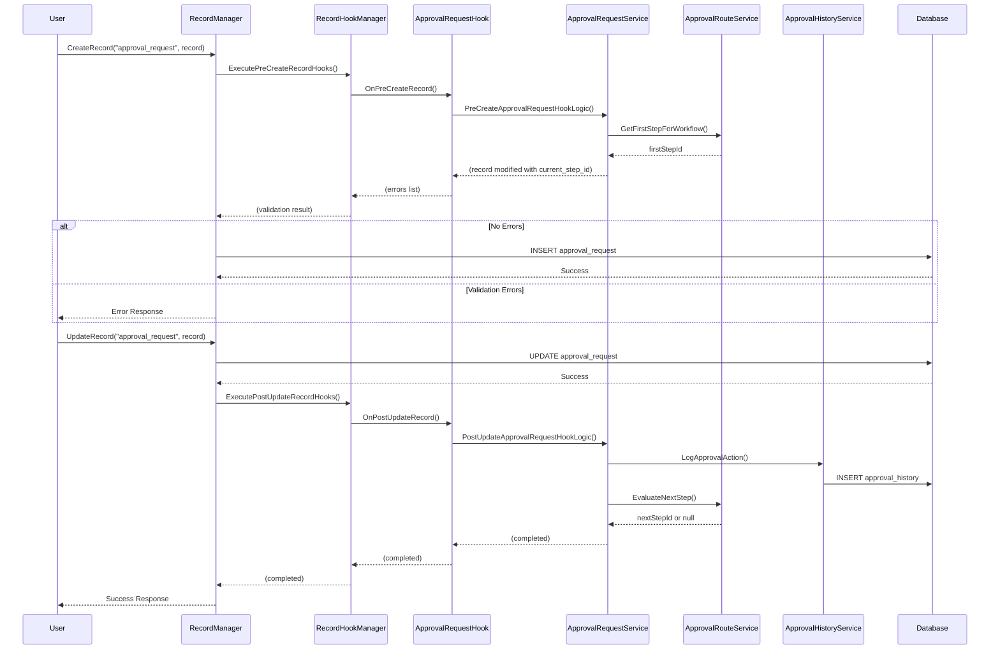
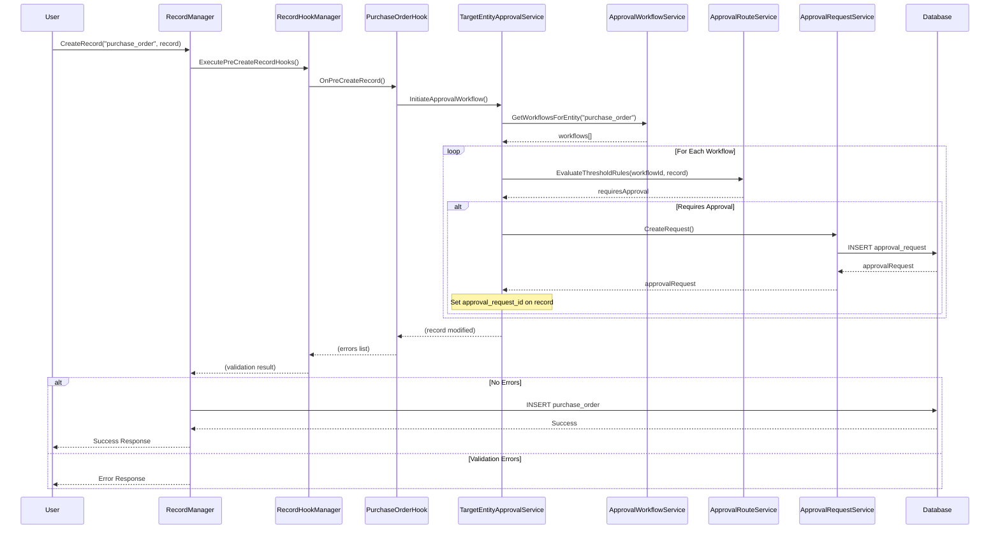

# STORY-005: Approval Hooks Integration

## Description

Implement pre/post record hooks for the WebVella ERP Approval Workflow system that enable automated workflow triggering and state change event handling. This story creates hook classes that intercept entity record operations and delegate to the approval service layer for business logic execution.

The hook integration layer consists of three primary hook classes:

- **ApprovalRequestCreateHook**: Implements `IErpPreCreateRecordHook` for the `approval_request` entity. Intercepts new approval request creation to initialize workflow routing by evaluating the first approval step and assigning initial approvers. Validates request data before persistence and can add validation errors to prevent creation if requirements are not met.

- **ApprovalRequestUpdateHook**: Implements `IErpPostUpdateRecordHook` for the `approval_request` entity. Fires after approval request updates to trigger downstream actions such as notification dispatch, history logging, and workflow progression. Detects status transitions (e.g., Pending → Approved) and initiates appropriate follow-up actions.

- **TargetEntityApprovalHook**: Implements `IErpPreCreateRecordHook` for configurable target entities (`purchase_order`, `expense_request`). Automatically initiates approval workflows when new records requiring approval are created. Evaluates applicable workflows and creates corresponding `approval_request` records when threshold conditions are met.

All hooks follow the WebVella ERP hook pattern established in `WebVella.Erp.Plugins.Project/Hooks/Api/Task.cs`:
- Hooks are stateless classes decorated with `[HookAttachment("entity_name")]` attribute
- Business logic is delegated to service layer classes (from STORY-004)
- Hooks do not perform direct database operations
- Error handling uses the `List<ErrorModel> errors` parameter for pre-hooks
- Priority can be specified via `[HookAttachment("entity_name", priority)]` for execution ordering

The hook system is automatically discovered and registered by `HookManager` at application startup through assembly scanning. Hooks are invoked by `RecordHookManager` during entity record CRUD operations, providing extension points for cross-cutting concerns without modifying core entity management code.

## Business Value

- **Automated Workflow Initiation**: Target entity hooks automatically create approval requests when new records meet threshold criteria, eliminating manual workflow initiation and ensuring consistent application of approval policies across the organization.

- **Consistent State Transitions**: Post-update hooks ensure that every approval state change triggers appropriate follow-up actions (notifications, history logging, next step assignment), preventing incomplete state transitions and orphaned requests.

- **Event-Driven Architecture**: Hook-based design decouples approval workflow logic from entity management, enabling the approval system to respond to events without tight coupling to source entity implementations. New entity types can be added to approval workflows without modifying existing code.

- **Validation Enforcement**: Pre-create hooks validate approval request data before persistence, ensuring data integrity and preventing invalid workflow states. Validation errors are surfaced through the standard WebVella error handling mechanism.

- **Extensibility**: The hook pattern allows additional approval-related behaviors to be added incrementally (e.g., Slack notifications, external system synchronization) without modifying existing hook implementations.

- **Audit Trail Integrity**: Post-update hooks guarantee that all state changes are logged to the approval history, maintaining complete audit trails for compliance requirements (SOX, GDPR, internal governance).

- **Performance Optimization**: Hooks execute synchronously within the transaction boundary, ensuring atomic operations while keeping approval logic separate from core entity operations. Long-running tasks (notifications) are queued for background processing.

## Acceptance Criteria

### ApprovalRequestCreateHook
- [ ] **AC1**: Hook is decorated with `[HookAttachment("approval_request")]` attribute and implements `IErpPreCreateRecordHook` interface, automatically discovered by `HookManager` during application startup
- [ ] **AC2**: `OnPreCreateRecord()` validates that required fields (`source_record_id`, `source_entity`, `workflow_id`) are present, adding `ErrorModel` entries to the `errors` list for any missing fields, preventing record creation when validation fails
- [ ] **AC3**: `OnPreCreateRecord()` calls `ApprovalRouteService.DetermineRoute()` to evaluate the first approval step, setting `current_step_id` on the record before creation
- [ ] **AC4**: `OnPreCreateRecord()` validates that the specified `workflow_id` exists and is enabled, adding validation error if workflow is disabled or not found
- [ ] **AC5**: Hook execution completes within 100ms for typical workflows, delegating long-running operations to background jobs via queue

### ApprovalRequestUpdateHook
- [ ] **AC6**: Hook is decorated with `[HookAttachment("approval_request")]` attribute and implements `IErpPostUpdateRecordHook` interface
- [ ] **AC7**: `OnPostUpdateRecord()` detects status field changes by comparing previous and current status values, triggering notification dispatch only when status actually changes
- [ ] **AC8**: `OnPostUpdateRecord()` calls `ApprovalHistoryService.LogApprovalAction()` to create audit trail entries for all status transitions, including actor, timestamp, and comments
- [ ] **AC9**: `OnPostUpdateRecord()` calls `ApprovalRouteService.EvaluateNextStep()` when status changes to "approved" to determine and assign the next approval step, or mark workflow as complete if no more steps exist
- [ ] **AC10**: When final approval is granted (no next step), hook updates source entity record with approval status through entity-specific integration

### TargetEntityApprovalHook
- [ ] **AC11**: Separate hook classes exist for `purchase_order` and `expense_request` entities, each with appropriate `[HookAttachment]` decoration implementing `IErpPreCreateRecordHook`
- [ ] **AC12**: `OnPreCreateRecord()` queries `ApprovalWorkflowService.GetWorkflowsForEntity()` to find applicable workflows for the entity type
- [ ] **AC13**: `OnPreCreateRecord()` evaluates amount threshold rules against record field values (e.g., `total_amount`, `expense_amount`) to determine if approval is required
- [ ] **AC14**: When approval is required, hook calls `ApprovalRequestService.CreateRequest()` to create a linked approval request, setting the request ID on the source record for tracking
- [ ] **AC15**: When no workflows apply or thresholds are not met, hook allows record creation to proceed without approval workflow initiation

### Cross-Cutting Concerns
- [ ] **AC16**: All hooks are stateless and create new service instances per invocation (following `new TaskService()` pattern), ensuring thread safety and isolation
- [ ] **AC17**: All hooks handle exceptions gracefully, logging errors via standard logging mechanism and either adding to `errors` list (pre-hooks) or failing silently with logging (post-hooks)
- [ ] **AC18**: Hook priority is set appropriately (default 10) to ensure correct execution order when multiple hooks target the same entity

## Technical Implementation Details

### Files/Modules to Create

| File Path | Description |
|-----------|-------------|
| `WebVella.Erp.Plugins.Approval/Hooks/Api/ApprovalRequest.cs` | Combined pre-create and post-update hooks for `approval_request` entity |
| `WebVella.Erp.Plugins.Approval/Hooks/Api/PurchaseOrderApproval.cs` | Pre-create hook for `purchase_order` entity workflow initiation |
| `WebVella.Erp.Plugins.Approval/Hooks/Api/ExpenseRequestApproval.cs` | Pre-create hook for `expense_request` entity workflow initiation |

### Key Classes and Functions

#### ApprovalRequest.cs (Approval Request Hooks)

```csharp
using System;
using System.Collections.Generic;
using WebVella.Erp.Api.Models;
using WebVella.Erp.Hooks;
using WebVella.Erp.Plugins.Approval.Services;

namespace WebVella.Erp.Plugins.Approval.Hooks.Api
{
    /// <summary>
    /// Pre-create and post-update hooks for the approval_request entity.
    /// Handles workflow initialization and state change events.
    /// </summary>
    /// <remarks>
    /// Source Pattern: WebVella.Erp.Plugins.Project/Hooks/Api/Task.cs
    /// </remarks>
    [HookAttachment("approval_request")]
    public class ApprovalRequest : IErpPreCreateRecordHook, IErpPostUpdateRecordHook
    {
        /// <summary>
        /// Intercepts approval request creation to initialize workflow routing.
        /// Validates required fields and assigns initial approval step.
        /// </summary>
        /// <param name="entityName">Entity name ("approval_request")</param>
        /// <param name="record">Record being created with field values</param>
        /// <param name="errors">Error collection for validation failures</param>
        public void OnPreCreateRecord(string entityName, EntityRecord record, List<ErrorModel> errors)
        {
            new ApprovalRequestService().PreCreateApprovalRequestHookLogic(entityName, record, errors);
        }

        /// <summary>
        /// Fires after approval request updates to trigger downstream actions.
        /// Handles notification dispatch, history logging, and workflow progression.
        /// </summary>
        /// <param name="entityName">Entity name ("approval_request")</param>
        /// <param name="record">Updated record with new field values</param>
        public void OnPostUpdateRecord(string entityName, EntityRecord record)
        {
            new ApprovalRequestService().PostUpdateApprovalRequestHookLogic(entityName, record);
        }
    }
}
```

#### PurchaseOrderApproval.cs (Purchase Order Hook)

```csharp
using System;
using System.Collections.Generic;
using WebVella.Erp.Api.Models;
using WebVella.Erp.Hooks;
using WebVella.Erp.Plugins.Approval.Services;

namespace WebVella.Erp.Plugins.Approval.Hooks.Api
{
    /// <summary>
    /// Pre-create hook for purchase_order entity to initiate approval workflows.
    /// Evaluates threshold rules and creates approval requests when required.
    /// </summary>
    /// <remarks>
    /// Source Pattern: WebVella.Erp.Plugins.Project/Hooks/Api/Task.cs
    /// </remarks>
    [HookAttachment("purchase_order")]
    public class PurchaseOrderApproval : IErpPreCreateRecordHook
    {
        /// <summary>
        /// Intercepts purchase order creation to evaluate approval requirements.
        /// Creates linked approval_request when workflow thresholds are met.
        /// </summary>
        /// <param name="entityName">Entity name ("purchase_order")</param>
        /// <param name="record">Purchase order record being created</param>
        /// <param name="errors">Error collection for validation failures</param>
        public void OnPreCreateRecord(string entityName, EntityRecord record, List<ErrorModel> errors)
        {
            new TargetEntityApprovalService().InitiateApprovalWorkflow(entityName, record, errors);
        }
    }
}
```

#### ExpenseRequestApproval.cs (Expense Request Hook)

```csharp
using System;
using System.Collections.Generic;
using WebVella.Erp.Api.Models;
using WebVella.Erp.Hooks;
using WebVella.Erp.Plugins.Approval.Services;

namespace WebVella.Erp.Plugins.Approval.Hooks.Api
{
    /// <summary>
    /// Pre-create hook for expense_request entity to initiate approval workflows.
    /// Evaluates threshold rules and creates approval requests when required.
    /// </summary>
    /// <remarks>
    /// Source Pattern: WebVella.Erp.Plugins.Project/Hooks/Api/Task.cs
    /// </remarks>
    [HookAttachment("expense_request")]
    public class ExpenseRequestApproval : IErpPreCreateRecordHook
    {
        /// <summary>
        /// Intercepts expense request creation to evaluate approval requirements.
        /// Creates linked approval_request when workflow thresholds are met.
        /// </summary>
        /// <param name="entityName">Entity name ("expense_request")</param>
        /// <param name="record">Expense request record being created</param>
        /// <param name="errors">Error collection for validation failures</param>
        public void OnPreCreateRecord(string entityName, EntityRecord record, List<ErrorModel> errors)
        {
            new TargetEntityApprovalService().InitiateApprovalWorkflow(entityName, record, errors);
        }
    }
}
```

### Service Layer Methods (Called by Hooks)

The following methods must be implemented in the service layer (STORY-004) to support hook operations:

#### ApprovalRequestService Extensions

```csharp
/// <summary>
/// Hook logic for pre-create approval request validation and initialization.
/// </summary>
/// <param name="entityName">Entity name</param>
/// <param name="record">Record being created</param>
/// <param name="errors">Error collection</param>
public void PreCreateApprovalRequestHookLogic(string entityName, EntityRecord record, List<ErrorModel> errors)
{
    // Validate required fields
    if (!record.Properties.ContainsKey("source_record_id") || record["source_record_id"] == null)
    {
        errors.Add(new ErrorModel("source_record_id", "source_record_id", "Source record ID is required"));
    }
    
    if (!record.Properties.ContainsKey("source_entity") || string.IsNullOrEmpty(record["source_entity"]?.ToString()))
    {
        errors.Add(new ErrorModel("source_entity", "source_entity", "Source entity is required"));
    }
    
    if (!record.Properties.ContainsKey("workflow_id") || record["workflow_id"] == null)
    {
        errors.Add(new ErrorModel("workflow_id", "workflow_id", "Workflow ID is required"));
    }
    
    if (errors.Count > 0) return;
    
    // Validate workflow exists and is enabled
    var workflowId = (Guid)record["workflow_id"];
    var workflow = new ApprovalWorkflowService().GetWorkflow(workflowId);
    if (workflow == null)
    {
        errors.Add(new ErrorModel("workflow_id", "workflow_id", $"Workflow {workflowId} not found"));
        return;
    }
    
    if (!(bool)workflow["is_enabled"])
    {
        errors.Add(new ErrorModel("workflow_id", "workflow_id", "Workflow is disabled"));
        return;
    }
    
    // Determine initial step
    var routeService = new ApprovalRouteService();
    var firstStepId = routeService.GetFirstStepForWorkflow(workflowId);
    if (firstStepId.HasValue)
    {
        record["current_step_id"] = firstStepId.Value;
    }
    
    // Set initial status
    if (!record.Properties.ContainsKey("status") || record["status"] == null)
    {
        record["status"] = "pending";
    }
    
    // Set creation timestamp
    if (!record.Properties.ContainsKey("created_on") || record["created_on"] == null)
    {
        record["created_on"] = DateTime.UtcNow;
    }
}

/// <summary>
/// Hook logic for post-update approval request state transitions.
/// </summary>
/// <param name="entityName">Entity name</param>
/// <param name="record">Updated record</param>
public void PostUpdateApprovalRequestHookLogic(string entityName, EntityRecord record)
{
    try
    {
        var requestId = (Guid)record["id"];
        var currentStatus = record["status"]?.ToString();
        
        // Log the status change to history
        var historyService = new ApprovalHistoryService();
        historyService.LogApprovalAction(
            requestId: requestId,
            actionType: GetActionTypeFromStatus(currentStatus),
            performedBy: GetCurrentUserId(),
            comments: record["last_action_comments"]?.ToString(),
            previousStatus: record["previous_status"]?.ToString(),
            newStatus: currentStatus
        );
        
        // If approved, evaluate next step
        if (currentStatus == "approved")
        {
            var routeService = new ApprovalRouteService();
            var nextStepId = routeService.EvaluateNextStep(requestId);
            
            if (nextStepId.HasValue)
            {
                // More steps remain - update to next step
                UpdateRequestToNextStep(requestId, nextStepId.Value);
            }
            else
            {
                // Workflow complete - update source entity approval status
                MarkSourceEntityApproved(record);
            }
        }
        else if (currentStatus == "rejected")
        {
            // Workflow terminated - update source entity rejection status
            MarkSourceEntityRejected(record);
        }
        
        // Queue notification for status change (processed by STORY-006 job)
        QueueApprovalNotification(requestId, currentStatus);
    }
    catch (Exception ex)
    {
        // Log error but don't throw - post-hooks should not block
        System.Diagnostics.Debug.WriteLine($"Error in PostUpdateApprovalRequestHookLogic: {ex.Message}");
    }
}
```

#### TargetEntityApprovalService

```csharp
namespace WebVella.Erp.Plugins.Approval.Services
{
    /// <summary>
    /// Service handling approval workflow initiation for target entities.
    /// </summary>
    public class TargetEntityApprovalService : BaseService
    {
        /// <summary>
        /// Evaluates and initiates approval workflow for a target entity record.
        /// </summary>
        /// <param name="entityName">Target entity name (e.g., "purchase_order")</param>
        /// <param name="record">Entity record being created</param>
        /// <param name="errors">Error collection for validation failures</param>
        public void InitiateApprovalWorkflow(string entityName, EntityRecord record, List<ErrorModel> errors)
        {
            try
            {
                // Find applicable workflows for this entity
                var workflowService = new ApprovalWorkflowService();
                var workflows = workflowService.GetWorkflowsForEntity(entityName);
                
                if (workflows == null || workflows.Count == 0)
                {
                    // No workflows configured - allow creation without approval
                    return;
                }
                
                foreach (EntityRecord workflow in workflows)
                {
                    var workflowId = (Guid)workflow["id"];
                    
                    // Evaluate threshold rules
                    var routeService = new ApprovalRouteService();
                    var requiresApproval = routeService.EvaluateThresholdRules(workflowId, record);
                    
                    if (requiresApproval)
                    {
                        // Create approval request
                        var requestService = new ApprovalRequestService();
                        var recordId = record.Properties.ContainsKey("id") 
                            ? (Guid)record["id"] 
                            : Guid.NewGuid();
                        
                        // Ensure record has ID for linking
                        if (!record.Properties.ContainsKey("id"))
                        {
                            record["id"] = recordId;
                        }
                        
                        var approvalRequest = requestService.CreateRequest(
                            sourceRecordId: recordId,
                            sourceEntity: entityName,
                            workflowId: workflowId,
                            initiatedBy: GetCurrentUserId()
                        );
                        
                        // Store approval request reference on source record
                        record["approval_request_id"] = approvalRequest["id"];
                        record["approval_status"] = "pending";
                        
                        // Only one workflow should apply per record
                        break;
                    }
                }
            }
            catch (Exception ex)
            {
                errors.Add(new ErrorModel("approval", "approval", 
                    $"Failed to initiate approval workflow: {ex.Message}"));
            }
        }
        
        private Guid GetCurrentUserId()
        {
            return SecurityContext.CurrentUser?.Id ?? Guid.Empty;
        }
    }
}
```

### Integration Points

| Integration Point | Description | Direction |
|-------------------|-------------|-----------|
| `HookManager.GetHookedInstances<T>()` | Discovers hooks during startup via assembly scanning | Framework → Hooks |
| `RecordHookManager.ExecutePreCreateRecordHooks()` | Invokes pre-create hooks before record insertion | Framework → Hooks |
| `RecordHookManager.ExecutePostUpdateRecordHooks()` | Invokes post-update hooks after record modification | Framework → Hooks |
| `ApprovalWorkflowService.GetWorkflowsForEntity()` | Queries applicable workflows | Hook → Service (STORY-004) |
| `ApprovalRouteService.EvaluateNextStep()` | Determines next approval step | Hook → Service (STORY-004) |
| `ApprovalRouteService.DetermineRoute()` | Evaluates initial routing | Hook → Service (STORY-004) |
| `ApprovalRequestService.CreateRequest()` | Creates new approval request records | Hook → Service (STORY-004) |
| `ApprovalHistoryService.LogApprovalAction()` | Records audit trail entries | Hook → Service (STORY-004) |
| `ProcessApprovalNotificationsJob` | Processes queued notifications | Hook → Job (STORY-006) |

### Technical Approach

#### Hook Discovery and Registration

WebVella ERP automatically discovers hook classes through assembly scanning at application startup. The `HookManager` class scans all loaded assemblies for classes implementing hook interfaces (`IErpPreCreateRecordHook`, `IErpPostUpdateRecordHook`, etc.) and indexes them by entity name using the `[HookAttachment]` attribute.

```
Source: WebVella.Erp/Hooks/HookManager.cs
```

The `RecordHookManager` class provides entity-specific hook execution during CRUD operations:

```csharp
// Executed by RecordManager.CreateRecord() before insertion
RecordHookManager.ExecutePreCreateRecordHooks(entityName, record, errors);

// Executed by RecordManager.UpdateRecord() after modification  
RecordHookManager.ExecutePostUpdateRecordHooks(entityName, record);
```

```
Source: WebVella.Erp/Hooks/RecordHookManager.cs:32-75
```

#### Hook Execution Flow



#### Target Entity Hook Flow



#### Error Handling Strategy

**Pre-Create Hooks:**
- Validation failures add `ErrorModel` entries to the `errors` list
- Non-empty error list prevents record creation
- User receives validation errors in response

**Post-Update Hooks:**
- Exceptions are caught and logged
- Hook failures do not rollback the completed database update
- Errors are logged for monitoring and troubleshooting
- Critical operations (history logging) should have retry mechanisms

#### Thread Safety

Hooks are instantiated per-invocation (using `new Service()` pattern), ensuring:
- No shared state between concurrent hook executions
- Thread-safe service layer operations
- Isolation of transaction scopes

```
Source Pattern: WebVella.Erp.Plugins.Project/Hooks/Api/Task.cs:11-29
```

### Hook Interface Contracts

#### IErpPreCreateRecordHook

```csharp
/// <summary>
/// Provide hook for point in code before entity record create.
/// </summary>
public interface IErpPreCreateRecordHook 
{
    /// <summary>
    /// Called before a record is created in the database.
    /// </summary>
    /// <param name="entityName">Name of the entity being created</param>
    /// <param name="record">Record data to be inserted (can be modified)</param>
    /// <param name="errors">Error collection - add errors to prevent creation</param>
    void OnPreCreateRecord(string entityName, EntityRecord record, List<ErrorModel> errors);
}
```

```
Source: WebVella.Erp/Hooks/IErpPreCreateRecordHook.cs:7-10
```

#### IErpPostUpdateRecordHook

```csharp
/// <summary>
/// Provide hook for point in code after entity record is updated.
/// </summary>
public interface IErpPostUpdateRecordHook
{
    /// <summary>
    /// Called after a record is updated in the database.
    /// </summary>
    /// <param name="entityName">Name of the entity that was updated</param>
    /// <param name="record">Updated record data</param>
    void OnPostUpdateRecord(string entityName, EntityRecord record);
}
```

```
Source: WebVella.Erp/Hooks/IErpPostUpdateRecordHook.cs:7-9
```

#### HookAttachmentAttribute

```csharp
/// <summary>
/// Attribute to specify which entity a hook class is attached to.
/// </summary>
[AttributeUsage(AttributeTargets.Class, AllowMultiple = false)]
public class HookAttachmentAttribute : Attribute
{
    /// <summary>
    /// Entity name key (e.g., "approval_request", "purchase_order")
    /// </summary>
    public string Key { get; private set; }
    
    /// <summary>
    /// Execution priority (lower values execute first, default 10)
    /// </summary>
    public int Priority { get; private set; }

    public HookAttachmentAttribute(string key = "", int priority = 10)
    {
        Key = key;
        Priority = priority;
    }
}
```

```
Source: WebVella.Erp/Hooks/HookAttachmentAttribute.cs:6-17
```

## Dependencies

| Story ID | Dependency Description |
|----------|----------------------|
| STORY-004 | **Approval Service Layer** - Hooks delegate business logic to service classes including `ApprovalWorkflowService`, `ApprovalRouteService`, `ApprovalRequestService`, and `ApprovalHistoryService`. All hook methods call service layer methods rather than performing direct database operations. |

## Effort Estimate

**5 Story Points**

**Rationale:**
- Medium complexity implementation building on established WebVella hook patterns
- Three hook classes with straightforward delegation to service layer
- Primary development effort is in service method implementations (covered in STORY-004)
- Well-defined interfaces and clear integration points
- Testing requires integration with entity operations and service layer
- Familiar patterns from existing `WebVella.Erp.Plugins.Project/Hooks/Api/Task.cs` implementation

**Breakdown:**
| Task | Effort |
|------|--------|
| ApprovalRequest hook implementation | 1 point |
| PurchaseOrderApproval hook implementation | 1 point |
| ExpenseRequestApproval hook implementation | 1 point |
| Service layer hook support methods | 1 point |
| Integration testing and validation | 1 point |

## Labels

`workflow`, `approval`, `backend`, `hooks`, `events`

---

## Additional Technical Notes

### Folder Structure

```
WebVella.Erp.Plugins.Approval/
├── Hooks/
│   └── Api/
│       ├── ApprovalRequest.cs          # approval_request pre-create and post-update hooks
│       ├── PurchaseOrderApproval.cs    # purchase_order pre-create hook
│       └── ExpenseRequestApproval.cs   # expense_request pre-create hook
```

### Configuration Considerations

**Adding New Target Entities:**

To add approval workflow support for additional entity types:

1. Create a new hook class in `Hooks/Api/` folder
2. Decorate with `[HookAttachment("entity_name")]`
3. Implement `IErpPreCreateRecordHook`
4. Call `TargetEntityApprovalService.InitiateApprovalWorkflow()`

Example for a new `invoice` entity:

```csharp
[HookAttachment("invoice")]
public class InvoiceApproval : IErpPreCreateRecordHook
{
    public void OnPreCreateRecord(string entityName, EntityRecord record, List<ErrorModel> errors)
    {
        new TargetEntityApprovalService().InitiateApprovalWorkflow(entityName, record, errors);
    }
}
```

### Testing Strategy

**Unit Testing:**
- Mock `ApprovalWorkflowService`, `ApprovalRouteService`, `ApprovalRequestService`
- Verify hook methods call correct service methods with expected parameters
- Test validation logic in isolation

**Integration Testing:**
- Create test entities and verify hooks are triggered
- Validate approval request creation on target entity creation
- Verify history logging on status updates
- Test error scenarios and validation failures

**Manual Testing Checklist:**
- [ ] Create purchase order above threshold - approval request created
- [ ] Create purchase order below threshold - no approval request
- [ ] Approve approval request - history logged, next step assigned
- [ ] Reject approval request - history logged, workflow terminated
- [ ] Create approval request with missing fields - validation errors returned
