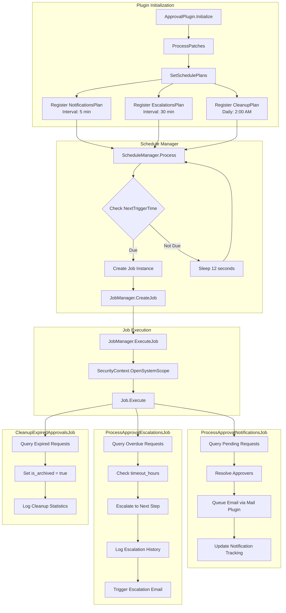

# STORY-006: Notification and Escalation Background Jobs

## Description

Implement scheduled background jobs for the WebVella ERP Approval Workflow system that handle automated notifications, escalation of overdue approvals, and cleanup of expired approval requests. This story creates three essential background jobs that ensure timely communication with approvers, enforcement of approval SLAs, and maintenance of system hygiene.

The background job layer consists of three primary job classes:

- **ProcessApprovalNotificationsJob**: Executes every 5 minutes to identify pending approval requests requiring notification and dispatches email reminders to assigned approvers. Integrates with `SmtpInternalService` from `WebVella.Erp.Plugins.Mail` to queue outbound emails. Tracks notification history to prevent duplicate sends and implements configurable notification intervals (initial notification, first reminder, final reminder before escalation).

- **ProcessApprovalEscalationsJob**: Executes every 30 minutes to identify approval requests that have exceeded their configured timeout period. Evaluates the `timeout_hours` field on the current `approval_step` entity record and automatically escalates overdue requests to the next level approver or designated escalation contact. Updates approval history with escalation action and triggers escalation notifications.

- **CleanupExpiredApprovalsJob**: Executes daily to archive completed, rejected, or cancelled approval requests older than the configured retention period. Moves historical records to an archive table (or marks as archived) to maintain database performance while preserving audit trail data for compliance requirements.

All jobs follow the WebVella ERP job pattern established in `WebVella.Erp.Plugins.Mail/Jobs/ProcessSmtpQueueJob.cs`:
- Jobs are decorated with `[Job(GUID, Name, allowSingleInstance, priority)]` attribute for registration
- Jobs inherit from the `ErpJob` base class and override `Execute(JobContext context)`
- All operations execute within `SecurityContext.OpenSystemScope()` for system-level permissions
- Jobs are stateless and idempotent, safely handling concurrent execution and crash recovery
- Schedule plans are registered in `ApprovalPlugin.SetSchedulePlans()` during plugin initialization

The job system is managed by `JobManager` and `ScheduleManager` (note: source uses `SheduleManager` spelling), which handle job scheduling, execution tracking, and failure retry logic. Jobs are automatically discovered through assembly scanning of classes with the `JobAttribute` decoration.

## Business Value

- **Timely Approver Notifications**: Automated email notifications ensure approvers are promptly informed of pending requests, reducing approval cycle times and preventing workflow bottlenecks. Configurable reminder intervals keep approvals top-of-mind without excessive notification fatigue.

- **SLA Enforcement Through Escalation**: Automatic escalation of overdue approvals ensures that time-sensitive requests (purchase orders, expense claims) are not blocked indefinitely by unresponsive approvers. Business-critical processes continue to flow even when individual approvers are unavailable.

- **Operational Visibility**: Notification and escalation history provides management visibility into approval workflow health, identifying patterns of delay and bottlenecks for process improvement initiatives.

- **System Performance and Hygiene**: Regular cleanup of archived approval records prevents database bloat, maintaining query performance as the approval system scales. Separation of active and historical data enables optimized indexing strategies.

- **Compliance and Audit Trail Preservation**: Even as records are cleaned up or archived, complete audit trails are preserved in compliance with regulatory requirements (SOX, GDPR internal controls). Archive operations are themselves logged for auditability.

- **Reduced Manual Intervention**: Automated job execution eliminates the need for manual follow-up on pending approvals, freeing administrative staff for higher-value activities. Escalation paths are pre-configured and execute automatically.

- **Configurable Business Rules**: Job behavior is configurable through plugin settings, allowing organizations to tune notification frequency, escalation thresholds, and retention periods to match their specific business requirements without code changes.

## Acceptance Criteria

### ProcessApprovalNotificationsJob
- [ ] **AC1**: Job class is decorated with `[Job("guid-here", "Process Approval Notifications", true, JobPriority.Low)]` attribute and inherits from `ErpJob`, automatically discovered by `JobManager` during application startup
- [ ] **AC2**: `Execute(JobContext context)` queries `approval_request` records with status "Pending" where `last_notification_sent` is null or older than configured reminder interval, processing up to 50 records per execution cycle
- [ ] **AC3**: For each pending request, job resolves current step approvers via `ApprovalRouteService.GetApproversForStep()` and queues notification emails using `SmtpInternalService` with approval request details (requester, amount, description, approval link)
- [ ] **AC4**: Job updates `approval_request.last_notification_sent` timestamp and increments `notification_count` after successful email queue, preventing duplicate notifications within the same interval
- [ ] **AC5**: Job completes within 60 seconds for typical workloads (up to 100 pending requests), with all database operations wrapped in appropriate transaction scope

### ProcessApprovalEscalationsJob
- [ ] **AC6**: Job class is decorated with `[Job("guid-here", "Process Approval Escalations", true, JobPriority.Low)]` attribute and inherits from `ErpJob`
- [ ] **AC7**: `Execute(JobContext context)` queries `approval_request` records with status "Pending" where `created_on` plus current step's `timeout_hours` is less than `DateTime.UtcNow`, identifying overdue requests
- [ ] **AC8**: For each overdue request, job calls `ApprovalRouteService.EvaluateNextStep()` to determine escalation target and updates `current_step_id` to the escalation step, or marks request as "escalated" if no further steps exist
- [ ] **AC9**: Job creates `approval_history` record via `ApprovalHistoryService.LogApprovalAction()` with action_type "escalated", capturing the escalation reason and previous/new step information
- [ ] **AC10**: Job triggers escalation notification to both the new approver and the original approver's manager (if configured), including escalation context in the email body

### CleanupExpiredApprovalsJob
- [ ] **AC11**: Job class is decorated with `[Job("guid-here", "Cleanup Expired Approvals", true, JobPriority.Low)]` attribute and inherits from `ErpJob`
- [ ] **AC12**: `Execute(JobContext context)` queries `approval_request` records with terminal status ("Approved", "Rejected", "Cancelled") where `created_on` is older than configured retention period (default: 365 days)
- [ ] **AC13**: Job archives eligible records by setting `is_archived` flag to true (soft delete pattern), preserving data for compliance queries while excluding from active workflow queries
- [ ] **AC14**: Job logs cleanup statistics (records processed, records archived, errors encountered) using standard WebVella logging mechanism for operational monitoring

### Schedule Plan Registration
- [ ] **AC15**: `ApprovalPlugin.SetSchedulePlans()` method creates three `SchedulePlan` instances: notifications (Interval type, 5 minutes), escalations (Interval type, 30 minutes), cleanup (Daily type, 2:00 AM UTC)
- [ ] **AC16**: Schedule plans are registered via `ScheduleManager.Current.CreateSchedulePlan()` with appropriate job type references and are persisted to the schedule_plan entity

### Cross-Cutting Concerns
- [ ] **AC17**: All jobs execute within `SecurityContext.OpenSystemScope()` to ensure system-level permissions for cross-entity operations without user context restrictions
- [ ] **AC18**: All jobs handle exceptions gracefully, logging errors via `Log.Create(LogType.Error, ...)` and continuing processing of remaining records rather than failing the entire batch

## Technical Implementation Details

### Files/Modules to Create

| File Path | Description |
|-----------|-------------|
| `WebVella.Erp.Plugins.Approval/Jobs/ProcessApprovalNotificationsJob.cs` | Background job for sending approval notification emails on 5-minute interval |
| `WebVella.Erp.Plugins.Approval/Jobs/ProcessApprovalEscalationsJob.cs` | Background job for escalating overdue approvals on 30-minute interval |
| `WebVella.Erp.Plugins.Approval/Jobs/CleanupExpiredApprovalsJob.cs` | Background job for archiving old approval records on daily schedule |

### Files/Modules to Modify

| File Path | Description |
|-----------|-------------|
| `WebVella.Erp.Plugins.Approval/ApprovalPlugin.cs` | Add `SetSchedulePlans()` method to register job schedules during plugin initialization |

### Key Classes and Functions

#### ProcessApprovalNotificationsJob.cs

```csharp
using System;
using System.Collections.Generic;
using System.Linq;
using WebVella.Erp.Api;
using WebVella.Erp.Api.Models;
using WebVella.Erp.Eql;
using WebVella.Erp.Jobs;
using WebVella.Erp.Plugins.Approval.Services;
using WebVella.Erp.Plugins.Mail.Services;

namespace WebVella.Erp.Plugins.Approval.Jobs
{
    /// <summary>
    /// Background job that processes pending approval requests and sends
    /// notification emails to assigned approvers.
    /// Runs every 5 minutes via SchedulePlan.
    /// </summary>
    /// <remarks>
    /// Source Pattern: WebVella.Erp.Plugins.Mail/Jobs/ProcessSmtpQueueJob.cs
    /// </remarks>
    [Job("a1b2c3d4-e5f6-7890-abcd-ef1234567890", "Process Approval Notifications", true, JobPriority.Low)]
    public class ProcessApprovalNotificationsJob : ErpJob
    {
        private const int BATCH_SIZE = 50;
        private const int REMINDER_INTERVAL_HOURS = 24;

        public override void Execute(JobContext context)
        {
            using (SecurityContext.OpenSystemScope())
            {
                ProcessPendingNotifications();
            }
        }

        private void ProcessPendingNotifications()
        {
            var cutoffTime = DateTime.UtcNow.AddHours(-REMINDER_INTERVAL_HOURS);
            
            // Query pending requests needing notification
            var eqlCommand = @"SELECT *,$approval_request_approval_workflow.name 
                              FROM approval_request 
                              WHERE status = @status 
                              AND (last_notification_sent = NULL OR last_notification_sent < @cutoff)
                              ORDER BY created_on ASC 
                              PAGE 1 PAGESIZE @pageSize";
            
            var parameters = new List<EqlParameter>
            {
                new EqlParameter("status", "Pending"),
                new EqlParameter("cutoff", cutoffTime),
                new EqlParameter("pageSize", BATCH_SIZE)
            };

            var pendingRequests = new EqlCommand(eqlCommand, parameters).Execute();
            
            var routeService = new ApprovalRouteService();
            var smtpService = new SmtpInternalService();

            foreach (var request in pendingRequests)
            {
                try
                {
                    ProcessSingleNotification(request, routeService, smtpService);
                }
                catch (Exception ex)
                {
                    // Log error but continue processing remaining requests
                    LogError($"Failed to process notification for request {request["id"]}", ex);
                }
            }
        }

        private void ProcessSingleNotification(EntityRecord request, 
            ApprovalRouteService routeService, SmtpInternalService smtpService)
        {
            var currentStepId = (Guid?)request["current_step_id"];
            if (!currentStepId.HasValue) return;

            // Get approvers for current step
            var approverIds = routeService.GetApproversForStep(currentStepId.Value);
            
            foreach (var approverId in approverIds)
            {
                QueueApprovalNotification(request, approverId, smtpService);
            }

            // Update notification tracking
            UpdateNotificationTracking(request);
        }

        private void QueueApprovalNotification(EntityRecord request, Guid approverId, 
            SmtpInternalService smtpService)
        {
            // Get approver email from user record
            var userQuery = new EqlCommand(
                "SELECT email,username FROM user WHERE id = @userId",
                new EqlParameter("userId", approverId)).Execute();
            
            if (!userQuery.Any()) return;
            
            var approverEmail = userQuery[0]["email"]?.ToString();
            if (string.IsNullOrEmpty(approverEmail)) return;

            // Queue notification email via Mail plugin
            var emailRecord = new EntityRecord();
            emailRecord["id"] = Guid.NewGuid();
            emailRecord["recipient_email"] = approverEmail;
            emailRecord["subject"] = $"Approval Required: {request["source_entity"]} Request";
            emailRecord["content_html"] = BuildNotificationEmailBody(request);
            emailRecord["status"] = (int)EmailStatus.Pending;
            emailRecord["scheduled_on"] = DateTime.UtcNow;
            emailRecord["priority"] = (int)EmailPriority.Normal;

            var recMan = new RecordManager();
            recMan.CreateRecord("email", emailRecord);
        }

        private string BuildNotificationEmailBody(EntityRecord request)
        {
            return $@"<html><body>
                <h2>Approval Request Pending Your Review</h2>
                <p>A new approval request requires your attention:</p>
                <ul>
                    <li><strong>Request ID:</strong> {request["id"]}</li>
                    <li><strong>Type:</strong> {request["source_entity"]}</li>
                    <li><strong>Submitted:</strong> {request["created_on"]:yyyy-MM-dd HH:mm}</li>
                </ul>
                <p>Please log in to the system to review and take action on this request.</p>
            </body></html>";
        }

        private void UpdateNotificationTracking(EntityRecord request)
        {
            var updateRecord = new EntityRecord();
            updateRecord["id"] = request["id"];
            updateRecord["last_notification_sent"] = DateTime.UtcNow;
            updateRecord["notification_count"] = ((int?)request["notification_count"] ?? 0) + 1;

            var recMan = new RecordManager();
            recMan.UpdateRecord("approval_request", updateRecord);
        }

        private void LogError(string message, Exception ex)
        {
            var log = new Diagnostics.Log();
            log.Create(Diagnostics.LogType.Error, "ProcessApprovalNotificationsJob", 
                       new Exception(message, ex));
        }
    }
}
```

#### ProcessApprovalEscalationsJob.cs

```csharp
using System;
using System.Collections.Generic;
using System.Linq;
using WebVella.Erp.Api;
using WebVella.Erp.Api.Models;
using WebVella.Erp.Eql;
using WebVella.Erp.Jobs;
using WebVella.Erp.Plugins.Approval.Services;

namespace WebVella.Erp.Plugins.Approval.Jobs
{
    /// <summary>
    /// Background job that identifies overdue approval requests and 
    /// escalates them to the next approval level.
    /// Runs every 30 minutes via SchedulePlan.
    /// </summary>
    /// <remarks>
    /// Source Pattern: WebVella.Erp.Plugins.Mail/Jobs/ProcessSmtpQueueJob.cs
    /// </remarks>
    [Job("b2c3d4e5-f6a7-8901-bcde-f23456789012", "Process Approval Escalations", true, JobPriority.Low)]
    public class ProcessApprovalEscalationsJob : ErpJob
    {
        public override void Execute(JobContext context)
        {
            using (SecurityContext.OpenSystemScope())
            {
                ProcessOverdueApprovals();
            }
        }

        private void ProcessOverdueApprovals()
        {
            // Query pending requests with their current step timeout configuration
            var eqlCommand = @"SELECT *,$approval_request_approval_step.timeout_hours 
                              FROM approval_request 
                              WHERE status = @status 
                              ORDER BY created_on ASC";
            
            var parameters = new List<EqlParameter>
            {
                new EqlParameter("status", "Pending")
            };

            var pendingRequests = new EqlCommand(eqlCommand, parameters).Execute();
            
            var routeService = new ApprovalRouteService();
            var historyService = new ApprovalHistoryService();

            foreach (var request in pendingRequests)
            {
                try
                {
                    if (IsRequestOverdue(request))
                    {
                        EscalateRequest(request, routeService, historyService);
                    }
                }
                catch (Exception ex)
                {
                    LogError($"Failed to process escalation for request {request["id"]}", ex);
                }
            }
        }

        private bool IsRequestOverdue(EntityRecord request)
        {
            var createdOn = (DateTime?)request["created_on"];
            if (!createdOn.HasValue) return false;

            // Get timeout from related step (via relation expansion)
            var stepData = request["$approval_request_approval_step"] as List<EntityRecord>;
            if (stepData == null || !stepData.Any()) return false;

            var timeoutHours = (int?)stepData[0]["timeout_hours"] ?? 48; // Default 48 hours
            var deadline = createdOn.Value.AddHours(timeoutHours);

            return DateTime.UtcNow > deadline;
        }

        private void EscalateRequest(EntityRecord request, 
            ApprovalRouteService routeService, ApprovalHistoryService historyService)
        {
            var requestId = (Guid)request["id"];
            var previousStepId = (Guid?)request["current_step_id"];

            // Determine escalation step
            var nextStepId = routeService.EvaluateNextStep(requestId);

            var updateRecord = new EntityRecord();
            updateRecord["id"] = requestId;

            if (nextStepId.HasValue)
            {
                // Move to next step (escalation level)
                updateRecord["current_step_id"] = nextStepId.Value;
                updateRecord["status"] = "Pending"; // Reset status for new step
            }
            else
            {
                // No more steps - mark as escalated (requires manual intervention)
                updateRecord["status"] = "Escalated";
            }

            var recMan = new RecordManager();
            recMan.UpdateRecord("approval_request", updateRecord);

            // Log escalation action
            historyService.LogApprovalAction(
                requestId,
                "escalated",
                Guid.Empty, // System action
                $"Request escalated due to timeout. Previous step: {previousStepId}",
                "Pending",
                nextStepId.HasValue ? "Pending" : "Escalated"
            );

            // Trigger escalation notification
            TriggerEscalationNotification(request, nextStepId, routeService);
        }

        private void TriggerEscalationNotification(EntityRecord request, 
            Guid? newStepId, ApprovalRouteService routeService)
        {
            if (!newStepId.HasValue) return;

            var newApprovers = routeService.GetApproversForStep(newStepId.Value);
            
            foreach (var approverId in newApprovers)
            {
                // Queue escalation notification (similar to regular notification)
                var emailRecord = new EntityRecord();
                emailRecord["id"] = Guid.NewGuid();
                emailRecord["subject"] = $"ESCALATED: Approval Required - {request["source_entity"]}";
                emailRecord["content_html"] = BuildEscalationEmailBody(request);
                emailRecord["status"] = (int)EmailStatus.Pending;
                emailRecord["scheduled_on"] = DateTime.UtcNow;
                emailRecord["priority"] = (int)EmailPriority.High;

                // Get approver email and set recipient
                var userQuery = new EqlCommand(
                    "SELECT email FROM user WHERE id = @userId",
                    new EqlParameter("userId", approverId)).Execute();
                
                if (userQuery.Any())
                {
                    emailRecord["recipient_email"] = userQuery[0]["email"];
                    var recMan = new RecordManager();
                    recMan.CreateRecord("email", emailRecord);
                }
            }
        }

        private string BuildEscalationEmailBody(EntityRecord request)
        {
            return $@"<html><body>
                <h2 style='color: #cc0000;'>ESCALATED: Approval Request Requires Immediate Attention</h2>
                <p>This approval request has been escalated due to timeout:</p>
                <ul>
                    <li><strong>Request ID:</strong> {request["id"]}</li>
                    <li><strong>Type:</strong> {request["source_entity"]}</li>
                    <li><strong>Originally Submitted:</strong> {request["created_on"]:yyyy-MM-dd HH:mm}</li>
                </ul>
                <p><strong>Please take action immediately.</strong></p>
            </body></html>";
        }

        private void LogError(string message, Exception ex)
        {
            var log = new Diagnostics.Log();
            log.Create(Diagnostics.LogType.Error, "ProcessApprovalEscalationsJob", 
                       new Exception(message, ex));
        }
    }

    // Enum placeholders for email integration
    internal enum EmailStatus { Pending = 0, Sent = 1, Aborted = 2 }
    internal enum EmailPriority { Low = 0, Normal = 1, High = 2 }
}
```

#### CleanupExpiredApprovalsJob.cs

```csharp
using System;
using System.Collections.Generic;
using WebVella.Erp.Api;
using WebVella.Erp.Api.Models;
using WebVella.Erp.Eql;
using WebVella.Erp.Jobs;

namespace WebVella.Erp.Plugins.Approval.Jobs
{
    /// <summary>
    /// Background job that archives old approval records to maintain 
    /// database performance while preserving audit trail.
    /// Runs daily at 2:00 AM UTC via SchedulePlan.
    /// </summary>
    /// <remarks>
    /// Source Pattern: WebVella.Erp.Plugins.Mail/Jobs/ProcessSmtpQueueJob.cs
    /// </remarks>
    [Job("c3d4e5f6-a7b8-9012-cdef-345678901234", "Cleanup Expired Approvals", true, JobPriority.Low)]
    public class CleanupExpiredApprovalsJob : ErpJob
    {
        private const int RETENTION_DAYS = 365;
        private const int BATCH_SIZE = 100;

        public override void Execute(JobContext context)
        {
            using (SecurityContext.OpenSystemScope())
            {
                ArchiveExpiredApprovals();
            }
        }

        private void ArchiveExpiredApprovals()
        {
            var cutoffDate = DateTime.UtcNow.AddDays(-RETENTION_DAYS);
            int totalProcessed = 0;
            int totalArchived = 0;
            int totalErrors = 0;

            // Query completed requests older than retention period
            var eqlCommand = @"SELECT id,status,created_on 
                              FROM approval_request 
                              WHERE is_archived = @notArchived 
                              AND status IN (@approved, @rejected, @cancelled)
                              AND created_on < @cutoff
                              ORDER BY created_on ASC 
                              PAGE 1 PAGESIZE @pageSize";
            
            var parameters = new List<EqlParameter>
            {
                new EqlParameter("notArchived", false),
                new EqlParameter("approved", "Approved"),
                new EqlParameter("rejected", "Rejected"),
                new EqlParameter("cancelled", "Cancelled"),
                new EqlParameter("cutoff", cutoffDate),
                new EqlParameter("pageSize", BATCH_SIZE)
            };

            var expiredRequests = new EqlCommand(eqlCommand, parameters).Execute();
            var recMan = new RecordManager();

            foreach (var request in expiredRequests)
            {
                totalProcessed++;
                try
                {
                    ArchiveRequest(request, recMan);
                    totalArchived++;
                }
                catch (Exception ex)
                {
                    totalErrors++;
                    LogError($"Failed to archive request {request["id"]}", ex);
                }
            }

            // Log cleanup statistics
            LogCleanupStatistics(totalProcessed, totalArchived, totalErrors);
        }

        private void ArchiveRequest(EntityRecord request, RecordManager recMan)
        {
            var updateRecord = new EntityRecord();
            updateRecord["id"] = request["id"];
            updateRecord["is_archived"] = true;
            updateRecord["archived_on"] = DateTime.UtcNow;

            recMan.UpdateRecord("approval_request", updateRecord);
        }

        private void LogCleanupStatistics(int processed, int archived, int errors)
        {
            var log = new Diagnostics.Log();
            var message = $"Cleanup completed: Processed={processed}, Archived={archived}, Errors={errors}";
            log.Create(Diagnostics.LogType.Info, "CleanupExpiredApprovalsJob", message);
        }

        private void LogError(string message, Exception ex)
        {
            var log = new Diagnostics.Log();
            log.Create(Diagnostics.LogType.Error, "CleanupExpiredApprovalsJob", 
                       new Exception(message, ex));
        }
    }
}
```

#### ApprovalPlugin.cs - SetSchedulePlans() Method Addition

```csharp
using System;
using WebVella.Erp.Jobs;
using WebVella.Erp.Plugins.Approval.Jobs;

namespace WebVella.Erp.Plugins.Approval
{
    public partial class ApprovalPlugin
    {
        /// <summary>
        /// Registers schedule plans for approval background jobs.
        /// Called during plugin initialization after ProcessPatches().
        /// </summary>
        /// <remarks>
        /// Source Pattern: WebVella.Erp.Plugins.Mail/MailPlugin.cs
        /// </remarks>
        private void SetSchedulePlans()
        {
            var scheduleManager = ScheduleManager.Current;

            // Process Approval Notifications - Every 5 minutes
            var notificationsPlan = new SchedulePlan
            {
                Id = Guid.Parse("d4e5f6a7-b8c9-0123-def0-456789012345"),
                Name = "Process Approval Notifications",
                Type = SchedulePlanType.Interval,
                IntervalInMinutes = 5,
                JobTypeId = Guid.Parse("a1b2c3d4-e5f6-7890-abcd-ef1234567890"),
                JobType = new JobType 
                { 
                    Id = Guid.Parse("a1b2c3d4-e5f6-7890-abcd-ef1234567890"),
                    Name = "Process Approval Notifications",
                    Assembly = typeof(ProcessApprovalNotificationsJob).Assembly.FullName,
                    CompleteClassName = typeof(ProcessApprovalNotificationsJob).FullName
                },
                Enabled = true,
                StartDate = DateTime.UtcNow,
                CreatedOn = DateTime.UtcNow,
                LastModifiedOn = DateTime.UtcNow
            };

            // Process Approval Escalations - Every 30 minutes
            var escalationsPlan = new SchedulePlan
            {
                Id = Guid.Parse("e5f6a7b8-c9d0-1234-ef01-567890123456"),
                Name = "Process Approval Escalations",
                Type = SchedulePlanType.Interval,
                IntervalInMinutes = 30,
                JobTypeId = Guid.Parse("b2c3d4e5-f6a7-8901-bcde-f23456789012"),
                JobType = new JobType 
                { 
                    Id = Guid.Parse("b2c3d4e5-f6a7-8901-bcde-f23456789012"),
                    Name = "Process Approval Escalations",
                    Assembly = typeof(ProcessApprovalEscalationsJob).Assembly.FullName,
                    CompleteClassName = typeof(ProcessApprovalEscalationsJob).FullName
                },
                Enabled = true,
                StartDate = DateTime.UtcNow,
                CreatedOn = DateTime.UtcNow,
                LastModifiedOn = DateTime.UtcNow
            };

            // Cleanup Expired Approvals - Daily at 2:00 AM UTC
            var cleanupPlan = new SchedulePlan
            {
                Id = Guid.Parse("f6a7b8c9-d0e1-2345-f012-678901234567"),
                Name = "Cleanup Expired Approvals",
                Type = SchedulePlanType.Daily,
                StartTimeOfDay = "02:00",
                JobTypeId = Guid.Parse("c3d4e5f6-a7b8-9012-cdef-345678901234"),
                JobType = new JobType 
                { 
                    Id = Guid.Parse("c3d4e5f6-a7b8-9012-cdef-345678901234"),
                    Name = "Cleanup Expired Approvals",
                    Assembly = typeof(CleanupExpiredApprovalsJob).Assembly.FullName,
                    CompleteClassName = typeof(CleanupExpiredApprovalsJob).FullName
                },
                Enabled = true,
                StartDate = DateTime.UtcNow,
                CreatedOn = DateTime.UtcNow,
                LastModifiedOn = DateTime.UtcNow
            };

            // Create or update schedule plans
            CreateOrUpdateSchedulePlan(scheduleManager, notificationsPlan);
            CreateOrUpdateSchedulePlan(scheduleManager, escalationsPlan);
            CreateOrUpdateSchedulePlan(scheduleManager, cleanupPlan);
        }

        private void CreateOrUpdateSchedulePlan(ScheduleManager manager, SchedulePlan plan)
        {
            var existing = manager.GetSchedulePlan(plan.Id);
            if (existing == null)
            {
                manager.CreateSchedulePlan(plan);
            }
            else
            {
                manager.UpdateSchedulePlan(plan);
            }
        }
    }
}
```

### Integration Points

| Integration Point | Description |
|-------------------|-------------|
| `WebVella.Erp.Plugins.Mail.Services.SmtpInternalService` | Used by `ProcessApprovalNotificationsJob` to queue outbound notification emails via the Mail plugin's email entity and SMTP processing infrastructure |
| `WebVella.Erp.Jobs.ScheduleManager` | Used to register and manage job schedule plans; jobs are triggered automatically based on configured intervals/schedules |
| `WebVella.Erp.Jobs.JobManager` | Handles job execution, tracking, and failure retry; discovered jobs via `JobAttribute` assembly scanning |
| `WebVella.Erp.Api.SecurityContext` | `OpenSystemScope()` provides system-level permissions for background job operations that span multiple entities |
| `WebVella.Erp.Plugins.Approval.Services.ApprovalRouteService` | Used by jobs to resolve approvers for notification and determine escalation targets |
| `WebVella.Erp.Plugins.Approval.Services.ApprovalHistoryService` | Used to log escalation and cleanup actions to maintain audit trail |
| `WebVella.Erp.Eql.EqlCommand` | Used to query approval_request, approval_step, and user entities for processing |
| `WebVella.Erp.Diagnostics.Log` | Used for error logging and operational statistics tracking |

### Technical Approach

The background job implementation follows the established WebVella ERP pattern demonstrated in `WebVella.Erp.Plugins.Mail/Jobs/ProcessSmtpQueueJob.cs`. Each job is a self-contained class that inherits from `ErpJob` and is decorated with `[Job]` attribute for automatic discovery.

**Job Discovery and Registration**: The `JobManager` scans assemblies for classes with `[Job]` attribute during application startup. The GUID in the attribute uniquely identifies the job type and must remain stable across deployments to maintain job history and scheduling continuity.

**Schedule Plan Configuration**: Jobs are scheduled through `SchedulePlan` entities managed by `ScheduleManager`. The `SetSchedulePlans()` method in `ApprovalPlugin` creates or updates schedule plans during plugin initialization, ensuring jobs start running after deployment without manual configuration.

**Execution Context**: All jobs execute within `SecurityContext.OpenSystemScope()` which provides system-level permissions without requiring a user context. This is essential for background operations that need to access and modify records across the entire system.

**Idempotency and Resilience**: Jobs are designed to be idempotent - running the same job multiple times produces the same result. Notification tracking prevents duplicate sends, escalation checks current state before acting, and cleanup uses soft-delete to prevent data loss. Jobs continue processing remaining records even when individual record processing fails.

**Integration with Mail Plugin**: Rather than implementing a custom email sending mechanism, the notification jobs integrate with the existing `WebVella.Erp.Plugins.Mail` infrastructure by creating `email` entity records that are processed by `ProcessSmtpQueueJob`. This leverages existing SMTP configuration, retry logic, and delivery tracking.

### Job Scheduling Flow Diagram



### Entity Fields Required for Job Processing

The jobs require the following fields on the `approval_request` entity (defined in STORY-002):

| Field Name | Type | Purpose |
|------------|------|---------|
| `last_notification_sent` | DateTime (nullable) | Tracks when last notification was sent to prevent duplicate notifications |
| `notification_count` | Integer | Counts total notifications sent for the request (for reporting) |
| `is_archived` | Boolean | Soft-delete flag for cleanup job (default: false) |
| `archived_on` | DateTime (nullable) | Timestamp when record was archived |

These fields should be added to the `approval_request` entity definition in the STORY-002 migration patch.

## Dependencies

| Story ID | Dependency Description |
|----------|----------------------|
| STORY-004 | **Approval Service Layer** - Jobs depend on `ApprovalRouteService.GetApproversForStep()` and `ApprovalRouteService.EvaluateNextStep()` for approver resolution and escalation routing. Jobs also use `ApprovalHistoryService.LogApprovalAction()` for audit trail logging of escalation actions. |
| STORY-005 | **Approval Hooks Integration** - The post-update hooks trigger notification queuing on state changes, complementing the scheduled notification job. Jobs and hooks work together to provide comprehensive notification coverage. |

## Effort Estimate

**5 Story Points**

Justification:
- Three job classes with moderate complexity (1.5 points each = 4.5 points)
- Schedule plan registration with configuration (0.5 points)
- Integration with existing Mail plugin (included in job complexity)
- Well-established pattern from `ProcessSmtpQueueJob.cs` reduces uncertainty

The implementation is straightforward due to the clear pattern established by the Mail plugin's job implementation. The main complexity lies in the business logic for escalation decisions and notification deduplication rather than the job infrastructure itself.

## Labels

`workflow`, `approval`, `backend`, `jobs`, `notifications`, `background-processing`, `email-integration`, `escalation`, `cleanup`

---

## Appendix: Source Code References

| Reference | Source File | Line/Section |
|-----------|-------------|--------------|
| Job base class | `WebVella.Erp/Jobs/ErpJob.cs` | Lines 1-9 |
| Job attribute | `WebVella.Erp/Jobs/JobAttribute.cs` | Lines 1-42 |
| Job execution pattern | `WebVella.Erp.Plugins.Mail/Jobs/ProcessSmtpQueueJob.cs` | Lines 1-18 |
| Schedule manager | `WebVella.Erp/Jobs/SheduleManager.cs` | Lines 37-66 (CreateSchedulePlan, GetSchedulePlans) |
| SMTP queue processing | `WebVella.Erp.Plugins.Mail/Services/SmtpInternalService.cs` | Lines 829-878 (ProcessSmtpQueue) |
| Security context scope | `WebVella.Erp/Api/SecurityContext.cs` | OpenSystemScope() method |
