# STORY-008: Approval UI Page Components

## Description

Implement the user interface layer for the WebVella ERP Approval Workflow system through a set of page components that enable administrators to configure workflows and users to manage approval requests. This story creates four primary page components following the established WebVella ERP component architecture.

The UI layer provides:

- **PcApprovalWorkflowConfig**: Administrator component for creating and managing approval workflow definitions. Enables configuration of workflow name, target entity, enabled status, and provides drill-down access to step and rule configuration. Displayed in the SDK admin area for system administrators.

- **PcApprovalRequestList**: Dashboard component displaying approval requests relevant to the current user. Shows pending approvals requiring action, requests submitted by the user, and filtered views by status (Pending, Approved, Rejected, Escalated). Supports pagination and provides quick-action buttons for approve/reject operations.

- **PcApprovalAction**: Action component for processing individual approval requests. Renders approve, reject, and delegate buttons with confirmation dialogs. Captures optional comments and displays the current approval step information. Integrates with the REST API (STORY-007) for request processing.

- **PcApprovalHistory**: Audit display component showing the complete history of an approval request. Renders a timeline of all approval actions with timestamps, actor information, comments, and status transitions. Supports embedding within request detail pages.

Each component follows the WebVella ERP page component pattern:

- Implements `PageComponent` base class with `[PageComponent]` attribute
- Supports multiple render modes: Display, Design, Options, Help
- Includes Options panel for page builder configuration
- Provides client-side JavaScript via embedded `service.js` for AJAX interactions
- Consumes REST API endpoints from `ApprovalController` (STORY-007)

All components integrate with the WebVella ERP page builder system, allowing administrators to place approval components on custom pages and configure their behavior through the visual design interface.

## Business Value

- **User-Friendly Configuration**: Visual workflow configuration interface reduces the technical barrier for administrators to create and modify approval workflows without direct database manipulation or coding.

- **Efficient Approval Processing**: Centralized request list and quick-action components enable approvers to review and process multiple requests efficiently from a single dashboard view.

- **Transparency and Accountability**: History component provides complete visibility into the approval process, supporting audit requirements and enabling stakeholders to track decision-making.

- **Customizable Page Integration**: Page component architecture allows approval UI elements to be placed on any page, enabling organization-specific layouts that match existing workflows and user expectations.

- **Consistent User Experience**: Following WebVella ERP component patterns ensures the approval UI integrates seamlessly with the existing ERP interface, reducing training requirements and user confusion.

- **Self-Service Administration**: Workflow configuration component enables business users to modify approval rules without developer intervention, reducing IT backlog and improving agility.

- **Mobile-Ready Interface**: Component-based rendering supports responsive layouts, enabling approval processing on tablets and mobile devices for approvers in the field.

## Acceptance Criteria

### PcApprovalWorkflowConfig Component
- [ ] **AC1**: Component renders in Design mode within the page builder, displaying a preview of the workflow configuration interface with placeholder workflow data
- [ ] **AC2**: Component Options panel provides configuration fields for: `workflowId` (existing workflow to edit), `showCreateButton` (boolean), `entityFilter` (optional target entity name)
- [ ] **AC3**: Display mode renders a form with workflow name input, target entity dropdown, is_enabled toggle, and Save/Delete action buttons that call ApprovalController endpoints
- [ ] **AC4**: Creating a new workflow via the form calls `POST /api/v3.0/p/approval/workflow` and displays success/error toast notification based on response

### PcApprovalRequestList Component
- [ ] **AC5**: Component renders a paginated table of approval requests with columns: Request ID, Source Entity, Requested By, Requested On, Status, and Actions
- [ ] **AC6**: Options panel provides configuration for: `filter` (pending/all/submitted), `pageSize` (default 10), `showEntityColumn` (boolean), `enableInlineActions` (boolean)
- [ ] **AC7**: When `filter=pending`, component calls `GET /api/v3.0/p/approval/pending` and displays only requests awaiting current user's action
- [ ] **AC8**: Inline action buttons (Approve/Reject) open a modal dialog for comments entry before calling respective API endpoints

### PcApprovalAction Component
- [ ] **AC9**: Component renders action buttons (Approve, Reject, Delegate) that are enabled only when `requestId` is configured and the current user is an authorized approver
- [ ] **AC10**: Approve/Reject buttons trigger a confirmation dialog with optional comments textarea, then call `POST /api/v3.0/p/approval/request/{id}/approve` or `/reject`
- [ ] **AC11**: Delegate button opens a user selection modal, then calls `POST /api/v3.0/p/approval/request/{id}/delegate` with selected user ID and comments

### PcApprovalHistory Component
- [ ] **AC12**: Component renders a timeline view of all approval history records for the configured `requestId`, displaying action type, performed by user, timestamp, and comments
- [ ] **AC13**: History records are retrieved via `GET /api/v3.0/p/approval/request/{id}/history` and rendered in chronological order with visual indicators for Approved (green), Rejected (red), and Delegated (blue) actions

### Cross-Cutting Requirements
- [ ] **AC14**: All components register correctly with `PageComponentLibraryService` and appear in the page builder component palette under "Approval Workflow" category
- [ ] **AC15**: All AJAX calls include proper error handling with user-friendly error messages displayed via toast notifications

## Technical Implementation Details

### Files/Modules to Create

| File Path | Description |
|-----------|-------------|
| `WebVella.Erp.Plugins.Approval/Components/PcApprovalWorkflowConfig/PcApprovalWorkflowConfig.cs` | Workflow configuration component class |
| `WebVella.Erp.Plugins.Approval/Components/PcApprovalWorkflowConfig/Design.cshtml` | Page builder preview view |
| `WebVella.Erp.Plugins.Approval/Components/PcApprovalWorkflowConfig/Display.cshtml` | Runtime display view |
| `WebVella.Erp.Plugins.Approval/Components/PcApprovalWorkflowConfig/Options.cshtml` | Configuration options panel |
| `WebVella.Erp.Plugins.Approval/Components/PcApprovalWorkflowConfig/Help.cshtml` | Component documentation view |
| `WebVella.Erp.Plugins.Approval/Components/PcApprovalWorkflowConfig/Error.cshtml` | Error display view |
| `WebVella.Erp.Plugins.Approval/Components/PcApprovalWorkflowConfig/service.js` | Client-side interaction logic |
| `WebVella.Erp.Plugins.Approval/Components/PcApprovalRequestList/PcApprovalRequestList.cs` | Request list component class |
| `WebVella.Erp.Plugins.Approval/Components/PcApprovalRequestList/Design.cshtml` | Page builder preview view |
| `WebVella.Erp.Plugins.Approval/Components/PcApprovalRequestList/Display.cshtml` | Runtime display view |
| `WebVella.Erp.Plugins.Approval/Components/PcApprovalRequestList/Options.cshtml` | Configuration options panel |
| `WebVella.Erp.Plugins.Approval/Components/PcApprovalRequestList/Help.cshtml` | Component documentation view |
| `WebVella.Erp.Plugins.Approval/Components/PcApprovalRequestList/Error.cshtml` | Error display view |
| `WebVella.Erp.Plugins.Approval/Components/PcApprovalRequestList/service.js` | Client-side interaction logic |
| `WebVella.Erp.Plugins.Approval/Components/PcApprovalAction/PcApprovalAction.cs` | Approval action buttons component class |
| `WebVella.Erp.Plugins.Approval/Components/PcApprovalAction/Design.cshtml` | Page builder preview view |
| `WebVella.Erp.Plugins.Approval/Components/PcApprovalAction/Display.cshtml` | Runtime display view |
| `WebVella.Erp.Plugins.Approval/Components/PcApprovalAction/Options.cshtml` | Configuration options panel |
| `WebVella.Erp.Plugins.Approval/Components/PcApprovalAction/Help.cshtml` | Component documentation view |
| `WebVella.Erp.Plugins.Approval/Components/PcApprovalAction/Error.cshtml` | Error display view |
| `WebVella.Erp.Plugins.Approval/Components/PcApprovalAction/service.js` | Client-side interaction logic |
| `WebVella.Erp.Plugins.Approval/Components/PcApprovalHistory/PcApprovalHistory.cs` | Approval history timeline component class |
| `WebVella.Erp.Plugins.Approval/Components/PcApprovalHistory/Design.cshtml` | Page builder preview view |
| `WebVella.Erp.Plugins.Approval/Components/PcApprovalHistory/Display.cshtml` | Runtime display view |
| `WebVella.Erp.Plugins.Approval/Components/PcApprovalHistory/Options.cshtml` | Configuration options panel |
| `WebVella.Erp.Plugins.Approval/Components/PcApprovalHistory/Help.cshtml` | Component documentation view |
| `WebVella.Erp.Plugins.Approval/Components/PcApprovalHistory/Error.cshtml` | Error display view |
| `WebVella.Erp.Plugins.Approval/Components/PcApprovalHistory/service.js` | Client-side interaction logic |

### Key Classes and Functions

#### PcApprovalWorkflowConfig.cs

```csharp
using Microsoft.AspNetCore.Mvc;
using Newtonsoft.Json;
using System;
using System.Collections.Generic;
using System.Threading.Tasks;
using WebVella.Erp.Api;
using WebVella.Erp.Api.Models;
using WebVella.Erp.Exceptions;
using WebVella.Erp.Web.Models;
using WebVella.Erp.Web.Services;

namespace WebVella.Erp.Plugins.Approval.Components
{
    /// <summary>
    /// Page component for configuring approval workflows.
    /// Provides admin interface for workflow CRUD operations.
    /// </summary>
    [PageComponent(
        Label = "Approval Workflow Config", 
        Library = "WebVella", 
        Description = "Configure approval workflow definitions", 
        Version = "0.0.1", 
        IconClass = "fas fa-cogs",
        Category = "Approval Workflow")]
    public class PcApprovalWorkflowConfig : PageComponent
    {
        protected ErpRequestContext ErpRequestContext { get; set; }

        public PcApprovalWorkflowConfig([FromServices] ErpRequestContext coreReqCtx)
        {
            ErpRequestContext = coreReqCtx;
        }

        /// <summary>
        /// Options model for workflow configuration component
        /// </summary>
        public class PcApprovalWorkflowConfigOptions
        {
            /// <summary>
            /// Existing workflow ID to edit (null for create mode)
            /// </summary>
            [JsonProperty(PropertyName = "workflow_id")]
            public string WorkflowId { get; set; } = "";

            /// <summary>
            /// Whether to show the create new workflow button
            /// </summary>
            [JsonProperty(PropertyName = "show_create_button")]
            public bool ShowCreateButton { get; set; } = true;

            /// <summary>
            /// Optional filter to show only workflows for specific entity
            /// </summary>
            [JsonProperty(PropertyName = "entity_filter")]
            public string EntityFilter { get; set; } = "";
        }

        public async Task<IViewComponentResult> InvokeAsync(PageComponentContext context)
        {
            ErpPage currentPage = null;
            try
            {
                #region << Init >>
                if (context.Node == null)
                {
                    return await Task.FromResult<IViewComponentResult>(
                        Content("Error: The node Id is required"));
                }

                var pageFromModel = context.DataModel.GetProperty("Page");
                if (pageFromModel == null)
                {
                    return await Task.FromResult<IViewComponentResult>(
                        Content("Error: PageModel cannot be null"));
                }
                else if (pageFromModel is ErpPage)
                {
                    currentPage = (ErpPage)pageFromModel;
                }
                else
                {
                    return await Task.FromResult<IViewComponentResult>(
                        Content("Error: PageModel does not have Page property"));
                }

                var options = new PcApprovalWorkflowConfigOptions();
                if (context.Options != null)
                {
                    options = JsonConvert.DeserializeObject<PcApprovalWorkflowConfigOptions>(
                        context.Options.ToString());
                }

                var componentMeta = new PageComponentLibraryService()
                    .GetComponentMeta(context.Node.ComponentName);
                #endregion

                ViewBag.Options = options;
                ViewBag.Node = context.Node;
                ViewBag.ComponentMeta = componentMeta;
                ViewBag.RequestContext = ErpRequestContext;
                ViewBag.AppContext = ErpAppContext.Current;
                ViewBag.ComponentContext = context;
                ViewBag.CurrentUser = SecurityContext.CurrentUser;

                // Load workflow data if WorkflowId is specified
                if (context.Mode == ComponentMode.Display && 
                    !string.IsNullOrEmpty(options.WorkflowId))
                {
                    // Workflow will be loaded via AJAX in Display mode
                    ViewBag.WorkflowId = options.WorkflowId;
                }

                // Load available entities for dropdown
                var entMan = new EntityManager();
                ViewBag.AvailableEntities = entMan.ReadEntities().Object;

                switch (context.Mode)
                {
                    case ComponentMode.Display:
                        return await Task.FromResult<IViewComponentResult>(View("Display"));
                    case ComponentMode.Design:
                        return await Task.FromResult<IViewComponentResult>(View("Design"));
                    case ComponentMode.Options:
                        return await Task.FromResult<IViewComponentResult>(View("Options"));
                    case ComponentMode.Help:
                        return await Task.FromResult<IViewComponentResult>(View("Help"));
                    default:
                        ViewBag.Error = new ValidationException()
                        {
                            Message = "Unknown component mode"
                        };
                        return await Task.FromResult<IViewComponentResult>(View("Error"));
                }
            }
            catch (ValidationException ex)
            {
                ViewBag.Error = ex;
                return await Task.FromResult<IViewComponentResult>(View("Error"));
            }
            catch (Exception ex)
            {
                ViewBag.Error = new ValidationException()
                {
                    Message = ex.Message
                };
                return await Task.FromResult<IViewComponentResult>(View("Error"));
            }
        }
    }
}
```

**Source Pattern**: `WebVella.Erp.Plugins.Project/Components/PcFeedList/PcFeedList.cs`

#### PcApprovalRequestList.cs

```csharp
using Microsoft.AspNetCore.Mvc;
using Newtonsoft.Json;
using System;
using System.Collections.Generic;
using System.Threading.Tasks;
using WebVella.Erp.Api;
using WebVella.Erp.Api.Models;
using WebVella.Erp.Exceptions;
using WebVella.Erp.Web.Models;
using WebVella.Erp.Web.Services;

namespace WebVella.Erp.Plugins.Approval.Components
{
    /// <summary>
    /// Page component for displaying approval request lists.
    /// Shows pending, submitted, or all requests based on configuration.
    /// </summary>
    [PageComponent(
        Label = "Approval Request List", 
        Library = "WebVella", 
        Description = "Display list of approval requests with actions", 
        Version = "0.0.1", 
        IconClass = "fas fa-list-alt",
        Category = "Approval Workflow")]
    public class PcApprovalRequestList : PageComponent
    {
        protected ErpRequestContext ErpRequestContext { get; set; }

        public PcApprovalRequestList([FromServices] ErpRequestContext coreReqCtx)
        {
            ErpRequestContext = coreReqCtx;
        }

        /// <summary>
        /// Options model for request list component
        /// </summary>
        public class PcApprovalRequestListOptions
        {
            /// <summary>
            /// Filter mode: "pending", "submitted", "all"
            /// </summary>
            [JsonProperty(PropertyName = "filter")]
            public string Filter { get; set; } = "pending";

            /// <summary>
            /// Number of items per page
            /// </summary>
            [JsonProperty(PropertyName = "page_size")]
            public int PageSize { get; set; } = 10;

            /// <summary>
            /// Whether to show the source entity column
            /// </summary>
            [JsonProperty(PropertyName = "show_entity_column")]
            public bool ShowEntityColumn { get; set; } = true;

            /// <summary>
            /// Whether to enable inline approve/reject buttons
            /// </summary>
            [JsonProperty(PropertyName = "enable_inline_actions")]
            public bool EnableInlineActions { get; set; } = true;

            /// <summary>
            /// Optional workflow ID to filter requests
            /// </summary>
            [JsonProperty(PropertyName = "workflow_id")]
            public string WorkflowId { get; set; } = "";
        }

        public async Task<IViewComponentResult> InvokeAsync(PageComponentContext context)
        {
            ErpPage currentPage = null;
            try
            {
                #region << Init >>
                if (context.Node == null)
                {
                    return await Task.FromResult<IViewComponentResult>(
                        Content("Error: The node Id is required"));
                }

                var pageFromModel = context.DataModel.GetProperty("Page");
                if (pageFromModel == null)
                {
                    return await Task.FromResult<IViewComponentResult>(
                        Content("Error: PageModel cannot be null"));
                }
                else if (pageFromModel is ErpPage)
                {
                    currentPage = (ErpPage)pageFromModel;
                }
                else
                {
                    return await Task.FromResult<IViewComponentResult>(
                        Content("Error: PageModel does not have Page property"));
                }

                var options = new PcApprovalRequestListOptions();
                if (context.Options != null)
                {
                    options = JsonConvert.DeserializeObject<PcApprovalRequestListOptions>(
                        context.Options.ToString());
                }

                var componentMeta = new PageComponentLibraryService()
                    .GetComponentMeta(context.Node.ComponentName);
                #endregion

                ViewBag.Options = options;
                ViewBag.Node = context.Node;
                ViewBag.ComponentMeta = componentMeta;
                ViewBag.RequestContext = ErpRequestContext;
                ViewBag.AppContext = ErpAppContext.Current;
                ViewBag.ComponentContext = context;
                ViewBag.CurrentUser = SecurityContext.CurrentUser;
                ViewBag.CurrentUserJson = JsonConvert.SerializeObject(SecurityContext.CurrentUser);

                switch (context.Mode)
                {
                    case ComponentMode.Display:
                        return await Task.FromResult<IViewComponentResult>(View("Display"));
                    case ComponentMode.Design:
                        return await Task.FromResult<IViewComponentResult>(View("Design"));
                    case ComponentMode.Options:
                        return await Task.FromResult<IViewComponentResult>(View("Options"));
                    case ComponentMode.Help:
                        return await Task.FromResult<IViewComponentResult>(View("Help"));
                    default:
                        ViewBag.Error = new ValidationException()
                        {
                            Message = "Unknown component mode"
                        };
                        return await Task.FromResult<IViewComponentResult>(View("Error"));
                }
            }
            catch (ValidationException ex)
            {
                ViewBag.Error = ex;
                return await Task.FromResult<IViewComponentResult>(View("Error"));
            }
            catch (Exception ex)
            {
                ViewBag.Error = new ValidationException()
                {
                    Message = ex.Message
                };
                return await Task.FromResult<IViewComponentResult>(View("Error"));
            }
        }
    }
}
```

#### PcApprovalAction.cs

```csharp
using Microsoft.AspNetCore.Mvc;
using Newtonsoft.Json;
using System;
using System.Threading.Tasks;
using WebVella.Erp.Api;
using WebVella.Erp.Exceptions;
using WebVella.Erp.Web.Models;
using WebVella.Erp.Web.Services;

namespace WebVella.Erp.Plugins.Approval.Components
{
    /// <summary>
    /// Page component for approval action buttons.
    /// Provides approve, reject, and delegate functionality for a specific request.
    /// </summary>
    [PageComponent(
        Label = "Approval Action", 
        Library = "WebVella", 
        Description = "Action buttons for processing approval requests", 
        Version = "0.0.1", 
        IconClass = "fas fa-check-circle",
        Category = "Approval Workflow")]
    public class PcApprovalAction : PageComponent
    {
        protected ErpRequestContext ErpRequestContext { get; set; }

        public PcApprovalAction([FromServices] ErpRequestContext coreReqCtx)
        {
            ErpRequestContext = coreReqCtx;
        }

        /// <summary>
        /// Options model for approval action component
        /// </summary>
        public class PcApprovalActionOptions
        {
            /// <summary>
            /// The approval request ID to act upon
            /// </summary>
            [JsonProperty(PropertyName = "request_id")]
            public string RequestId { get; set; } = "";

            /// <summary>
            /// Whether to show the Approve button
            /// </summary>
            [JsonProperty(PropertyName = "show_approve")]
            public bool ShowApprove { get; set; } = true;

            /// <summary>
            /// Whether to show the Reject button
            /// </summary>
            [JsonProperty(PropertyName = "show_reject")]
            public bool ShowReject { get; set; } = true;

            /// <summary>
            /// Whether to show the Delegate button
            /// </summary>
            [JsonProperty(PropertyName = "show_delegate")]
            public bool ShowDelegate { get; set; } = true;

            /// <summary>
            /// Custom CSS class for the button container
            /// </summary>
            [JsonProperty(PropertyName = "css_class")]
            public string CssClass { get; set; } = "";

            /// <summary>
            /// Button size: "sm", "md", "lg"
            /// </summary>
            [JsonProperty(PropertyName = "button_size")]
            public string ButtonSize { get; set; } = "md";
        }

        public async Task<IViewComponentResult> InvokeAsync(PageComponentContext context)
        {
            ErpPage currentPage = null;
            try
            {
                #region << Init >>
                if (context.Node == null)
                {
                    return await Task.FromResult<IViewComponentResult>(
                        Content("Error: The node Id is required"));
                }

                var pageFromModel = context.DataModel.GetProperty("Page");
                if (pageFromModel == null)
                {
                    return await Task.FromResult<IViewComponentResult>(
                        Content("Error: PageModel cannot be null"));
                }
                else if (pageFromModel is ErpPage)
                {
                    currentPage = (ErpPage)pageFromModel;
                }
                else
                {
                    return await Task.FromResult<IViewComponentResult>(
                        Content("Error: PageModel does not have Page property"));
                }

                var options = new PcApprovalActionOptions();
                if (context.Options != null)
                {
                    options = JsonConvert.DeserializeObject<PcApprovalActionOptions>(
                        context.Options.ToString());
                }

                var componentMeta = new PageComponentLibraryService()
                    .GetComponentMeta(context.Node.ComponentName);
                #endregion

                ViewBag.Options = options;
                ViewBag.Node = context.Node;
                ViewBag.ComponentMeta = componentMeta;
                ViewBag.RequestContext = ErpRequestContext;
                ViewBag.AppContext = ErpAppContext.Current;
                ViewBag.ComponentContext = context;
                ViewBag.CurrentUser = SecurityContext.CurrentUser;

                // Resolve RequestId from data model if it's a data source reference
                var resolvedRequestId = options.RequestId;
                if (!string.IsNullOrEmpty(options.RequestId) && 
                    options.RequestId.StartsWith("{"))
                {
                    var resolved = context.DataModel.GetPropertyValueByDataSource(
                        options.RequestId);
                    if (resolved != null)
                    {
                        resolvedRequestId = resolved.ToString();
                    }
                }
                ViewBag.ResolvedRequestId = resolvedRequestId;

                switch (context.Mode)
                {
                    case ComponentMode.Display:
                        return await Task.FromResult<IViewComponentResult>(View("Display"));
                    case ComponentMode.Design:
                        return await Task.FromResult<IViewComponentResult>(View("Design"));
                    case ComponentMode.Options:
                        return await Task.FromResult<IViewComponentResult>(View("Options"));
                    case ComponentMode.Help:
                        return await Task.FromResult<IViewComponentResult>(View("Help"));
                    default:
                        ViewBag.Error = new ValidationException()
                        {
                            Message = "Unknown component mode"
                        };
                        return await Task.FromResult<IViewComponentResult>(View("Error"));
                }
            }
            catch (ValidationException ex)
            {
                ViewBag.Error = ex;
                return await Task.FromResult<IViewComponentResult>(View("Error"));
            }
            catch (Exception ex)
            {
                ViewBag.Error = new ValidationException()
                {
                    Message = ex.Message
                };
                return await Task.FromResult<IViewComponentResult>(View("Error"));
            }
        }
    }
}
```

#### PcApprovalHistory.cs

```csharp
using Microsoft.AspNetCore.Mvc;
using Newtonsoft.Json;
using System;
using System.Threading.Tasks;
using WebVella.Erp.Api;
using WebVella.Erp.Exceptions;
using WebVella.Erp.Web.Models;
using WebVella.Erp.Web.Services;

namespace WebVella.Erp.Plugins.Approval.Components
{
    /// <summary>
    /// Page component for displaying approval history timeline.
    /// Shows chronological audit trail of all approval actions.
    /// </summary>
    [PageComponent(
        Label = "Approval History", 
        Library = "WebVella", 
        Description = "Timeline display of approval request history", 
        Version = "0.0.1", 
        IconClass = "fas fa-history",
        Category = "Approval Workflow")]
    public class PcApprovalHistory : PageComponent
    {
        protected ErpRequestContext ErpRequestContext { get; set; }

        public PcApprovalHistory([FromServices] ErpRequestContext coreReqCtx)
        {
            ErpRequestContext = coreReqCtx;
        }

        /// <summary>
        /// Options model for approval history component
        /// </summary>
        public class PcApprovalHistoryOptions
        {
            /// <summary>
            /// The approval request ID to show history for
            /// </summary>
            [JsonProperty(PropertyName = "request_id")]
            public string RequestId { get; set; } = "";

            /// <summary>
            /// Whether to show user avatars in the timeline
            /// </summary>
            [JsonProperty(PropertyName = "show_avatars")]
            public bool ShowAvatars { get; set; } = true;

            /// <summary>
            /// Whether to show relative timestamps (e.g., "2 hours ago")
            /// </summary>
            [JsonProperty(PropertyName = "relative_time")]
            public bool RelativeTime { get; set; } = true;

            /// <summary>
            /// Maximum number of history items to display (0 = all)
            /// </summary>
            [JsonProperty(PropertyName = "max_items")]
            public int MaxItems { get; set; } = 0;

            /// <summary>
            /// Sort order: "asc" or "desc"
            /// </summary>
            [JsonProperty(PropertyName = "sort_order")]
            public string SortOrder { get; set; } = "desc";
        }

        public async Task<IViewComponentResult> InvokeAsync(PageComponentContext context)
        {
            ErpPage currentPage = null;
            try
            {
                #region << Init >>
                if (context.Node == null)
                {
                    return await Task.FromResult<IViewComponentResult>(
                        Content("Error: The node Id is required"));
                }

                var pageFromModel = context.DataModel.GetProperty("Page");
                if (pageFromModel == null)
                {
                    return await Task.FromResult<IViewComponentResult>(
                        Content("Error: PageModel cannot be null"));
                }
                else if (pageFromModel is ErpPage)
                {
                    currentPage = (ErpPage)pageFromModel;
                }
                else
                {
                    return await Task.FromResult<IViewComponentResult>(
                        Content("Error: PageModel does not have Page property"));
                }

                var options = new PcApprovalHistoryOptions();
                if (context.Options != null)
                {
                    options = JsonConvert.DeserializeObject<PcApprovalHistoryOptions>(
                        context.Options.ToString());
                }

                var componentMeta = new PageComponentLibraryService()
                    .GetComponentMeta(context.Node.ComponentName);
                #endregion

                ViewBag.Options = options;
                ViewBag.Node = context.Node;
                ViewBag.ComponentMeta = componentMeta;
                ViewBag.RequestContext = ErpRequestContext;
                ViewBag.AppContext = ErpAppContext.Current;
                ViewBag.ComponentContext = context;
                ViewBag.CurrentUser = SecurityContext.CurrentUser;

                // Resolve RequestId from data model if it's a data source reference
                var resolvedRequestId = options.RequestId;
                if (!string.IsNullOrEmpty(options.RequestId) && 
                    options.RequestId.StartsWith("{"))
                {
                    var resolved = context.DataModel.GetPropertyValueByDataSource(
                        options.RequestId);
                    if (resolved != null)
                    {
                        resolvedRequestId = resolved.ToString();
                    }
                }
                ViewBag.ResolvedRequestId = resolvedRequestId;

                switch (context.Mode)
                {
                    case ComponentMode.Display:
                        return await Task.FromResult<IViewComponentResult>(View("Display"));
                    case ComponentMode.Design:
                        return await Task.FromResult<IViewComponentResult>(View("Design"));
                    case ComponentMode.Options:
                        return await Task.FromResult<IViewComponentResult>(View("Options"));
                    case ComponentMode.Help:
                        return await Task.FromResult<IViewComponentResult>(View("Help"));
                    default:
                        ViewBag.Error = new ValidationException()
                        {
                            Message = "Unknown component mode"
                        };
                        return await Task.FromResult<IViewComponentResult>(View("Error"));
                }
            }
            catch (ValidationException ex)
            {
                ViewBag.Error = ex;
                return await Task.FromResult<IViewComponentResult>(View("Error"));
            }
            catch (Exception ex)
            {
                ViewBag.Error = new ValidationException()
                {
                    Message = ex.Message
                };
                return await Task.FromResult<IViewComponentResult>(View("Error"));
            }
        }
    }
}
```

### Component Hierarchy Diagram

```mermaid
graph TB
    subgraph "Approval UI Components"
        A[PcApprovalWorkflowConfig]
        B[PcApprovalRequestList]
        C[PcApprovalAction]
        D[PcApprovalHistory]
    end
    
    subgraph "View Files per Component"
        A --> A1[Design.cshtml]
        A --> A2[Display.cshtml]
        A --> A3[Options.cshtml]
        A --> A4[Help.cshtml]
        A --> A5[Error.cshtml]
        A --> A6[service.js]
        
        B --> B1[Design.cshtml]
        B --> B2[Display.cshtml]
        B --> B3[Options.cshtml]
        B --> B4[Help.cshtml]
        B --> B5[Error.cshtml]
        B --> B6[service.js]
        
        C --> C1[Design.cshtml]
        C --> C2[Display.cshtml]
        C --> C3[Options.cshtml]
        C --> C4[Help.cshtml]
        C --> C5[Error.cshtml]
        C --> C6[service.js]
        
        D --> D1[Design.cshtml]
        D --> D2[Display.cshtml]
        D --> D3[Options.cshtml]
        D --> D4[Help.cshtml]
        D --> D5[Error.cshtml]
        D --> D6[service.js]
    end
    
    subgraph "REST API Layer (STORY-007)"
        API[ApprovalController]
        API --> E1[GET /workflow]
        API --> E2[POST /workflow]
        API --> E3[GET /pending]
        API --> E4[POST /request/approve]
        API --> E5[POST /request/reject]
        API --> E6[POST /request/delegate]
        API --> E7[GET /request/history]
    end
    
    A6 --> API
    B6 --> API
    C6 --> API
    D6 --> API
```



### Integration Points

| Integration | Description | Source Reference |
|-------------|-------------|------------------|
| ApprovalController | REST API for all CRUD and action operations | STORY-007, `Controllers/ApprovalController.cs` |
| PageComponentLibraryService | Component registration and discovery | `WebVella.Erp.Web/Services/PageComponentLibraryService.cs` |
| ErpRequestContext | Page and application context injection | `WebVella.Erp.Web/Models/ErpRequestContext.cs` |
| SecurityContext | Current user authentication context | `WebVella.Erp/Api/SecurityContext.cs` |
| PageComponent | Base class for page components | `WebVella.Erp.Web/Models/PageComponent.cs` |
| PageComponentAttribute | Component metadata registration | `WebVella.Erp.Web/Models/PageComponentAttribute.cs` |
| EntityManager | Entity metadata for dropdown population | `WebVella.Erp/Api/EntityManager.cs` |

### Technical Approach

#### Component Architecture

Each approval component follows the established WebVella ERP pattern for page components:

1. **Component Class Structure**:
   - Inherit from `PageComponent` base class
   - Decorate with `[PageComponent]` attribute specifying Label, Library, Description, Version, IconClass, and Category
   - Inject `ErpRequestContext` via constructor for page context access
   - Implement `InvokeAsync(PageComponentContext context)` method
   - Define nested Options class with `[JsonProperty]` decorated properties

2. **Render Mode Handling**:
   ```csharp
   switch (context.Mode)
   {
       case ComponentMode.Display:
           return await Task.FromResult<IViewComponentResult>(View("Display"));
       case ComponentMode.Design:
           return await Task.FromResult<IViewComponentResult>(View("Design"));
       case ComponentMode.Options:
           return await Task.FromResult<IViewComponentResult>(View("Options"));
       case ComponentMode.Help:
           return await Task.FromResult<IViewComponentResult>(View("Help"));
       default:
           return await Task.FromResult<IViewComponentResult>(View("Error"));
   }
   ```

3. **Options Deserialization**:
   ```csharp
   var options = new ComponentOptions();
   if (context.Options != null)
   {
       options = JsonConvert.DeserializeObject<ComponentOptions>(
           context.Options.ToString());
   }
   ```

#### View File Structure

**Design.cshtml Example (PcApprovalRequestList)**:
```html
@addTagHelper *, WebVella.Erp.Web
@using WebVella.Erp.Web.Components;
@using WebVella.Erp.Web.Models;
@using WebVella.Erp.Plugins.Approval.Components;
@{
    var options = (PcApprovalRequestList.PcApprovalRequestListOptions)ViewBag.Options;
    var node = (PageBodyNode)ViewBag.Node;
}
<div class="card">
    <div class="card-header">
        <i class="fas fa-list-alt mr-2"></i>Approval Request List
    </div>
    <div class="card-body">
        <p class="text-muted">
            Displays @options.Filter approval requests 
            (@options.PageSize items per page)
        </p>
        <table class="table table-sm">
            <thead>
                <tr>
                    <th>Request ID</th>
                    @if(options.ShowEntityColumn) { <th>Entity</th> }
                    <th>Requested By</th>
                    <th>Status</th>
                    @if(options.EnableInlineActions) { <th>Actions</th> }
                </tr>
            </thead>
            <tbody>
                <tr class="text-muted">
                    <td colspan="5" class="text-center">
                        <em>Data loads in Display mode</em>
                    </td>
                </tr>
            </tbody>
        </table>
    </div>
</div>
```

**Options.cshtml Example (PcApprovalAction)**:
```html
@addTagHelper *, WebVella.Erp.Web
@using WebVella.Erp.Plugins.Approval.Components;
@{
    var options = (PcApprovalAction.PcApprovalActionOptions)ViewBag.Options;
}
<wv-row>
    <wv-column span="12">
        <wv-field-text name="request_id" 
                       value="@options.RequestId" 
                       label-text="Request ID (or data source)">
        </wv-field-text>
    </wv-column>
</wv-row>
<wv-row>
    <wv-column span="4">
        <wv-field-checkbox name="show_approve" 
                           value="@options.ShowApprove" 
                           label-text="Show Approve">
        </wv-field-checkbox>
    </wv-column>
    <wv-column span="4">
        <wv-field-checkbox name="show_reject" 
                           value="@options.ShowReject" 
                           label-text="Show Reject">
        </wv-field-checkbox>
    </wv-column>
    <wv-column span="4">
        <wv-field-checkbox name="show_delegate" 
                           value="@options.ShowDelegate" 
                           label-text="Show Delegate">
        </wv-field-checkbox>
    </wv-column>
</wv-row>
<wv-row>
    <wv-column span="6">
        <wv-field-select name="button_size" 
                         value="@options.ButtonSize" 
                         label-text="Button Size">
            <wv-field-select-option value="sm">Small</wv-field-select-option>
            <wv-field-select-option value="md">Medium</wv-field-select-option>
            <wv-field-select-option value="lg">Large</wv-field-select-option>
        </wv-field-select>
    </wv-column>
    <wv-column span="6">
        <wv-field-text name="css_class" 
                       value="@options.CssClass" 
                       label-text="Custom CSS Class">
        </wv-field-text>
    </wv-column>
</wv-row>
```

#### Client-Side JavaScript Pattern

**service.js Example (PcApprovalAction)**:
```javascript
"use strict";
(function (window, $) {

    // Approval Action Component Event Handlers
    $(function () {
        document.addEventListener("WvPbManager_Design_Loaded", function (event) {
            if (event && event.payload && 
                event.payload.component_name === 
                "WebVella.Erp.Plugins.Approval.Components.PcApprovalAction") {
                console.log("PcApprovalAction Design loaded");
            }
        });
    });

    $(function () {
        document.addEventListener("WvPbManager_Options_Loaded", function (event) {
            if (event && event.payload && 
                event.payload.component_name === 
                "WebVella.Erp.Plugins.Approval.Components.PcApprovalAction") {
                console.log("PcApprovalAction Options loaded");
            }
        });
    });

    // Global function for approve action
    window.approvalActionApprove = function(requestId, nodeId) {
        var comments = prompt("Enter approval comments (optional):", "");
        if (comments === null) return; // User cancelled
        
        $.ajax({
            url: "/api/v3.0/p/approval/request/" + requestId + "/approve",
            type: "POST",
            contentType: "application/json",
            data: JSON.stringify({ comments: comments }),
            success: function(response) {
                if (response.success) {
                    toastr.success(response.message);
                    // Refresh the page or component
                    location.reload();
                } else {
                    toastr.error(response.message);
                }
            },
            error: function(xhr) {
                toastr.error("Failed to approve request");
            }
        });
    };

    // Global function for reject action
    window.approvalActionReject = function(requestId, nodeId) {
        var comments = prompt("Enter rejection reason:", "");
        if (comments === null) return; // User cancelled
        
        $.ajax({
            url: "/api/v3.0/p/approval/request/" + requestId + "/reject",
            type: "POST",
            contentType: "application/json",
            data: JSON.stringify({ comments: comments }),
            success: function(response) {
                if (response.success) {
                    toastr.success(response.message);
                    location.reload();
                } else {
                    toastr.error(response.message);
                }
            },
            error: function(xhr) {
                toastr.error("Failed to reject request");
            }
        });
    };

    // Global function for delegate action
    window.approvalActionDelegate = function(requestId, nodeId) {
        // Open user selection modal
        // This would integrate with WebVella user picker component
        var delegateUserId = prompt("Enter delegate user ID:", "");
        if (!delegateUserId) return;
        
        var comments = prompt("Enter delegation notes (optional):", "");
        if (comments === null) return;
        
        $.ajax({
            url: "/api/v3.0/p/approval/request/" + requestId + "/delegate",
            type: "POST",
            contentType: "application/json",
            data: JSON.stringify({ 
                delegateToUserId: delegateUserId, 
                comments: comments 
            }),
            success: function(response) {
                if (response.success) {
                    toastr.success(response.message);
                    location.reload();
                } else {
                    toastr.error(response.message);
                }
            },
            error: function(xhr) {
                toastr.error("Failed to delegate request");
            }
        });
    };

})(window, jQuery);
```

#### API Consumption Pattern

All components consume the ApprovalController REST API (STORY-007) using jQuery AJAX:

| Component | Endpoint | Method | Purpose |
|-----------|----------|--------|---------|
| PcApprovalWorkflowConfig | `/api/v3.0/p/approval/workflow` | GET | Load workflow for editing |
| PcApprovalWorkflowConfig | `/api/v3.0/p/approval/workflow` | POST | Create new workflow |
| PcApprovalWorkflowConfig | `/api/v3.0/p/approval/workflow/{id}` | PUT | Update workflow |
| PcApprovalWorkflowConfig | `/api/v3.0/p/approval/workflow/{id}` | DELETE | Delete workflow |
| PcApprovalRequestList | `/api/v3.0/p/approval/pending` | GET | Load pending requests |
| PcApprovalRequestList | `/api/v3.0/p/approval/request/{id}` | GET | Load request details |
| PcApprovalAction | `/api/v3.0/p/approval/request/{id}/approve` | POST | Approve request |
| PcApprovalAction | `/api/v3.0/p/approval/request/{id}/reject` | POST | Reject request |
| PcApprovalAction | `/api/v3.0/p/approval/request/{id}/delegate` | POST | Delegate request |
| PcApprovalHistory | `/api/v3.0/p/approval/request/{id}/history` | GET | Load history records |

#### Folder Structure

```
WebVella.Erp.Plugins.Approval/
├── Components/
│   ├── PcApprovalWorkflowConfig/
│   │   ├── PcApprovalWorkflowConfig.cs
│   │   ├── Design.cshtml
│   │   ├── Display.cshtml
│   │   ├── Options.cshtml
│   │   ├── Help.cshtml
│   │   ├── Error.cshtml
│   │   └── service.js
│   ├── PcApprovalRequestList/
│   │   ├── PcApprovalRequestList.cs
│   │   ├── Design.cshtml
│   │   ├── Display.cshtml
│   │   ├── Options.cshtml
│   │   ├── Help.cshtml
│   │   ├── Error.cshtml
│   │   └── service.js
│   ├── PcApprovalAction/
│   │   ├── PcApprovalAction.cs
│   │   ├── Design.cshtml
│   │   ├── Display.cshtml
│   │   ├── Options.cshtml
│   │   ├── Help.cshtml
│   │   ├── Error.cshtml
│   │   └── service.js
│   └── PcApprovalHistory/
│       ├── PcApprovalHistory.cs
│       ├── Design.cshtml
│       ├── Display.cshtml
│       ├── Options.cshtml
│       ├── Help.cshtml
│       ├── Error.cshtml
│       └── service.js
└── ...
```

## Dependencies

| Story ID | Dependency Description |
|----------|----------------------|
| **STORY-007** | REST API - Required for `ApprovalController` endpoints that provide CRUD operations for workflows, request actions (approve/reject/delegate), and history queries consumed by all UI components |

## Effort Estimate

**8 Story Points**

Rationale:
- Four distinct page components with similar but non-trivial structure
- Each component requires 6 files (cs, 5 cshtml views, service.js)
- Total of 28 files to create with consistent patterns
- Client-side JavaScript requires API integration and error handling
- Options panels need careful design for configuration flexibility
- Testing requires visual verification in page builder context
- Integration testing across all API endpoints
- Responsive design considerations for different viewports

## Labels

`workflow`, `approval`, `ui`, `frontend`, `components`
