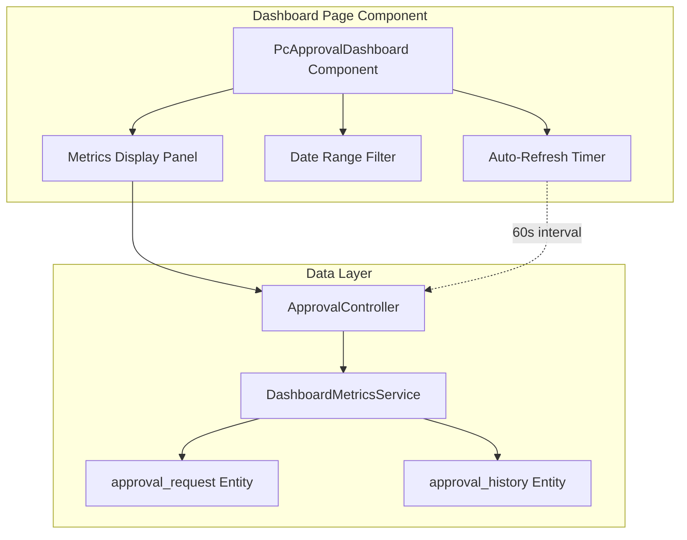
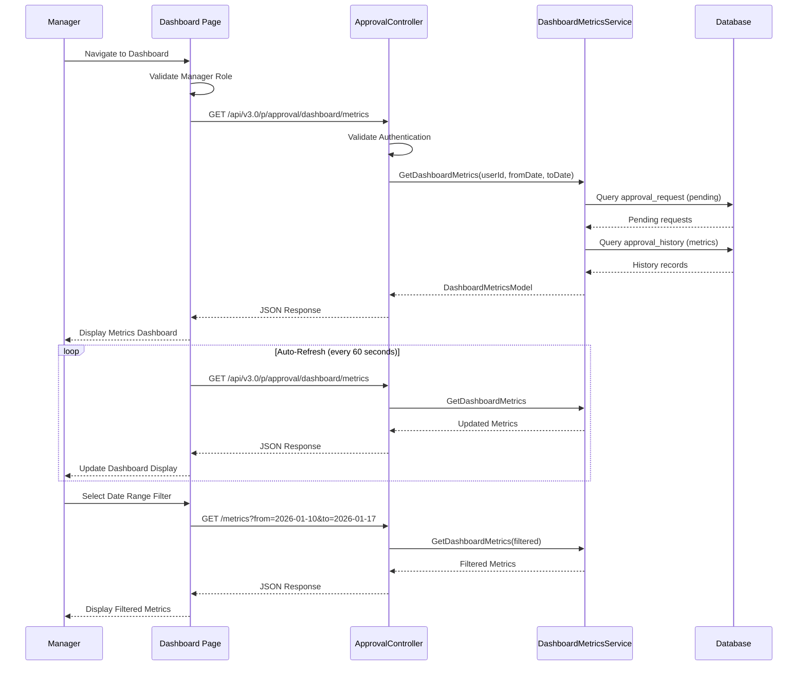

# STORY-009: Manager Approval Dashboard with Real-Time Metrics

## Description

As a Manager with approval responsibilities,
I want to view a real-time dashboard displaying my team's approval workflow metrics,
so that I can make faster, data-driven decisions about resource allocation and identify processing bottlenecks.

Implement a dashboard page component (`PcApprovalDashboard`) for the WebVella ERP Approval Workflow system that provides managers with real-time visibility into team approval workflow performance. This story creates a comprehensive metrics dashboard that displays key performance indicators including pending approvals count, average processing time, approval rate percentage, overdue requests, and recent activity feed.

The dashboard provides:

- **Real-Time Metrics Display**: Five key performance indicators that auto-refresh at a configurable interval (default 60 seconds) without requiring page reload. Metrics are calculated from `approval_request` and `approval_history` entity data scoped to the manager's team.

- **Pending Approvals Count**: Number of approval requests currently awaiting action, filtered to requests where the current user is an authorized approver for the current step.

- **Average Approval Time**: Mean time from request creation to final approval decision, calculated from `approval_history` timestamp differences over the selected date range.

- **Approval Rate**: Percentage of requests approved versus total processed requests (approved + rejected), providing insight into team approval patterns.

- **Overdue Requests**: Count of pending requests that have exceeded their configured `timeout_hours` from the associated `approval_step`, indicating SLA violations requiring immediate attention.

- **Recent Activity Feed**: Last 5 approval actions performed, showing action type, performer, and timestamp for quick visibility into team activity.

The component follows the established WebVella ERP page component pattern:

- Implements `PageComponent` base class with `[PageComponent]` attribute
- Supports multiple render modes: Display, Design, Options, Help, Error
- Includes Options panel for configuring refresh interval, date range defaults, and metrics display preferences
- Provides client-side JavaScript via embedded `service.js` for AJAX-based auto-refresh
- Consumes REST API endpoints from `ApprovalController` (STORY-007) for metrics data retrieval
- Integrates with role-based access control to restrict dashboard access to Manager role

The dashboard integrates with the WebVella ERP page builder system, allowing administrators to place the dashboard component on custom pages and configure its behavior through the visual design interface.

## Business Value

- **Reduces time managers spend gathering performance data from multiple sources**: Consolidates key approval metrics into a single view, eliminating the need to navigate multiple screens or generate manual reports to understand team performance.

- **Enables proactive identification of workflow bottlenecks before escalation**: Real-time visibility into overdue requests and processing times allows managers to intervene early, reallocating resources or following up on delayed approvals before they impact business operations.

- **Provides visibility into team workload for resource planning decisions**: Pending approval counts and processing metrics inform staffing decisions, helping managers balance workloads across team members and identify training needs.

- **Supports compliance reporting with real-time SLA monitoring**: Overdue request tracking provides immediate awareness of SLA violations, enabling managers to maintain compliance with organizational approval policies and external regulatory requirements.

- **Improves manager accountability through transparent metrics**: Quantified performance data creates a shared understanding of team effectiveness, supporting performance discussions and continuous improvement initiatives.

## Acceptance Criteria

- [ ] **AC1**: Given I am logged in as a user with Manager role, When I navigate to the Approvals Dashboard page, Then I see a dashboard displaying my team's approval metrics including Pending Approvals Count, Average Approval Time, Approval Rate, Overdue Requests, and Recent Activity

- [ ] **AC2**: Given the dashboard is displayed, When 60 seconds have elapsed, Then the metrics automatically refresh without requiring page reload and the display updates to reflect current data

- [ ] **AC3**: Given I am viewing the dashboard, When I select a date range filter (7 days, 30 days, 90 days, or custom range), Then the metrics update to reflect only the selected time period

- [ ] **AC4**: Given I have pending approval requests in queue where I am an authorized approver, When I view the Pending Approvals metric, Then the count accurately reflects requests awaiting my action

- [ ] **AC5**: Given approval requests exceed their configured timeout from the associated approval step, When I view the Overdue Requests metric, Then the count accurately identifies requests past their SLA

- [ ] **AC6**: Given I am a user without Manager role, When I attempt to access the dashboard, Then I receive an access denied message and am not shown the dashboard metrics

## Technical Implementation Details

### Files/Modules to Create

| File Path | Description |
|-----------|-------------|
| `WebVella.Erp.Plugins.Approval/Components/PcApprovalDashboard/PcApprovalDashboard.cs` | Dashboard page component class implementing PageComponent base with metrics display logic |
| `WebVella.Erp.Plugins.Approval/Components/PcApprovalDashboard/Design.cshtml` | Page builder preview view showing dashboard layout with sample metrics |
| `WebVella.Erp.Plugins.Approval/Components/PcApprovalDashboard/Display.cshtml` | Runtime display view rendering live metrics with auto-refresh capability |
| `WebVella.Erp.Plugins.Approval/Components/PcApprovalDashboard/Options.cshtml` | Configuration options panel for refresh interval, date range, and display preferences |
| `WebVella.Erp.Plugins.Approval/Components/PcApprovalDashboard/Help.cshtml` | Component documentation view explaining dashboard features and configuration |
| `WebVella.Erp.Plugins.Approval/Components/PcApprovalDashboard/Error.cshtml` | Error display view for access denied and data retrieval failures |
| `WebVella.Erp.Plugins.Approval/Components/PcApprovalDashboard/service.js` | Client-side JavaScript for AJAX metrics retrieval and auto-refresh timer |
| `WebVella.Erp.Plugins.Approval/Services/DashboardMetricsService.cs` | Service class containing metric calculation methods querying approval entities |
| `WebVella.Erp.Plugins.Approval/Api/DashboardMetricsModel.cs` | Response DTO containing all dashboard metric values |

### Folder Structure to Create

```
WebVella.Erp.Plugins.Approval/
├── Components/
│   └── PcApprovalDashboard/
│       ├── PcApprovalDashboard.cs      # Dashboard component class
│       ├── Design.cshtml               # Page builder preview
│       ├── Display.cshtml              # Runtime metrics display
│       ├── Options.cshtml              # Configuration panel
│       ├── Help.cshtml                 # Documentation view
│       ├── Error.cshtml                # Error handling view
│       └── service.js                  # AJAX refresh logic
├── Services/
│   └── DashboardMetricsService.cs      # Metrics calculation service
├── Api/
│   └── DashboardMetricsModel.cs        # Response model
└── Controllers/
    └── ApprovalController.cs           # Add dashboard metrics endpoint (existing file)
```

### Key Classes and Functions

#### PcApprovalDashboard.cs

```csharp
using Microsoft.AspNetCore.Mvc;
using Newtonsoft.Json;
using System;
using System.Collections.Generic;
using System.Threading.Tasks;
using WebVella.Erp.Api;
using WebVella.Erp.Api.Models;
using WebVella.Erp.Exceptions;
using WebVella.Erp.Web.Models;
using WebVella.Erp.Web.Services;
using WebVella.Erp.Plugins.Approval.Services;

namespace WebVella.Erp.Plugins.Approval.Components
{
    /// <summary>
    /// Page component for displaying manager approval dashboard with real-time metrics.
    /// Provides visibility into team approval workflow performance.
    /// </summary>
    [PageComponent(
        Label = "Approval Dashboard", 
        Library = "WebVella", 
        Description = "Real-time dashboard displaying team approval workflow metrics", 
        Version = "0.0.1", 
        IconClass = "fas fa-chart-line",
        Category = "Approval Workflow")]
    public class PcApprovalDashboard : PageComponent
    {
        protected ErpRequestContext ErpRequestContext { get; set; }

        public PcApprovalDashboard([FromServices] ErpRequestContext coreReqCtx)
        {
            ErpRequestContext = coreReqCtx;
        }

        /// <summary>
        /// Options model for dashboard configuration
        /// </summary>
        public class PcApprovalDashboardOptions
        {
            /// <summary>
            /// Auto-refresh interval in seconds (default: 60)
            /// </summary>
            [JsonProperty(PropertyName = "refresh_interval")]
            public int RefreshInterval { get; set; } = 60;

            /// <summary>
            /// Default date range for metrics (7d, 30d, 90d)
            /// </summary>
            [JsonProperty(PropertyName = "date_range_default")]
            public string DateRangeDefault { get; set; } = "30d";

            /// <summary>
            /// Whether to highlight overdue requests with alert styling
            /// </summary>
            [JsonProperty(PropertyName = "show_overdue_alert")]
            public bool ShowOverdueAlert { get; set; } = true;

            /// <summary>
            /// Comma-separated list of metrics to display
            /// </summary>
            [JsonProperty(PropertyName = "metrics_to_display")]
            public string MetricsToDisplay { get; set; } = "pending,avg_time,approval_rate,overdue,recent";
        }

        public async Task<IViewComponentResult> InvokeAsync(PageComponentContext context)
        {
            ErpPage currentPage = null;
            try
            {
                #region << Init >>
                if (context.Node == null)
                {
                    return await Task.FromResult<IViewComponentResult>(
                        Content("Error: The node Id is required"));
                }

                var pageFromModel = context.DataModel.GetProperty("Page");
                if (pageFromModel == null)
                {
                    return await Task.FromResult<IViewComponentResult>(
                        Content("Error: PageModel cannot be null"));
                }
                else if (pageFromModel is ErpPage)
                {
                    currentPage = (ErpPage)pageFromModel;
                }
                else
                {
                    return await Task.FromResult<IViewComponentResult>(
                        Content("Error: PageModel does not have Page property"));
                }

                var options = new PcApprovalDashboardOptions();
                if (context.Options != null)
                {
                    options = JsonConvert.DeserializeObject<PcApprovalDashboardOptions>(
                        context.Options.ToString());
                }

                var componentMeta = new PageComponentLibraryService()
                    .GetComponentMeta(context.Node.ComponentName);
                #endregion

                // Validate manager role access
                var currentUser = SecurityContext.CurrentUser;
                if (context.Mode == ComponentMode.Display && !IsManagerRole(currentUser))
                {
                    ViewBag.Error = new ValidationException()
                    {
                        Message = "Access denied. Manager role required to view dashboard."
                    };
                    return await Task.FromResult<IViewComponentResult>(View("Error"));
                }

                ViewBag.Options = options;
                ViewBag.Node = context.Node;
                ViewBag.ComponentMeta = componentMeta;
                ViewBag.RequestContext = ErpRequestContext;
                ViewBag.AppContext = ErpAppContext.Current;
                ViewBag.ComponentContext = context;
                ViewBag.CurrentUser = currentUser;

                switch (context.Mode)
                {
                    case ComponentMode.Display:
                        return await Task.FromResult<IViewComponentResult>(View("Display"));
                    case ComponentMode.Design:
                        return await Task.FromResult<IViewComponentResult>(View("Design"));
                    case ComponentMode.Options:
                        return await Task.FromResult<IViewComponentResult>(View("Options"));
                    case ComponentMode.Help:
                        return await Task.FromResult<IViewComponentResult>(View("Help"));
                    default:
                        ViewBag.Error = new ValidationException()
                        {
                            Message = "Unknown component mode"
                        };
                        return await Task.FromResult<IViewComponentResult>(View("Error"));
                }
            }
            catch (ValidationException ex)
            {
                ViewBag.Error = ex;
                return await Task.FromResult<IViewComponentResult>(View("Error"));
            }
            catch (Exception ex)
            {
                ViewBag.Error = new ValidationException()
                {
                    Message = ex.Message
                };
                return await Task.FromResult<IViewComponentResult>(View("Error"));
            }
        }

        /// <summary>
        /// Checks if the user has Manager role
        /// </summary>
        private bool IsManagerRole(ErpUser user)
        {
            if (user == null) return false;
            // Check for manager role in user's assigned roles
            foreach (var role in user.Roles)
            {
                if (role.Name.ToLower() == "manager" || role.Name.ToLower() == "administrator")
                    return true;
            }
            return false;
        }
    }
}
```

**Source Pattern**: `WebVella.Erp.Plugins.Approval/Components/PcApprovalWorkflowConfig/PcApprovalWorkflowConfig.cs`

#### DashboardMetricsService.cs

```csharp
using System;
using System.Collections.Generic;
using System.Linq;
using WebVella.Erp.Api;
using WebVella.Erp.Api.Models;
using WebVella.Erp.Plugins.Approval.Api;

namespace WebVella.Erp.Plugins.Approval.Services
{
    /// <summary>
    /// Service for calculating dashboard metrics from approval entities.
    /// Provides aggregated metrics for manager dashboard display.
    /// </summary>
    public class DashboardMetricsService
    {
        private readonly RecordManager recMan;

        public DashboardMetricsService()
        {
            recMan = new RecordManager();
        }

        /// <summary>
        /// Gets all dashboard metrics for the current user within date range
        /// </summary>
        /// <param name="userId">Current manager user ID</param>
        /// <param name="fromDate">Start of date range</param>
        /// <param name="toDate">End of date range</param>
        /// <returns>Dashboard metrics model</returns>
        public DashboardMetricsModel GetDashboardMetrics(Guid userId, DateTime fromDate, DateTime toDate)
        {
            var metrics = new DashboardMetricsModel
            {
                PendingApprovalsCount = GetPendingApprovalsCount(userId),
                AverageApprovalTimeHours = GetAverageApprovalTime(userId, fromDate, toDate),
                ApprovalRatePercent = GetApprovalRate(userId, fromDate, toDate),
                OverdueRequestsCount = GetOverdueRequestsCount(userId),
                RecentActivity = GetRecentActivity(userId, 5),
                MetricsAsOf = DateTime.UtcNow,
                DateRangeStart = fromDate,
                DateRangeEnd = toDate
            };

            return metrics;
        }

        /// <summary>
        /// Gets count of pending approvals awaiting the user's action
        /// </summary>
        public int GetPendingApprovalsCount(Guid userId)
        {
            // Query approval_request where status='pending' 
            // and current_step has user as authorized approver
            var query = new EntityQuery("approval_request");
            query.Query = EntityQuery.QueryEQ("status", "pending");
            var result = recMan.Find(query);
            
            if (!result.Success || result.Object?.Data == null)
                return 0;

            return result.Object.Data.Count(r => IsUserAuthorizedApprover(userId, r));
        }

        /// <summary>
        /// Gets average approval time in hours for completed requests
        /// </summary>
        public double GetAverageApprovalTime(Guid userId, DateTime fromDate, DateTime toDate)
        {
            // Calculate average time from request creation to final approval
            var query = new EntityQuery("approval_history");
            query.Query = EntityQuery.QueryAND(
                EntityQuery.QueryGTE("performed_on", fromDate),
                EntityQuery.QueryLTE("performed_on", toDate),
                EntityQuery.QueryOR(
                    EntityQuery.QueryEQ("action", "approved"),
                    EntityQuery.QueryEQ("action", "rejected")
                )
            );
            var result = recMan.Find(query);

            if (!result.Success || result.Object?.Data == null || !result.Object.Data.Any())
                return 0;

            var totalHours = result.Object.Data.Sum(r => 
                CalculateApprovalTimeHours(r));
            
            return Math.Round(totalHours / result.Object.Data.Count, 1);
        }

        /// <summary>
        /// Gets approval rate percentage
        /// </summary>
        public double GetApprovalRate(Guid userId, DateTime fromDate, DateTime toDate)
        {
            var query = new EntityQuery("approval_history");
            query.Query = EntityQuery.QueryAND(
                EntityQuery.QueryGTE("performed_on", fromDate),
                EntityQuery.QueryLTE("performed_on", toDate)
            );
            var result = recMan.Find(query);

            if (!result.Success || result.Object?.Data == null || !result.Object.Data.Any())
                return 0;

            var approved = result.Object.Data.Count(r => 
                r["action"]?.ToString() == "approved");
            var total = result.Object.Data.Count(r => 
                r["action"]?.ToString() == "approved" || 
                r["action"]?.ToString() == "rejected");

            if (total == 0) return 0;
            return Math.Round((double)approved / total * 100, 1);
        }

        /// <summary>
        /// Gets count of overdue requests exceeding SLA timeout
        /// </summary>
        public int GetOverdueRequestsCount(Guid userId)
        {
            // Find pending requests where created_on + timeout_hours < now
            var query = new EntityQuery("approval_request");
            query.Query = EntityQuery.QueryEQ("status", "pending");
            var result = recMan.Find(query);

            if (!result.Success || result.Object?.Data == null)
                return 0;

            return result.Object.Data.Count(r => IsRequestOverdue(r));
        }

        /// <summary>
        /// Gets recent approval activity
        /// </summary>
        public List<RecentActivityItem> GetRecentActivity(Guid userId, int count)
        {
            var query = new EntityQuery("approval_history");
            query.Sort = new List<QuerySortObject> 
            { 
                new QuerySortObject("performed_on", QuerySortType.Descending) 
            };
            query.PageSize = count;
            var result = recMan.Find(query);

            var activity = new List<RecentActivityItem>();
            if (result.Success && result.Object?.Data != null)
            {
                foreach (var record in result.Object.Data)
                {
                    activity.Add(new RecentActivityItem
                    {
                        Action = record["action"]?.ToString() ?? "unknown",
                        PerformedBy = record["performed_by"]?.ToString() ?? "",
                        PerformedOn = DateTime.Parse(record["performed_on"]?.ToString() 
                            ?? DateTime.UtcNow.ToString()),
                        RequestId = Guid.Parse(record["request_id"]?.ToString() 
                            ?? Guid.Empty.ToString())
                    });
                }
            }

            return activity;
        }

        // Helper methods
        private bool IsUserAuthorizedApprover(Guid userId, EntityRecord request) { /* Implementation */ return true; }
        private double CalculateApprovalTimeHours(EntityRecord history) { /* Implementation */ return 0; }
        private bool IsRequestOverdue(EntityRecord request) { /* Implementation */ return false; }
    }
}
```

**Source Pattern**: `WebVella.Erp.Plugins.Approval/Services/ApprovalWorkflowService.cs`

#### DashboardMetricsModel.cs

```csharp
using Newtonsoft.Json;
using System;
using System.Collections.Generic;

namespace WebVella.Erp.Plugins.Approval.Api
{
    /// <summary>
    /// Response model for dashboard metrics endpoint
    /// </summary>
    public class DashboardMetricsModel
    {
        /// <summary>
        /// Number of approval requests pending the manager's action
        /// </summary>
        [JsonProperty(PropertyName = "pending_approvals_count")]
        public int PendingApprovalsCount { get; set; }

        /// <summary>
        /// Average time in hours from request to approval decision
        /// </summary>
        [JsonProperty(PropertyName = "average_approval_time_hours")]
        public double AverageApprovalTimeHours { get; set; }

        /// <summary>
        /// Percentage of requests approved vs total processed
        /// </summary>
        [JsonProperty(PropertyName = "approval_rate_percent")]
        public double ApprovalRatePercent { get; set; }

        /// <summary>
        /// Count of pending requests exceeding SLA timeout
        /// </summary>
        [JsonProperty(PropertyName = "overdue_requests_count")]
        public int OverdueRequestsCount { get; set; }

        /// <summary>
        /// Recent approval activity items
        /// </summary>
        [JsonProperty(PropertyName = "recent_activity")]
        public List<RecentActivityItem> RecentActivity { get; set; } = new List<RecentActivityItem>();

        /// <summary>
        /// Timestamp when metrics were calculated
        /// </summary>
        [JsonProperty(PropertyName = "metrics_as_of")]
        public DateTime MetricsAsOf { get; set; }

        /// <summary>
        /// Start of the date range for metrics calculation
        /// </summary>
        [JsonProperty(PropertyName = "date_range_start")]
        public DateTime DateRangeStart { get; set; }

        /// <summary>
        /// End of the date range for metrics calculation
        /// </summary>
        [JsonProperty(PropertyName = "date_range_end")]
        public DateTime DateRangeEnd { get; set; }
    }

    /// <summary>
    /// Individual recent activity item
    /// </summary>
    public class RecentActivityItem
    {
        /// <summary>
        /// Action type (approved, rejected, delegated)
        /// </summary>
        [JsonProperty(PropertyName = "action")]
        public string Action { get; set; }

        /// <summary>
        /// User who performed the action
        /// </summary>
        [JsonProperty(PropertyName = "performed_by")]
        public string PerformedBy { get; set; }

        /// <summary>
        /// Timestamp of the action
        /// </summary>
        [JsonProperty(PropertyName = "performed_on")]
        public DateTime PerformedOn { get; set; }

        /// <summary>
        /// Related approval request ID
        /// </summary>
        [JsonProperty(PropertyName = "request_id")]
        public Guid RequestId { get; set; }
    }
}
```

**Source Pattern**: `WebVella.Erp.Plugins.Approval/Api/ApproveRequestModel.cs`

#### ApprovalController.cs (Dashboard Endpoint Addition)

```csharp
/// <summary>
/// Gets dashboard metrics for the current manager
/// </summary>
/// <param name="from">Start date for metrics range (optional, defaults to 30 days ago)</param>
/// <param name="to">End date for metrics range (optional, defaults to today)</param>
/// <returns>Dashboard metrics model</returns>
[Route("api/v3.0/p/approval/dashboard/metrics")]
[HttpGet]
public ActionResult GetDashboardMetrics([FromQuery] DateTime? from = null, [FromQuery] DateTime? to = null)
{
    var response = new ResponseModel();
    try
    {
        var currentUserId = CurrentUserId;
        if (!currentUserId.HasValue)
        {
            response.Success = false;
            response.Message = "User authentication required";
            return Json(response);
        }

        // Validate manager role
        var currentUser = SecurityContext.CurrentUser;
        if (!IsManagerRole(currentUser))
        {
            response.Success = false;
            response.Message = "Access denied. Manager role required.";
            return StatusCode(403, response);
        }

        // Default date range: last 30 days
        var toDate = to ?? DateTime.UtcNow;
        var fromDate = from ?? toDate.AddDays(-30);

        var metricsService = new DashboardMetricsService();
        var metrics = metricsService.GetDashboardMetrics(currentUserId.Value, fromDate, toDate);

        response.Object = metrics;
        response.Success = true;
        response.Message = "Dashboard metrics retrieved successfully";
    }
    catch (Exception ex)
    {
        response.Success = false;
        response.Message = ex.Message;
    }

    return Json(response);
}

/// <summary>
/// Checks if user has manager role
/// </summary>
private bool IsManagerRole(ErpUser user)
{
    if (user == null) return false;
    foreach (var role in user.Roles)
    {
        if (role.Name.ToLower() == "manager" || role.Name.ToLower() == "administrator")
            return true;
    }
    return false;
}
```

**Source Pattern**: `WebVella.Erp.Plugins.Approval/Controllers/ApprovalController.cs`

### Component Options

| Option | Type | Default | Description |
|--------|------|---------|-------------|
| `refresh_interval` | Number | 60 | Seconds between auto-refresh cycles |
| `date_range_default` | Text | "30d" | Default date range for metrics (7d/30d/90d) |
| `show_overdue_alert` | Boolean | true | Highlight overdue requests with alert styling |
| `metrics_to_display` | Text | "pending,avg_time,approval_rate,overdue,recent" | Comma-separated list of metrics to show |

### API Endpoints

| Method | Endpoint | Description |
|--------|----------|-------------|
| GET | `/api/v3.0/p/approval/dashboard/metrics` | Returns dashboard metrics for current manager with default 30-day range |
| GET | `/api/v3.0/p/approval/dashboard/metrics?from={date}&to={date}` | Returns dashboard metrics filtered by specified date range |

### API Response Example

```json
{
  "success": true,
  "message": "Dashboard metrics retrieved successfully",
  "object": {
    "pending_approvals_count": 12,
    "average_approval_time_hours": 4.5,
    "approval_rate_percent": 87.5,
    "overdue_requests_count": 2,
    "recent_activity": [
      {
        "action": "approved",
        "performed_by": "John Smith",
        "performed_on": "2026-01-17T14:30:00Z",
        "request_id": "a1b2c3d4-e5f6-7890-abcd-ef1234567890"
      }
    ],
    "metrics_as_of": "2026-01-17T14:35:00Z",
    "date_range_start": "2025-12-18T00:00:00Z",
    "date_range_end": "2026-01-17T23:59:59Z"
  },
  "errors": []
}
```

### Mermaid Diagrams

#### Component Architecture



#### User Workflow Sequence



### Integration Points

| Integration | Description |
|-------------|-------------|
| `PageComponent` base class | Inherits from `WebVella.Erp.Web.Models.PageComponent` for page builder integration |
| `SecurityContext.CurrentUser` | Retrieves authenticated user for role validation and metrics scoping |
| `ApprovalController` | REST API endpoint for metrics retrieval via AJAX |
| `DashboardMetricsService` | Service layer for metric calculations from approval entities |
| `approval_request` entity | Source data for pending approvals and request counts |
| `approval_history` entity | Source data for approval times, rates, and activity feed |
| `PageComponentLibraryService` | Registers component in page builder palette |

### Technical Approach

1. **Create Component Structure**: Initialize the `PcApprovalDashboard` component folder with all required files (cs, cshtml views, service.js) following the established pattern from `PcApprovalWorkflowConfig`.

2. **Implement Component Class**: Create `PcApprovalDashboard.cs` with PageComponent attribute, options model, and role validation. Support Display, Design, Options, Help, and Error render modes.

3. **Create Metrics Service**: Implement `DashboardMetricsService.cs` with methods for calculating each metric from `approval_request` and `approval_history` entities.

4. **Create Response Model**: Implement `DashboardMetricsModel.cs` as a DTO with JSON serialization attributes for all metric properties.

5. **Add API Endpoint**: Extend `ApprovalController.cs` with `GetDashboardMetrics` endpoint that validates authentication, checks manager role, and delegates to the metrics service.

6. **Implement Display View**: Create `Display.cshtml` with Bootstrap card layout for metrics, date range selector, and JavaScript initialization for auto-refresh.

7. **Implement Client-Side Logic**: Create `service.js` with AJAX functions for metrics retrieval and setInterval timer for auto-refresh at configured interval.

8. **Implement Design View**: Create `Design.cshtml` showing a preview of dashboard layout with sample/placeholder metrics for page builder context.

9. **Implement Options View**: Create `Options.cshtml` with form fields for configuring refresh_interval, date_range_default, show_overdue_alert, and metrics_to_display.

10. **Role-Based Access Control**: Implement manager role validation in both component class and API endpoint to restrict dashboard access.

## Dependencies

| Story ID | Dependency Description |
|----------|----------------------|
| **STORY-007** | REST API Endpoints - Required for `ApprovalController` pattern and endpoint conventions. The dashboard metrics endpoint follows the same controller structure and `ResponseModel` envelope pattern established in STORY-007. |
| **STORY-008** | UI Page Components - Required for `PageComponent` implementation pattern, component folder structure, render mode handling, and Options panel conventions. The dashboard component follows the identical architecture of the four components created in STORY-008. |

## Effort Estimate

**5 Story Points**

Rationale:
- Single page component with established patterns from STORY-008
- Six files for component (cs, 5 cshtml views) plus service.js
- One new service class with straightforward entity queries
- One new DTO model with JSON serialization
- One API endpoint addition to existing controller
- Clear metric calculations with well-defined entity data sources
- Testing includes role validation and date range filtering
- Auto-refresh mechanism uses standard setInterval pattern

## Labels

`dashboard`, `metrics`, `ui`, `manager`, `approval`, `real-time`

---

## Additional Notes

### Source Code References

| Reference | Purpose |
|-----------|---------|
| `WebVella.Erp.Plugins.Approval/Components/PcApprovalWorkflowConfig/` | Reference implementation for page component structure and render modes |
| `WebVella.Erp.Plugins.Approval/Controllers/ApprovalController.cs` | Reference for REST API endpoint patterns and ResponseModel usage |
| `WebVella.Erp.Plugins.Approval/Services/ApprovalWorkflowService.cs` | Reference for service layer patterns and entity queries |
| `WebVella.Erp.Web/Models/PageComponent.cs` | Base class providing component lifecycle and rendering contract |

### INVEST Criteria Validation

| Criterion | Validation | Status |
|-----------|------------|--------|
| **Independent** | Self-contained component with no blocking dependencies on undelivered features; builds on completed STORY-007 and STORY-008 | ✓ Pass |
| **Negotiable** | Metrics selection, refresh interval, and display options are configurable and negotiable | ✓ Pass |
| **Valuable** | Directly addresses manager decision-making business objective with quantifiable metrics | ✓ Pass |
| **Estimable** | Similar scope to STORY-007 (API endpoints); clear implementation path from patterns | ✓ Pass |
| **Sized** | Single dashboard view with five metrics; appropriate for single sprint delivery | ✓ Pass |
| **Testable** | All six acceptance criteria have clear pass/fail conditions with Given/When/Then format | ✓ Pass |
| **Demo-able** | Dashboard with live metrics can be demonstrated to Product Owner | ✓ Pass |

### Testing Considerations

- Verify component appears in page builder under "Approval Workflow" category
- Confirm manager role validation blocks non-manager access
- Validate auto-refresh timer fires at configured interval
- Test date range filtering updates all metrics correctly
- Verify pending count matches actual requests awaiting user action
- Confirm overdue detection compares against step timeout_hours
- Test API endpoint returns 403 for non-manager users
- Validate responsive layout on tablet and mobile viewports

### Future Enhancements (Out of Scope)

The following enhancements are explicitly out of scope for this story and may be addressed in future stories:

- Additional filtering by team member, department, or workflow type
- Export functionality for metrics data (PDF/Excel)
- Historical trend charts and graphs
- Push notifications via SignalR for real-time updates
- Drill-down to individual request details from metrics
- Customizable dashboard layouts with drag-and-drop widgets
